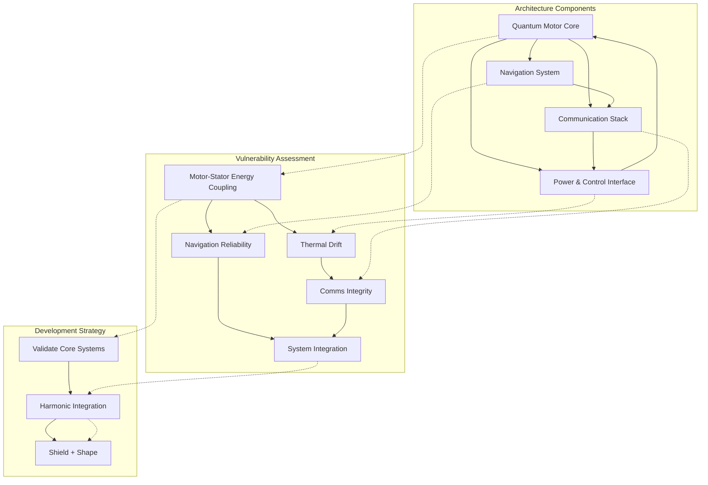

# Introducing the System Dissection and Development Strategy Document

We're excited to announce the addition of a comprehensive **System Dissection and Developmental Strategy** document to our technical documentation. This critical new resource provides a systematic approach to understanding, analyzing, and implementing our quantum propulsion technology.

*System Architecture, Vulnerability Map, and Development Strategy Integration*

<!-- truncate -->

## What's Included in the System Dissection Document?

The System Dissection and Development Strategy document provides a comprehensive framework that addresses several critical aspects of our quantum propulsion technology development:

1. **System Architecture Overview** - A detailed breakdown of our quantum propulsion framework's key components:
   - Quantum motor core technology options
   - Advanced navigation systems with quantum gyros
   - Communication stack alternatives
   - Power and control interface considerations

2. **Vulnerability Assessment** - Systematic identification of potential failure points:
   - Motor-stator energy coupling challenges
   - Thermal drift and vibrational interference issues
   - Navigation reliability concerns
   - Communications integrity verification
   - System integration failure prevention

3. **Development Strategy** - Our three-phase approach to technology development:
   - Phase 1: Validating core systems in isolation
   - Phase 2: Harmonic integration testing
   - Phase 3: Shielding and shaping for field deployment

## Strategic Importance

This document represents a significant evolution in our approach to quantum propulsion development. Rather than pursuing a single-track development path, we're now implementing a more comprehensive strategy that:

- Identifies and addresses potential technical obstacles early
- Establishes clear validation protocols before integration
- Ensures system components work harmoniously together
- Provides a concrete roadmap for field deployment

## Implementation Timeline

The System Dissection approach has been integrated into our master development timeline. Implementation begins with Phase 1 (Core System Validation) in Q2 2025, with subsequent phases following our established development roadmap.

## Next Steps

The technology team will immediately begin implementing the vulnerability assessment protocols outlined in the document, with initial results expected within the next quarter. We encourage all stakeholders to review the document and provide feedback on our approach.

[Read the full System Dissection and Development Strategy →](/docs/core-documentation/system-dissection)

---

*This document is part of Azure Space Group's commitment to systematic, methodical technology development.* 