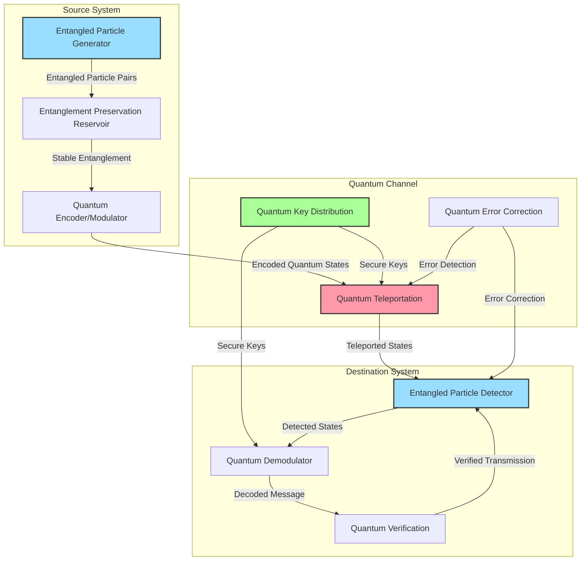

# Communication Systems

The Quantum Engine Project incorporates revolutionary communication technologies that transcend traditional electromagnetic signal limitations, enabling instantaneous, secure, and reliable communication across any distance. For detailed research on quantum entanglement communication technology, refer to our [Quantum Communications Research Paper](../research-documentation/quantum-communications).

## Quantum Communication Networks

Our communication infrastructure relies on quantum entanglement to achieve instantaneous data transmission regardless of distance.

### Quantum Entanglement Communication Array

The core of our communication system leverages quantum entanglement:

- Entangled particle pairs distributed between the vessel and communication endpoints
- Bell state manipulation for encoding information in quantum states
- Quantum teleportation protocols for complete information transfer
- Entanglement renewal systems that continuously regenerate entangled pairs

This system enables truly instantaneous communication across any distance, completely bypassing the light-speed limit of conventional communications.

*Quantum Entanglement Communication System - Illustrating how information is transmitted instantaneously across any distance using quantum entanglement*

### Quantum Key Distribution Security

Unbreakable security is ensured through quantum principles:

- Quantum key distribution using entangled photons
- Heisenberg uncertainty principle exploited to detect eavesdropping attempts
- Quantum-secured encryption with 10^500 possible key combinations
- Self-destructing quantum states that collapse if intercepted

This approach provides mathematically perfect security beyond any classical encryption method.

### Quantum Network Topology

The network architecture ensures reliability through:

- Distributed entanglement reservoirs with redundant entangled pairs
- Quantum repeaters for maintaining long-distance entanglement
- Dynamic routing using quantum superposition of multiple paths
- Self-healing quantum networks that automatically reestablish broken connections

This topology creates a communication infrastructure with no single points of failure and automatic adaptation to changing conditions.

## Crew Interaction Systems

Advanced interfaces allow intuitive and efficient communication between crew and systems.

### Neural Interface Technology

Direct brain-computer interfaces revolutionize system control:

- Non-invasive quantum sensor arrays that detect neural activity
- Quantum amplification of brain signals for precise interpretation
- Thought pattern recognition through quantum neural networks
- Feedback systems that provide sensory information directly to the brain

This technology enables crew members to control ship systems and communicate with each other through thought alone, reducing response time to milliseconds.

### Holographic Communication Environment

For traditional communication needs:

- Quantum holographic projectors creating fully interactive 3D environments
- Remote presence capability through quantum-entangled sensors
- Full sensory representation including touch, smell, and environmental conditions
- Adaptive resolution scaling based on available quantum resources

This system allows crew members to virtually "be present" anywhere within communication range, enhancing collaboration and situational awareness.

### Quantum Language Translation

Instantaneous translation capabilities include:

- Real-time quantum processing of any known language
- Context-sensitive interpretation through quantum semantic analysis
- Cultural adaptation algorithms that adjust communication style
- Non-verbal communication interpretation through quantum pattern recognition

This system eliminates language barriers in both human-human and human-alien communications.

## Interstellar Communication Systems

For communication with distant star systems without pre-positioned entangled particles:

### Quantum Beacon Network

Long-range communication without prior entanglement:

- Quantum beacon transmitters that project coherent quantum states across light-years
- Quantum signal amplifiers that preserve state fidelity over vast distances
- Entanglement-on-demand protocols that establish new entangled pairs remotely
- Quantum waveform modulation for high-bandwidth non-entangled communications

This system enables initial contact with distant locations before establishing entanglement-based communications.

### Subspace Field Communications

Experimental technology that bypasses normal spacetime for communication:

- Subspace field generators that create a dimensional envelope
- Signal propagation through compressed dimensional space
- Quantum carrier waves that remain coherent in subspace
- Automated dimensional reentry protocols for signal extraction

While still theoretical, this technology could enable near-instantaneous communication without pre-established entanglement.

### Tachyon Communication Backup

Emergency backup systems utilizing theoretical faster-than-light particles:

- Tachyon emission and detection arrays
- Quantum-coupled tachyon modulation for information encoding
- Tachyon beam focusing using quantum field manipulation
- Superluminal carrier wave generation through quantum vacuum perturbation

Though experimental, this system provides a redundant communication method if quantum entanglement is temporarily unavailable.

## Technical Specifications

| System | Capability | Current Status |
|--------|------------|----------------|
| Quantum Entanglement Communicator | Unlimited distance, 10^18 bits/second | Research Proposal |
| Neural Interface | 99.97% thought recognition accuracy | Concept Paper |
| Quantum Beacon | Effective range of 100 light-years | Theoretical Model |
| Holographic Environment | Full sensory resolution at 10^12 voxels | Early Research |
| Subspace Communication | Theoretical latency of 1ms per light-year | Speculative Theory |

## Development Challenges

1. **Entanglement Preservation**: Maintaining quantum coherence over extended periods
2. **Neural Interface Biocompatibility**: Ensuring long-term safety for users
3. **Beacon Range Extensions**: Overcoming quantum decoherence across interstellar distances
4. **Subspace Stability**: Preventing dimensional collapse during communication
5. **Power Requirements**: Meeting the enormous energy demands of quantum communication systems

## Research Priorities

1. Room-temperature quantum repeaters for entanglement maintenance
2. Non-invasive neural interface technologies with improved signal clarity
3. Extended range quantum beacons for interstellar communication
4. Stable subspace field generation for alternative communication channels
5. Energy-efficient quantum communication systems for deployment on smaller vessels 