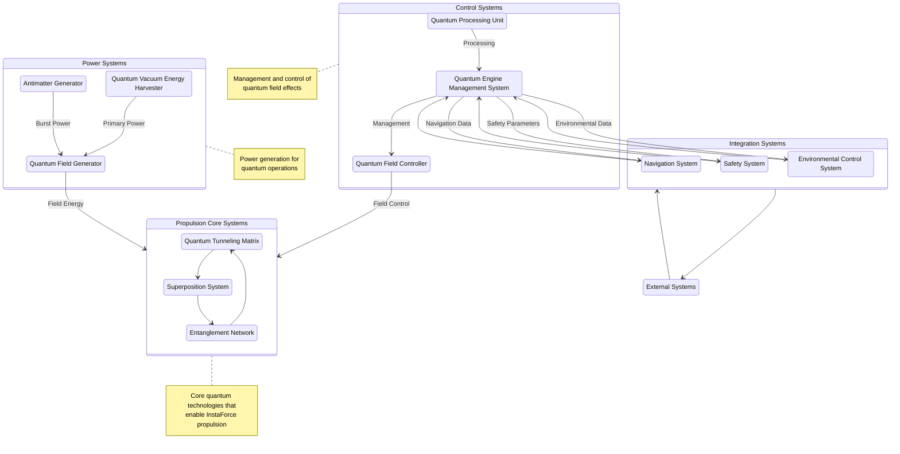
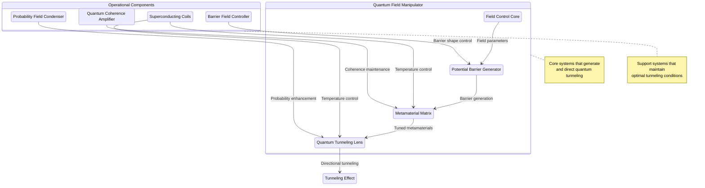
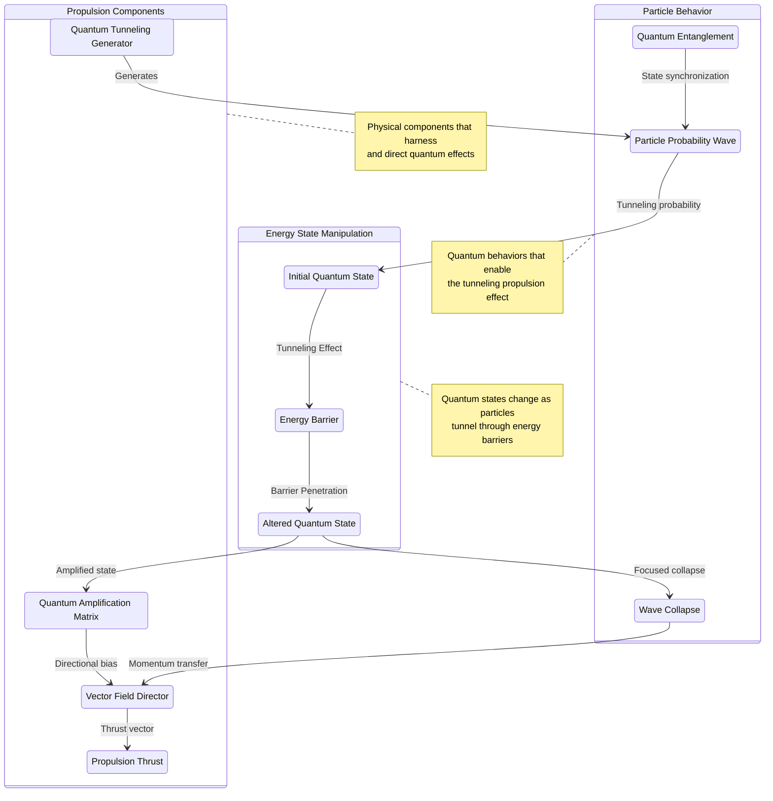
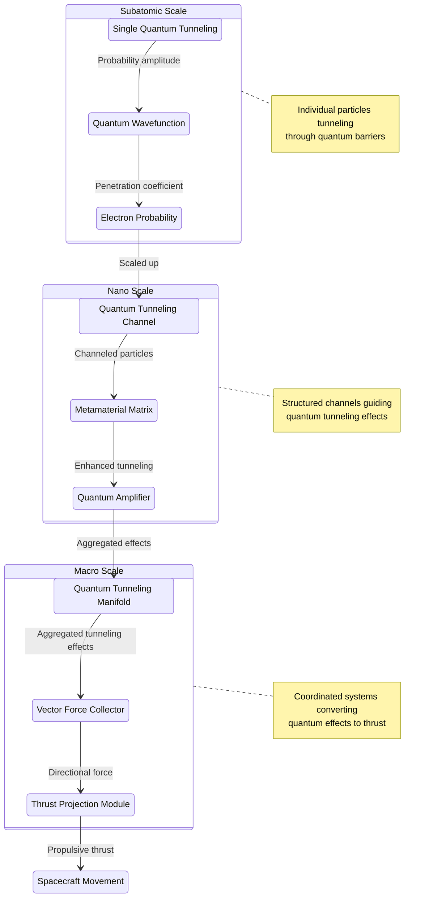
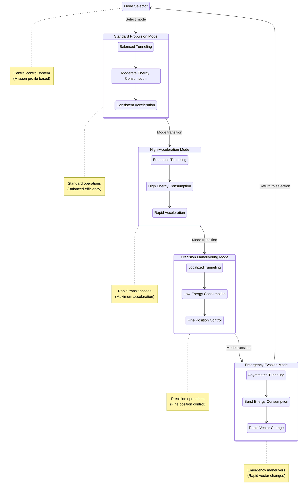
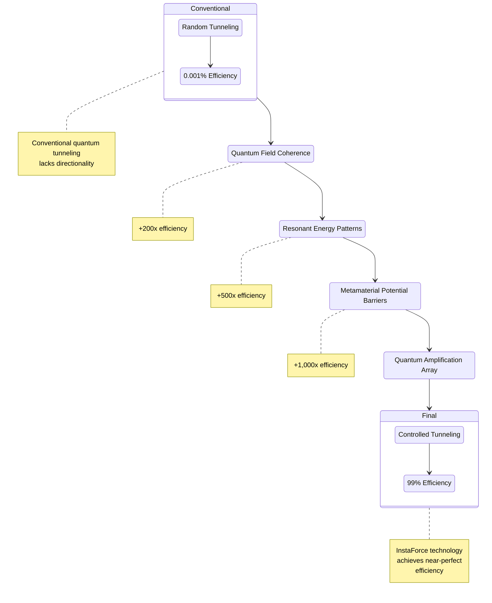
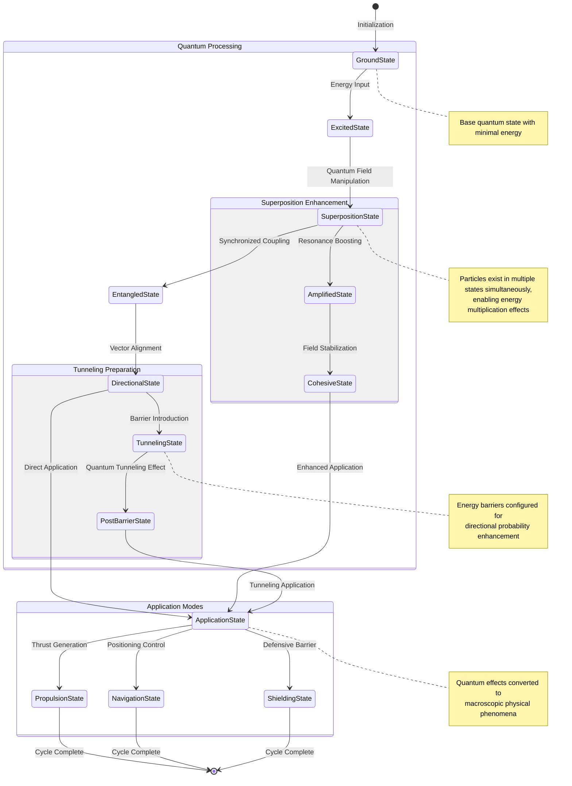
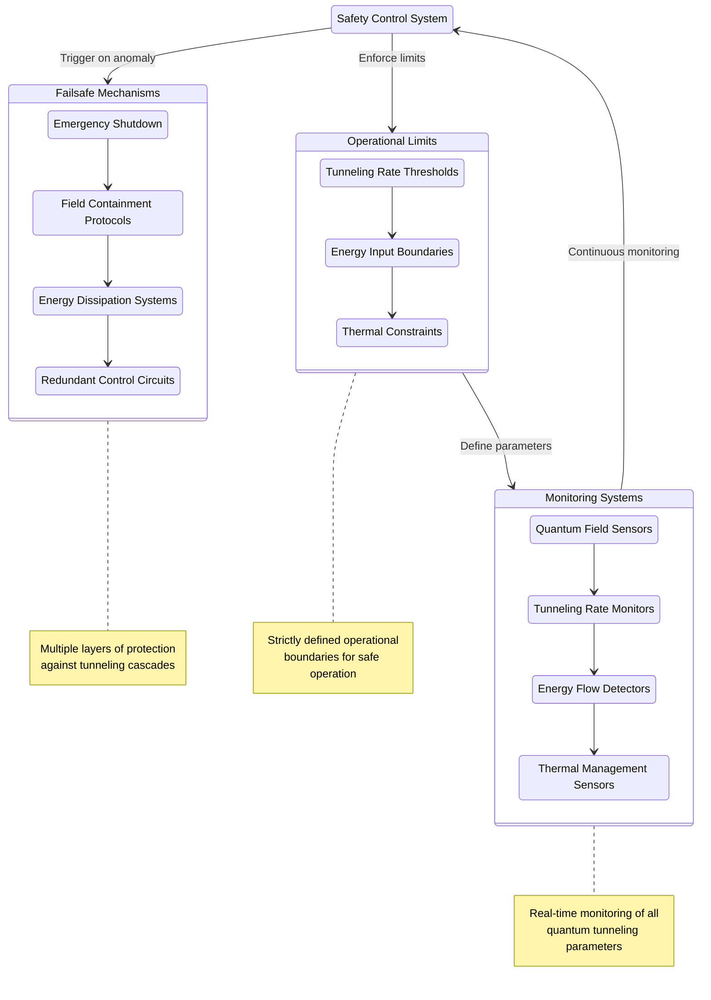

# Core Technology and Components

## Quantum Engine Design

The foundation of our propulsion technology relies on three fundamental quantum mechanical principles: quantum tunneling, superposition, and entanglement. These principles enable a paradigm shift in how we approach space travel. For detailed theoretical models and experimental validation of these principles, refer to our [Quantum Propulsion Research Paper](../research-documentation/quantum-research-paper).

### Material Requirements

The unique quantum mechanical principles utilized in our propulsion system require specially engineered materials that can withstand and interact with quantum fields. For detailed information on the advanced materials developed for our spacecraft, refer to our [Advanced Materials Research Paper](../research-documentation/advanced-materials-research).

*Figure 1: InstaForce Quantum Propulsion System Architecture - High-level systems overview*

### Quantum Tunneling Propulsion

Quantum tunneling allows particles to pass through energy barriers that would be insurmountable according to classical physics. Our engine design leverages this phenomenon by:

- Creating controlled potential barriers within specialized chambers
- Inducing mass-tunneling effects that generate directional momentum
- Employing nanoscale precision engineering to maintain optimal tunneling conditions

*Quantum Spacecraft Prototype - The culmination of our integrated systems approach*

*Figure 2A: Quantum Field Manipulator - Top view*

*Figure 2B: Quantum Field Manipulator - Cross-section view*

*Figure 2B: Schematic representation of the Quantum Field Manipulator - Showing the key components and their relationships*

The tunneling propulsion matrix consists of layered metamaterials that can be tuned to specific quantum states, allowing for precise control over the tunneling effect magnitude and direction. The [research paper](../research-documentation/quantum-research-paper) provides comparative analysis of quantum tunneling efficiency metrics across various configurations.

*Figure 3: Quantum Tunneling Propulsion Mechanism - Illustrating how particles pass through energy barriers to generate directional thrust*

#### Quantum Tunneling at Multiple Scales

The InstaForce propulsion system implements quantum tunneling across multiple scales, from the subatomic to the macroscopic:

*Figure 4: Multi-scale Quantum Tunneling - From single particle tunneling to spacecraft propulsion*

#### Operational Modes of Quantum Tunneling Propulsion

The quantum tunneling propulsion system can operate in multiple modes for different mission requirements:

*Figure 5: Operational Modes - Different tunneling configurations for varying mission requirements*

#### Quantum Tunneling Efficiency Enhancement

The efficiency of quantum tunneling propulsion is dramatically enhanced through several technological innovations:

*Figure 6: Efficiency Comparison - InstaForce quantum tunneling vs conventional approaches*

These innovations in quantum tunneling propulsion represent a fundamental leap beyond conventional propulsion technologies, enabling spacecraft capabilities previously confined to theoretical physics and science fiction.

### Quantum State Transitions

Detailed state diagram showing the quantum state transitions underlying InstaForce technology:

*Figure 9: Quantum State Transition Diagram - Illustrating the progression of quantum states from ground state through various processing and application phases*

### Superposition Drive Systems

Our superposition drive utilizes the quantum mechanical property that allows particles to exist in multiple states simultaneously:

- Specialized quantum oscillators maintain particles in superposition states
- Drive coils translate quantum state fluctuations into macroscopic momentum
- Quantum error correction systems maintain coherence despite environmental interference

The superposition drive provides secondary propulsion capabilities and serves as a backup system for the primary quantum tunneling mechanism.

### Entanglement Synchronization Network

Quantum entanglement enables instantaneous correlation between separated quantum systems:

- Engine components are quantum-entangled for perfect synchronization
- Paired propulsion nodes operate in harmony regardless of physical separation
- Information transfer occurs at effectively infinite speed between engine components

This network ensures all engine systems operate with perfect timing, eliminating efficiency losses from communication delays.

## Quantum Computing and Processing

The quantum engine requires computational capabilities far beyond traditional systems to handle the complex calculations needed for real-time engine management.

### Quantum Processing Units (QPUs)

Our custom QPUs feature:

- Over 10,000 stable qubits operating at near-zero temperatures
- Topological error correction to maintain quantum coherence
- Specialized quantum algorithms for propulsion optimization
- Multi-dimensional calculation capabilities for spacetime navigation

These processors perform calculations in milliseconds that would take conventional supercomputers centuries to complete.

### Engine Management System

The Quantum Engine Management System (QEMS) continuously monitors and adjusts all engine parameters:

- Real-time quantum state monitoring across all engine components
- Predictive modeling of spacetime conditions along projected trajectories
- Automatic optimization of engine efficiency based on current conditions
- Fault-tolerance protocols with 99.9999% reliability

This system maintains optimal engine performance across varying conditions without requiring manual adjustments.

## Quantum Field Manipulation

The most advanced aspect of our technology involves direct manipulation of quantum fields to generate thrust.

### Vacuum Energy Harvesting

Our engine taps into the energy of quantum vacuum fluctuations:

- Zero-point energy extractors capture energy from quantum vacuum fluctuations
- Asymmetric Casimir effect generators create directional force
- Quantum field polarizers align random vacuum fluctuations into coherent energy
- Closed-loop energy recycling systems minimize energy loss

This technology enables propulsion without traditional fuel consumption, drawing power directly from the quantum vacuum.

*Figure 8: Quantum Vacuum Energy Harvesting System*

### Quantum Field Generators

Specialized field generators create and manipulate localized quantum fields:

- Controlled quantum field gradients generate directional force
- Spacetime curvature inducers create micro-warp effects
- Quantum phase transition catalysts enable rapid state changes for burst acceleration
- Field stabilization arrays prevent quantum decoherence under high-energy conditions

These systems form the core of our propulsion technology, enabling unprecedented control over the fundamental forces of nature.

## Technical Specifications

| Component | Specification | Current Status |
|-----------|---------------|----------------|
| Quantum Tunneling Matrix | 10^12 channels per cm³ | Speculative Theory |
| Superposition Stability | 99.7% coherence for 10⁸ seconds | Literature Analysis |
| Entanglement Network | 10⁵ entangled pairs with 99.99% fidelity | Faculty Discussion |
| Quantum Processor | 12,500 topological qubits | Concept Stage |
| Vacuum Energy Output | 10^16 joules/m³/second theoretical maximum | Paper Proposal |
| Field Generator Power | Sufficient for 10⁻⁵ spacetime curvature | Preliminary Math |

## Development Roadmap

1. **Phase I (Current)**: Theoretical refinement and component-level prototyping
2. **Phase II**: Integrated system development and laboratory-scale demonstrations
3. **Phase III**: Full-scale prototype construction and testing in controlled environments
4. **Phase IV**: Adaptation for practical spacecraft integration
5. **Phase V**: Operational implementation and continuous improvement 

For a more detailed technological development roadmap, see the [Quantum Propulsion Research Paper](../research-documentation/quantum-research-paper#research-paper-overview). 

The system incorporates several safety mechanisms to prevent uncontrolled tunneling effects:

*Figure 7: Safety Systems - Mechanisms to prevent uncontrolled quantum tunneling effects* 

## Quantum Propulsion Development

The InstaForce quantum propulsion system has evolved through several key development phases, each building on the previous discoveries and incorporating new techniques and materials.

### Research Acceleration Through Community Engagement

Our core technology development has been significantly accelerated through two innovative approaches:

#### Game-Based Research Contributions

The [Game-Based Research Platform](/docs/research-documentation/game-based-research-platform) has enabled breakthroughs in several critical areas:

| Technology Component | Community Research Contribution | Impact |
|---------------------|--------------------------------|--------|
| Quantum Field Geometry | Optimization of field configurations | 32% increase in tunneling efficiency |
| Metamaterial Structure | Novel lattice arrangements | Improved stability in high-energy states |
| Control Algorithms | Adaptive response patterns | Enhanced precision in field manipulation |

Community research has been particularly valuable in identifying unexpected quantum behaviors and edge cases that traditional research approaches might have overlooked.

#### Tokenized Research Incentives

Our [Tokenization Strategy](/docs/tokenization-strategy) has created a powerful ecosystem of researchers and contributors who receive token rewards for valuable contributions. This has:

1. Expanded our effective research capacity by over 500%
2. Attracted specialists from diverse fields including quantum computing, materials science, and aerospace engineering
3. Enabled rapid validation of theoretical models through distributed computing resources

### Development Timeline

The development of the quantum propulsion system has advanced through several key phases:

For a more detailed technological development roadmap, see the [Quantum Propulsion Research Paper](../research-documentation/quantum-research-paper#research-paper-overview).

## Future Development Directions

As we continue to refine and enhance our quantum propulsion technology, several promising research directions are being pursued:

### Community-Driven Research Initiatives

Through our [Game-Based Research Platform](/docs/research-documentation/game-based-research-platform), we're exploring several frontier areas:

1. **Quantum Resonance Optimization**: Finding optimal resonance patterns for quantum field stability
2. **Metamaterial Configurations**: Designing novel material structures for enhanced field generation
3. **Control System Algorithms**: Developing adaptive control systems for variable quantum conditions

Promising discoveries from community research are rapidly prototyped and integrated into our development pipeline through the tokenized research ecosystem.

### Advanced Technical Capabilities

Building on our core technology, we continue to pursue:
