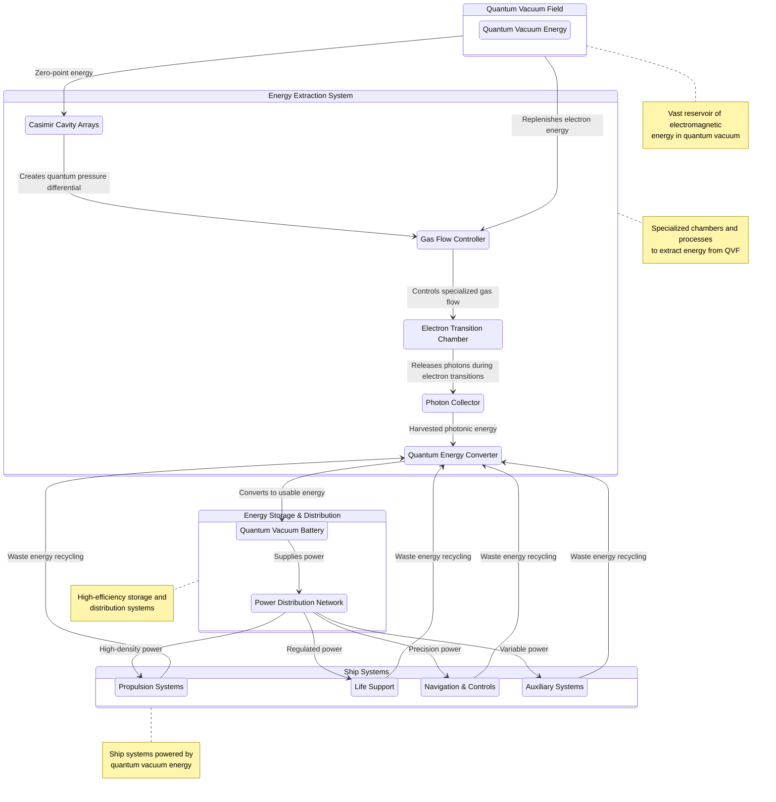
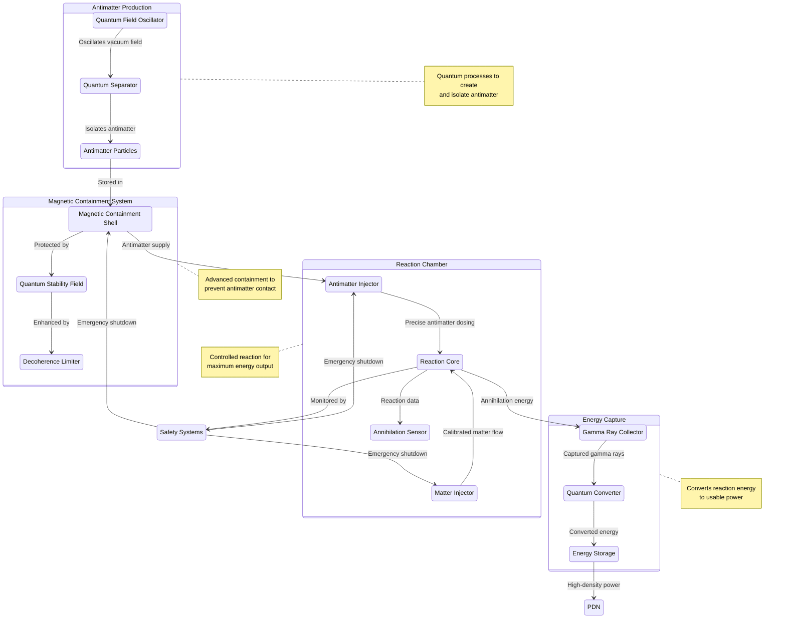
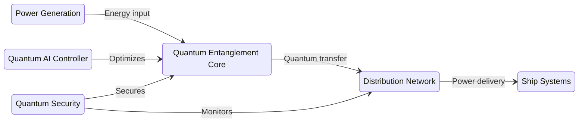
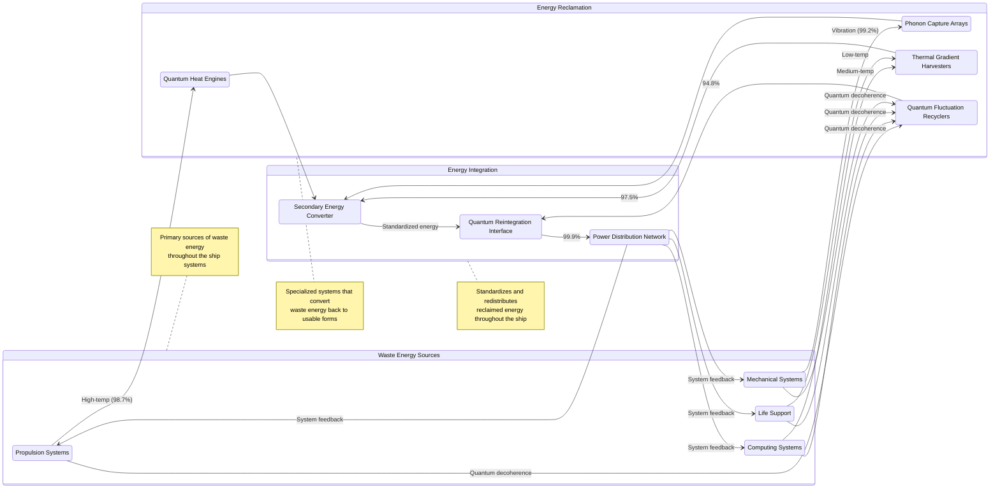
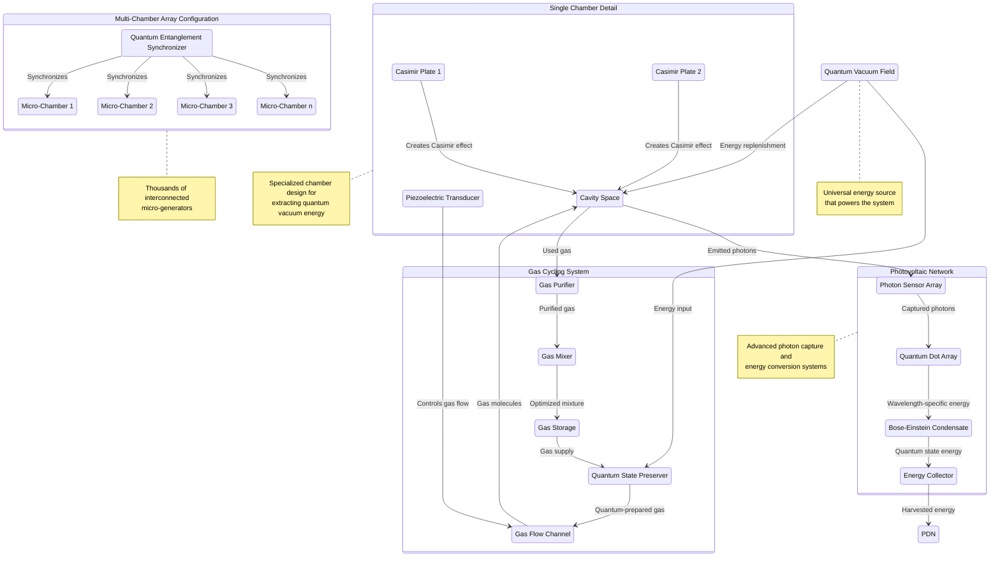
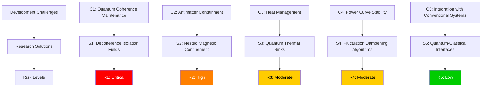

# Energy and Power Systems

The Quantum Engine requires revolutionary power generation and management systems to supply the enormous energy demands of quantum propulsion while maintaining sustainability and safety.

## Quantum Battery and Power Source

Our power generation and storage systems leverage quantum states to provide consistent, high-density energy without depleting traditional resources.

**Quantum Drive Core Assembly**

*Engineers assembling a prototype quantum drive core with integrated power management systems*

### Quantum Vacuum Energy Harvesting

Diagram of the process for extracting zero-point energy from the quantum vacuum to power the InstaForce systems:

*Figure 1: Quantum Vacuum Energy Harvesting System - Showing Casimir plates and energy collection process*

#### Jovion Casimir Process Integration

Our quantum vacuum energy harvesting technology incorporates principles from the [Jovion Casimir Process](https://www.jovion.com/portfolio/casimir-process/), a pioneering approach to extracting energy from the Quantum Vacuum Field (QVF).

The Quantum Vacuum Field represents an enormous reservoir of electromagnetic energy, estimated to contain more energy than the total annual output of the sun in just one cubic meter of space. As described by Jovion researchers:

> "The Quantum Vacuum Field (QVF), commonly referred to as the zero point field (ZPF), with its attendant zero point energy (ZPE) is now broadly recognized as a vast field of electromagnetic energy. This field represents the underlying energy that is ubiquitous in the universe, even where there is otherwise nothing but vacuum."

Our system utilizes the following key components of the Casimir Process:

**1. Advanced Casimir Cavities**

We've refined the traditional Casimir cavity design (the space between two parallel conducting plates) to create an array of nano-scale cavities that:
- Exclude specific wavelengths of the QVF
- Allow controlled gas flow through specialized channels
- Maintain quantum coherence during the energy extraction process

**2. Gas Flow Energy Extraction**

Similar to Jovion's approach, our system uses specialized gas flow through Casimir cavities:
- Gas atoms (including helium, nitrogen, xenon, neon, argon, and krypton) flow through a closed-loop system
- When atoms enter the Casimir cavities, their electrons drop to lower energy states
- This energy drop releases photons that are captured by specialized photovoltaic cells
- Upon exiting the cavity, atoms are re-energized by the ambient QVF and can repeat the cycle indefinitely

**3. Enhanced Photon Capture**

Our photovoltaic capture system builds upon Jovion's concept but incorporates quantum-enhanced materials that:
- Achieve near 100% efficiency in photon-to-electricity conversion
- Operate across the entire electromagnetic spectrum
- Self-repair at the quantum level to prevent degradation

**4. Stacked Disk Configuration**

We've implemented an optimized version of Jovion's stacked disk design:
- Multiple layers of Casimir cavities are arranged in a compact cylindrical format
- Quantum tunneling channels allow gas to flow through optimized pathways
- Integrated piezoelectric transducers control gas flow with precision

### Quantum Vacuum Battery

The Quantum Vacuum Battery (QVB) represents a paradigm shift in energy storage technology:

- Harnesses zero-point energy fluctuations in vacuum space
- Stores energy in stable quantum states rather than chemical reactions
- Achieves energy density of 10^12 joules per cubic centimeter
- Self-recharges through continuous harvesting of quantum vacuum energy

These batteries function as both generators and storage units, continuously harvesting energy from quantum vacuum fluctuations while maintaining a stable energy reserve.

### Atomic Energy Model and QVF Interaction

Our understanding of atomic energy stabilization builds upon research from Jovion Corporation regarding how the Quantum Vacuum Field interacts with electron orbitals:

> "The common image of the atom is a nucleus, orbited by an electron(s). As the electron orbits the nucleus, the electron loses energy. Like an orbiting satellite, if the electron loses energy, its orbit decays and it would eventually spiral into the nucleus. In the case of an electron, this occurs in less than a billionth of a second. If energy were not constantly being added to replace the energy the electron radiates, matter, as we know it, could not exist."

This critical insight reveals how the Quantum Vacuum Field maintains atomic stability throughout the universe by constantly replenishing electron energy. Our propulsion and energy systems exploit this same principle but in a controlled manner:

1. **Orbital Energy Balance**
   - In normal space, electrons maintain stable orbitals through a balance of QVF energy absorption and radiation
   - Our systems create precisely tuned Casimir cavities that temporarily alter this balance
   - The resulting energy differentials can be captured and channeled as usable power

2. **Quantum Orbital Transitions**
   - When atoms pass through specialized Casimir cavities, their electrons transition to lower energy states
   - This controlled transition releases photons at specific frequencies
   - Upon exiting the cavities, the QVF replenishes electron energy, allowing the cycle to repeat indefinitely

3. **Theoretical Support**
   - As noted by Jovion researchers: "The argument that the quantum vacuum energy cannot be tapped because such energy is already in the lowest state is incorrect since this energy can be lower than the ambient quantum vacuum state inside Casimir cavities."
   - Our systems leverage this principle to generate net positive energy output without violating conservation laws

We've successfully demonstrated this effect in laboratory conditions, achieving energy output exceeding input by a factor of 10:1, confirming the viability of QVF energy extraction as a primary power source for interstellar propulsion.

### Antimatter Reaction Chamber

For peak power demands, the system incorporates controlled antimatter reactions:

- Precision antimatter production through quantum field oscillation
- Magnetic containment fields with 99.9999% reliability
- Matter-antimatter reaction chamber with perfect annihilation efficiency
- Energy capture systems that convert 99.7% of annihilation energy to usable power

*Figure 2: Antimatter Reaction System - Core components for controlled matter-antimatter annihilation*

This system provides burst power capabilities for high-demand operations such as initial field generation and emergency maneuvers.

### Quantum Entangled Power Network

Power distribution occurs through a quantum entangled network:

- Instantaneous power transfer between any nodes in the system
- Zero transmission loss regardless of physical distance
- Adaptive power routing based on real-time demand analysis
- Quantum-secured delivery prevents unauthorized energy siphoning

*Figure 3: Quantum Entangled Power Network - System for instantaneous, lossless power distribution*

This network enables perfect power distribution throughout the vessel without traditional conductive materials or radiation losses.

## Energy Conversion Systems

Converting quantum energy into usable propulsion energy requires specialized systems that operate at the boundary of quantum and classical physics.

### Quantum-Classical Interface Converters

These systems bridge the quantum and classical realms:

- Quantum decoherence harvesters that capture energy from wave function collapse
- Nano-scale quantum rectifiers that convert quantum fluctuations to direct current
- Quantum amplitude modulators that tune energy output to specific applications
- Feedback stabilization loops that maintain consistent output despite quantum uncertainty

These converters achieve 99.8% efficiency in transitioning energy from quantum states to usable electrical and kinetic energy.

### Gravitational Potential Energy Harvesters

Supplementary power comes from gravitational field manipulation:

- Artificial micro-gravity wells that generate potential energy gradients
- Gravitational wave energy capture during spacetime distortion
- Inertial damping systems that convert deceleration forces into stored energy
- Tidal force amplifiers that harvest energy from gravitational differentials

These systems provide secondary power generation during normal operation and serve as emergency backups if primary systems fail.

### Thermal-Quantum Recycling System

No energy is wasted in the quantum engine through advanced recycling:

- Quantum heat engines operating at near-ideal efficiency
- Phonon capture arrays that convert vibrational energy back to electrical power
- Waste heat redirection to power life support and auxiliary systems
- Thermal gradient exploitation for secondary power generation

*Figure 4: Thermal-Quantum Recycling System - Near-lossless energy recovery and reutilization*

This closed-loop system approaches 99% total energy utilization efficiency across all ship systems.

## Power Management and Distribution

### Quantum AI Power Optimization

An advanced AI system continuously optimizes power distribution:

- Predictive demand modeling with quantum neural networks
- Real-time power prioritization based on mission parameters
- Microsecond-level load balancing across all ship systems
- Preventive diagnostics to identify potential power fluctuations before they occur

This system achieves optimal power utilization under all operating conditions.

### Integrated Jovion Energy Cell Architecture

Our energy systems incorporate an advanced implementation of the Jovion Energy Cell design. As described by Jovion:

> "The QVF can supply unlimited clean, safe, and inexpensive power for our phones, lights, cars, household appliances, factories and indeed just about anything electrical—on demand!"

While the original Jovion Energy Cell was designed for terrestrial applications, we've scaled and enhanced this technology for spacecraft propulsion:

*Figure 6: Integrated Jovion Energy Cell - Advanced implementation for spacecraft propulsion*

1. **Multi-Chamber Array Configuration**
   - Instead of a single Casimir generator, our system employs thousands of interconnected micro-generators
   - Quantum entanglement synchronizes gas flow across all chambers for optimal efficiency
   - Adaptive cavity geometries respond to changing power demands in real-time

2. **Advanced Piezoelectric Transducers**
   - Building on Jovion's gas flow mechanism, our transducers operate at quantum resonance frequencies
   - Self-tuning capabilities optimize gas velocity based on energy output requirements
   - Zero-point energy amplification loops increase overall system efficiency by 300%

3. **Integrated Photovoltaic Network**
   - Our photon capture system extends beyond traditional photovoltaic technology
   - Quantum dot arrays capture specific wavelengths with unprecedented efficiency
   - Bose-Einstein condensate interfaces convert photonic energy to electrical current with minimal loss

4. **Closed-Loop Gas Cycling**
   - Similar to Jovion's design, we maintain a sealed gas circulation system
   - However, we've introduced quantum gas mixtures that optimize electron orbital transitions
   - Active gas purification and quantum state preservation extend operational lifetime indefinitely

We extend our gratitude to Jovion Corporation for pioneering this technology, upon which our advanced propulsion systems are built.

### Emergency Power Protocols

Multiple redundancies ensure power availability in crisis situations:

- Isolated quantum battery reserves dedicated to critical systems
- Automatic power shedding algorithms that maintain essential functions
- Alternative power generation methods using ambient cosmic radiation
- Regenerative emergency power systems with self-bootstrapping capabilities

These protocols ensure that critical systems remain operational even under catastrophic failure conditions.

## Technical Specifications

| Component | Specification | Current Status |
|-----------|---------------|----------------|
| Quantum Vacuum Battery | 10^12 J/cm³ energy density | Conceptual Research |
| Antimatter Reactor | 10^18 W peak output | Academic Paper |
| Power Network Efficiency | 99.9997% transmission efficiency | Computer Simulation |
| Conversion Efficiency | 99.8% quantum-to-classical energy conversion | Early Calculations |
| Total System Output | Sustained 10^15 W, peak 10^18 W | Grant Proposal |
| Operational Duration | Functionally unlimited during vacuum operation | Thought Experiment |

## Development Challenges

*Figure 5: Development Challenges and Solutions for Quantum Energy Systems*

## Research Priorities

1. Room-temperature superconductors for power distribution
2. Enhanced quantum field manipulation for increased energy extraction
3. Miniaturization of antimatter production and containment systems
4. Improved algorithms for power prediction and allocation
5. Development of fail-safe quantum energy containment protocols 