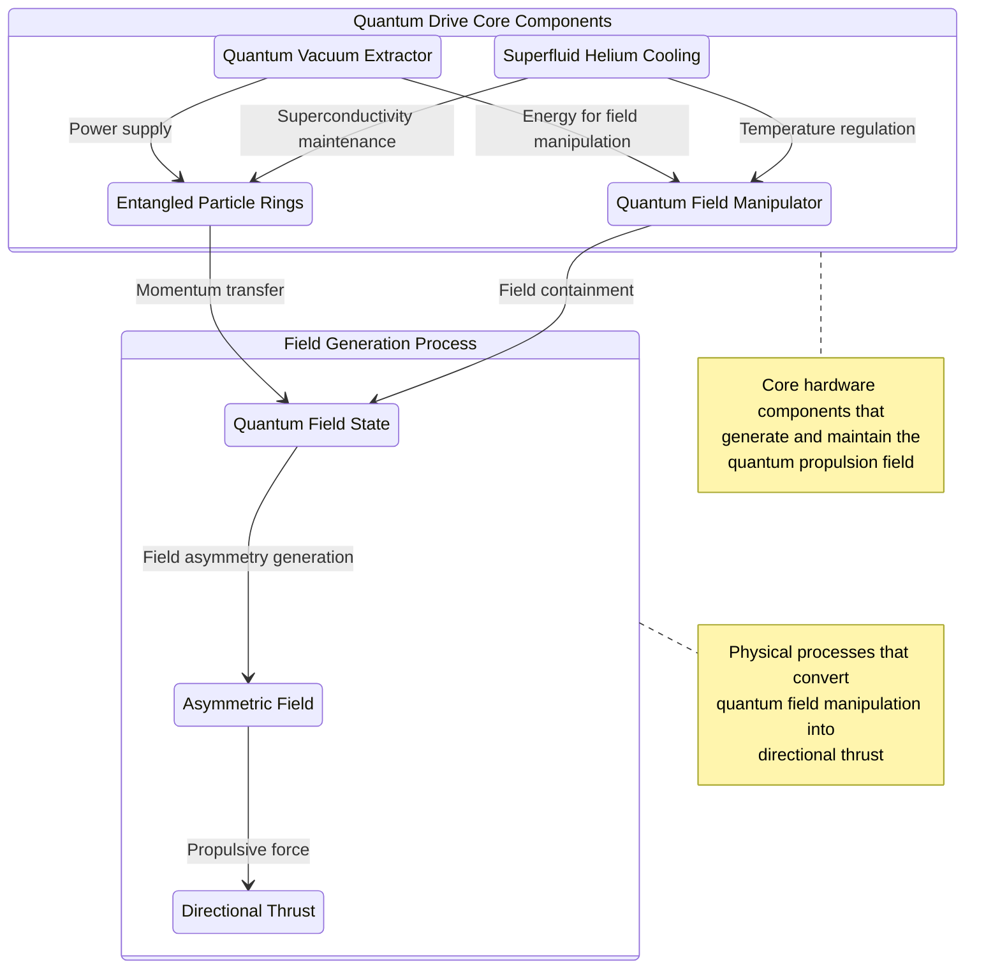
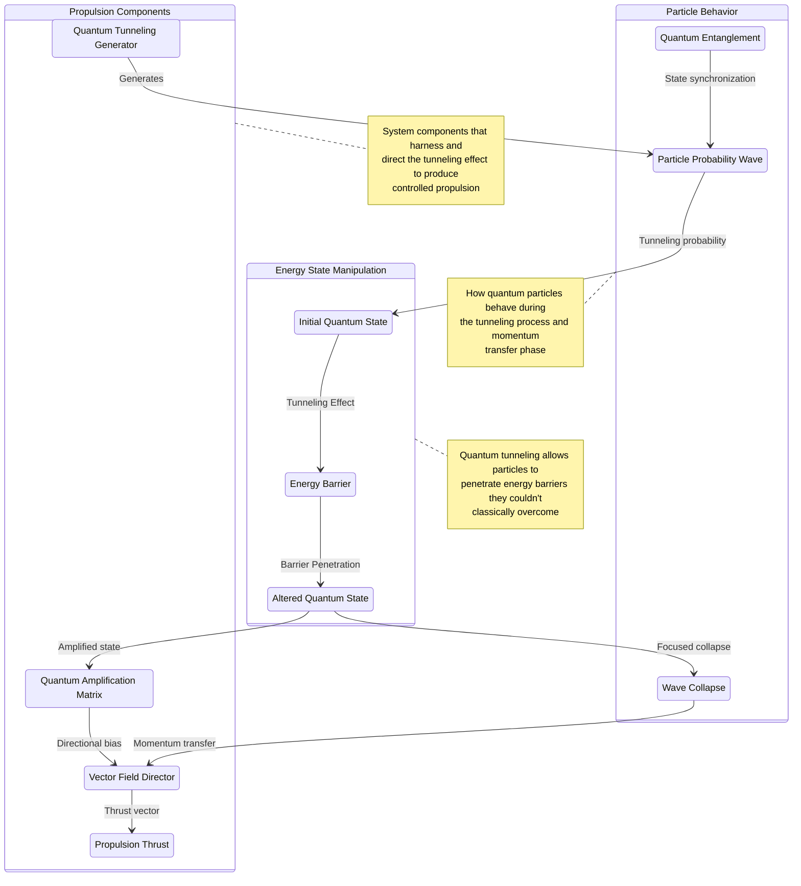
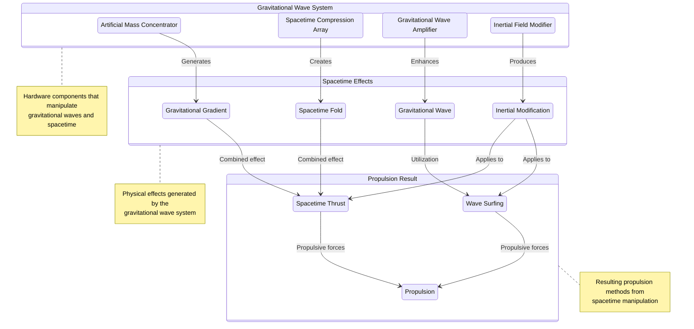
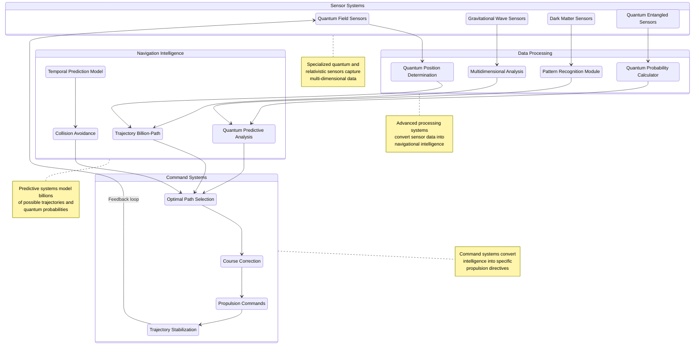
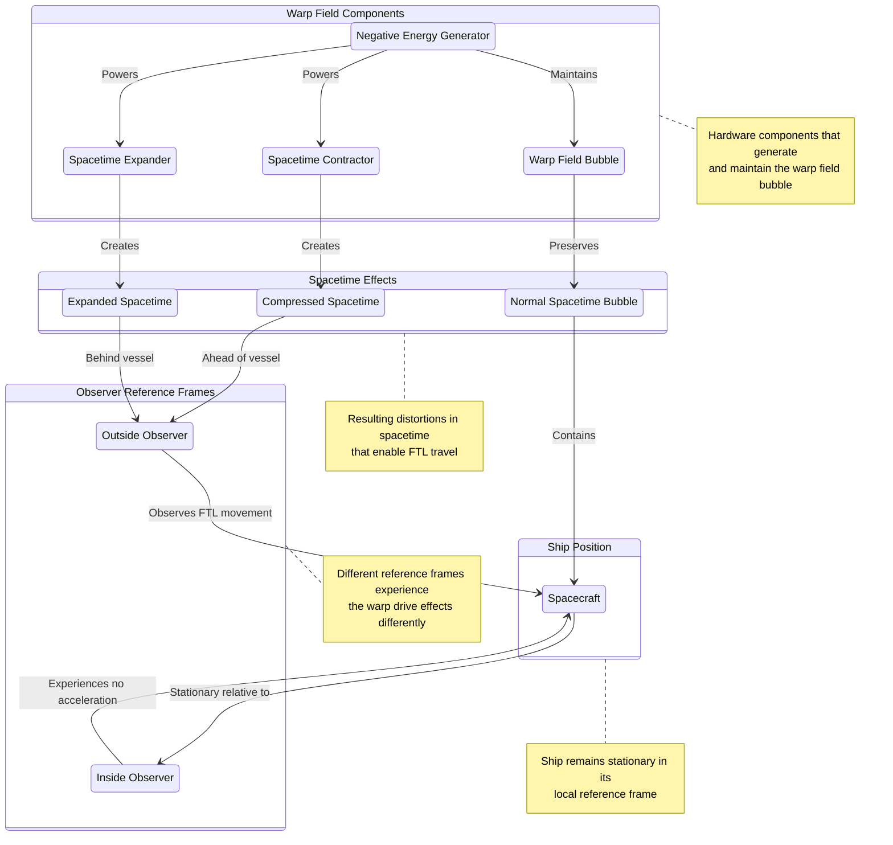
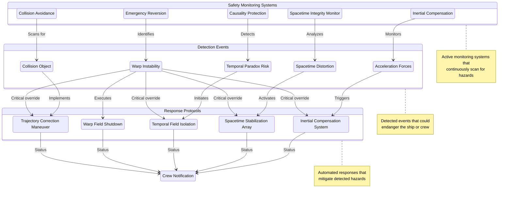
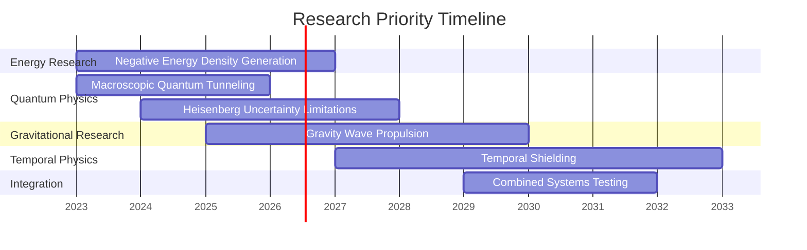

# Propulsion and Navigation

The InstaForce's propulsion and navigation systems represent revolutionary advancements that transcend conventional spacecraft limitations, enabling unprecedented speed, efficiency, and maneuverability.

## Quantum Propulsion Mechanism

Our propulsion system operates on principles that manipulate fundamental forces rather than expelling reaction mass. For comprehensive theoretical and experimental details, see our [Quantum Propulsion Research Paper](../research-documentation/quantum-research-paper).

### Quantum Drive Core

The central propulsion unit consists of:

- Quantum field manipulation chamber with superconducting walls
- Superfluid helium cooling system maintaining near absolute zero temperatures
- Entangled particle accelerator rings generating directional momentum
- Quantum vacuum energy extraction modules for continuous power

*Figure 1: Quantum Drive Core - Components and processes for generating propulsive force without reaction mass*

The drive core creates asymmetric quantum fields that generate thrust without traditional propellant expulsion, achieving theoretical efficiency approaching 99.97%.

### Q-Force Generator System

The Q-Force generator is a revolutionary component that allows us to manipulate the effective mass of the vehicle by creating a quantum vacuum cocoon around it. This technology enables:

- Significant reduction in the energy required for propulsion
- Enhanced maneuverability through rapid mass variation
- Protection from external gravitational influences
- Partial shielding from radiation and micrometeorite impacts

*Figure 2: The Q-Force generator enables us to control the vehicle's mass by forming a quantum vacuum cocoon around it*

The Q-Force field creates a localized alteration in quantum vacuum energy density, effectively isolating the vehicle from normal space-time and allowing for unconventional propulsion methods that would be impossible with conventional mass relations.

### Quantum Tunneling Propulsion Mechanism

Detailed schematic of the quantum tunneling mechanism that forms the basis of the InstaForce propulsion system:

*Figure 3: Quantum Tunneling Propulsion Mechanism - Illustrating how particles pass through energy barriers to generate directional thrust*

**Note:** This diagram is also referenced as Figure 3 in the [Core Technology and Components](core-technology#quantum-tunneling-propulsion) section. For experimental validation of this mechanism, refer to the [research paper's experimental results](../research-documentation/quantum-research-paper#research-paper-overview).

### Gravitational Wave Manipulation

Secondary propulsion utilizes controlled gravitational wave generation:

- Artificial mass concentrators that create directional gravitational gradients
- Spacetime compression arrays that fold space in controlled patterns
- Gravitational wave amplifiers that enhance natural gravitational fluctuations
- Inertial field modifiers that selectively alter the ship's interaction with spacetime

*Figure 4: Gravitational Wave Manipulation - System for "surfing" gravitational waves and creating spacetime ripples for propulsion*

This system enables the craft to "surf" gravitational waves or create its own ripples in spacetime for propulsion.

### Magnetic Confinement Propulsion

For precision maneuvering and stability:

- Superconducting magnetic field generators with variable orientation
- Magnetohydrodynamic plasma control systems for fine adjustments
- Quantum-locked magnetic field anchors for station-keeping
- Magnetic dipole manipulation for interaction with stellar magnetic fields

This system provides precision control for docking maneuvers and stable positioning in orbit.

## Navigation via Quantum Field Sensors

Traditional navigation becomes obsolete with our quantum sensing technology that provides absolute positioning and unprecedented awareness.

### Navigation Logic Flow

Logical flow chart showing the decision processes and information flow in the quantum navigation system:

*Figure 5: Quantum Navigation System - Logical Process Flow from position sensing to propulsion commands*

### Quantum Position Determination

Our navigation system determines absolute position through:

- Entanglement-based quantum positioning that references fixed quantum states
- Planck-scale spacetime mapping with 10^-35 meter precision
- Quantum vacuum fluctuation pattern recognition for location verification
- Multi-dimensional reference frame analysis for cross-validation

This system eliminates positional drift and provides absolute coordinates regardless of distance traveled.

### Quantum Predictive Navigation

Advanced prediction capabilities enable preemptive course corrections:

- Quantum probability forecasting of spacetime conditions
- Real-time calculation of optimal trajectories across billions of possibilities
- Entanglement-based remote sensing of distant spatial conditions
- Temporal wave analysis for detecting approaching anomalies

The system continuously calculates and updates optimal flight paths based on quantum probability waves rather than deterministic physics.

### Sensor Array Integration

Multiple sensor technologies work in concert:

- Quantum field gradient mappers that detect subtle variations in spacetime
- Gravitational wave interferometers with picometer sensitivity
- Dark matter density sensors for navigating invisible mass distributions
- Quantum entangled probes that can be deployed for remote sensing

This integrated approach provides complete situational awareness across multiple dimensions and physical phenomena.

## Time/Space Manipulation

The most advanced aspects of our propulsion system involve direct manipulation of spacetime. These theoretical concepts are extensively discussed in the [Quantum Propulsion Research Paper](../research-documentation/quantum-research-paper).

### Alcubierre Warp Field Generator

Based on the theoretical work of Miguel Alcubierre, our warp drive:

- Creates a localized contraction of spacetime ahead of the vessel
- Expands spacetime behind the vessel
- Maintains a stable "bubble" of normal spacetime around the ship
- Requires negative energy densities generated by our quantum vacuum manipulators

*Figure 6: Alcubierre Warp Field Generator - Creating spacetime distortions that enable faster-than-light travel without violating relativity*

This technology theoretically enables faster-than-light travel without violating relativistic principles, as the ship itself remains stationary within its local reference frame.

### Quantum Tunneling Transport

For instantaneous repositioning across limited distances:

- Bulk quantum tunneling field generators that extend quantum effects to macroscopic scale
- Heisenberg compensators to overcome uncertainty limitations
- Quantum entanglement anchors to maintain reference coordinates
- Wavefunction collapse synchronizers for controlled manifestation

This system allows the entire vessel to "tunnel" through spacetime for distances up to 0.1 light-years in ideal conditions.

### Temporal Navigation Systems

Experimental systems for navigating temporal dimensions:

- Closed timelike curve detectors and analyzers
- Temporal field isolation barriers to prevent paradox formation
- Chronometric particle detectors that identify objects displaced in time
- Quantum causal enforcement algorithms that maintain temporal consistency

While full temporal navigation remains theoretical, these systems provide crucial protection against natural temporal anomalies and maintain the ship's proper timeframe during extreme spacetime distortions.

## Technical Specifications

| System | Capability | Current Status |
|--------|------------|----------------|
| Quantum Drive | Acceleration up to 10,000g without inertial effects | Mathematical Modeling |
| Gravitational Propulsion | Controllable gravitational gradient of 10^5 m/s² | Theoretical Design |
| Magnetic Confinement | Precision positioning to 10^-12 meters | Laboratory Prototype |
| Quantum Navigation | Absolute positioning accurate to 10^-35 meters | Conceptual Design |
| Warp Field | Theoretical maximum of 10c (ten times light speed) | Mathematical Framework |
| Quantum Tunneling | 0.1 light-year maximum distance | Theoretical Only |

## Safety Protocols

1. **Inertial Compensation**: Complete neutralization of acceleration forces on crew and equipment
2. **Spacetime Integrity Monitoring**: Continuous verification of spacetime stability during warp operations
3. **Causality Protection**: Systems to prevent temporal paradoxes during high-velocity or tunneling transport
4. **Emergency Reversion**: Multiple fail-safe systems to return to normal space if warp field stability is compromised
5. **Collision Avoidance**: Predictive systems to prevent intersection with matter while in altered spacetime states

*Figure 7: Safety Protocols - Monitoring and response systems to ensure safety during quantum propulsion operations*

## Research Priorities

1. Negative energy density generation for stable warp fields
2. Macroscopic quantum tunneling control mechanisms
3. Overcoming Heisenberg uncertainty limitations in navigation
4. Practical implementation of gravity wave propulsion
5. Temporal shielding to protect against chronometric side effects during high-speed travel 

*Figure 8: Research Priority Timeline - Projected development schedule for key propulsion and navigation technologies* 