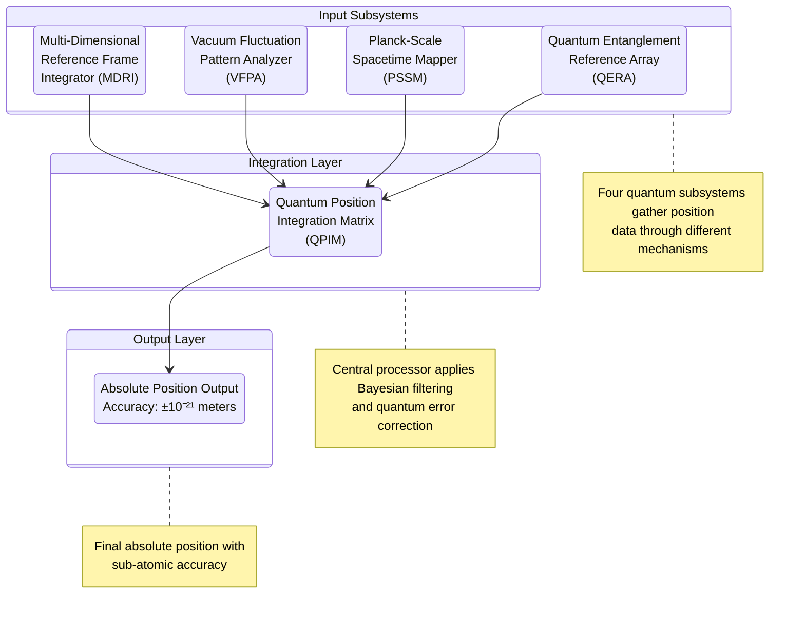
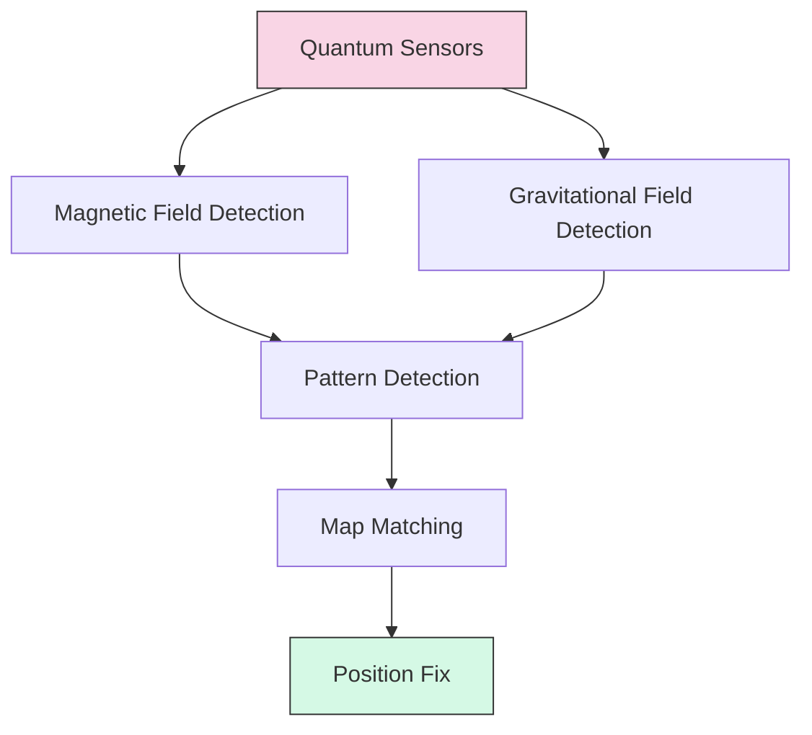

# Quantum Position Determination System (QPDS)

## Executive Summary

The Quantum Position Determination System (QPDS) represents a revolutionary advancement in navigation technology, transcending the limitations of conventional positioning systems. While traditional systems rely on relative measurements and are subject to cumulative errors, drift, and signal degradation, QPDS leverages the fundamental properties of quantum mechanics to establish absolute spatial coordinates with unprecedented precision.

By utilizing quantum entanglement, Planck-scale spacetime mapping, vacuum fluctuation patterns, and multi-dimensional reference frames, QPDS provides consistent sub-atomic positioning accuracy regardless of distance traveled or environmental conditions. This technology forms the backbone of the Azure Space Group navigation infrastructure, enabling precise deployment, coordination, and operations across both terrestrial and extraterrestrial environments.

## System Architecture

The QPDS comprises four integrated quantum-mechanical subsystems, each contributing a unique layer of positional data that, when synthesized, produces absolute spatial coordinates:

1. **Quantum Entanglement Reference Array (QERA)**
2. **Planck-Scale Spacetime Mapper (PSSM)**
3. **Vacuum Fluctuation Pattern Analyzer (VFPA)**
4. **Multi-Dimensional Reference Frame Integrator (MDRI)**

These subsystems operate simultaneously, cross-validating measurements and establishing an unbreakable positioning framework that exists independently of conventional spatial references.

### Quantum Entanglement Reference Array (QERA)

The QERA forms the foundation of the QPDS by utilizing quantum-entangled particles distributed throughout strategic reference points.

#### Operational Principles

- **Bell-State Reference Network**: The system maintains a network of entangled quantum bits (qubits) in specially prepared Bell states. When a measurement is performed on one qubit, the corresponding entangled qubit instantaneously reflects the complementary state, regardless of physical separation.

- **Entanglement Distribution**: Strategic "anchor points" throughout our operational region contain perfectly maintained entangled qubit arrays. Each Azure Space Group vessel carries corresponding entangled partners.

- **Non-Local Correlation Mapping**: By measuring the states of local entangled particles, the system instantaneously determines relative positions to multiple anchor points, creating a triangulation framework that operates independent of classical signal transmission.

- **Quantum State Preservation**: Advanced decoherence suppression technology maintains quantum states for extended periods, using recursive error correction algorithms and specialized containment fields.

#### Technical Specifications

- **Entangled Pair Count**: Each positioning array maintains 1012 entangled pairs
- **Quantum Coherence Duration**: 7,500 hours under field conditions
- **Measurement Rate**: 106 quantum state assessments per second
- **Position Fix Acquisition Time**: &lt;0.3 milliseconds
- **Baseline Positional Accuracy**: ±10-18 meters

### Planck-Scale Spacetime Mapper (PSSM)

The PSSM subsystem directly measures the fundamental structure of spacetime at the Planck scale (approximately 10-35 meters), providing absolute positioning against the universe's own fabric.

#### Operational Principles

- **Quantum Foam Detection**: Specialized sensors detect and analyze quantum foam variations—the minute fluctuations in spacetime itself that occur at the Planck scale.

- **Spacetime Topographical Mapping**: The system generates detailed maps of spacetime curvature and topology at quantum scales, identifying unique "fingerprints" in the universal fabric.

- **Invariant Reference Detection**: Certain quantum-gravitational structures remain invariant across space and time, providing fixed reference points against which absolute position can be determined.

- **Superposition Measurement**: By placing reference particles in quantum superposition across minute distances, the system measures spacetime intervals with precision far exceeding classical limitations.

#### Technical Specifications

- **Mapping Resolution**: 10-35 meters (approaching the Planck length)
- **Topological Feature Detection**: 99.9997% accuracy in unique feature identification
- **Scanning Range**: 500-meter radius at full resolution, 50-kilometer radius at reduced resolution
- **Reference Update Frequency**: 109 Hz
- **Computational Requirements**: 1015 operations per second

### Vacuum Fluctuation Pattern Analyzer (VFPA)

The VFPA subsystem leverages the inherent patterns in quantum vacuum fluctuations—the constant emergence and annihilation of virtual particles in supposedly "empty" space—to establish positional references.

#### Operational Principles

- **Virtual Particle Detection**: Highly sensitive detectors identify the momentary appearance of virtual particle pairs throughout the quantum vacuum.

- **Fluctuation Pattern Recognition**: Advanced algorithms recognize unique patterns in these vacuum fluctuations, which correlate to specific points in spacetime.

- **Casimir Configuration Mapping**: The system utilizes modified Casimir effect sensors to detect subtle variations in quantum vacuum energy density.

- **Heisenberg-Optimized Sampling**: Specially designed quantum sensors operate at the theoretical limits defined by the Heisenberg uncertainty principle to maximize measurement precision.

#### Technical Specifications

- **Detection Sensitivity**: Capable of registering virtual particles with lifespans of 10-43 seconds
- **Pattern Database Size**: 1018 unique quantum vacuum signatures
- **Signature Matching Speed**: 1012 pattern comparisons per second
- **Verification Confidence Level**: 99.9985%
- **Environmental Interference Rejection**: Effective in gravitational fields up to 350,000 times Earth gravity

### Multi-Dimensional Reference Frame Integrator (MDRI)

The MDRI provides the final layer of the QPDS, integrating data from additional dimensional frameworks beyond standard 3D space to further refine positional accuracy.

#### Operational Principles

- **Kaluza-Klein Dimension Sensing**: Detects and maps higher spatial dimensions predicted by string theory and Kaluza-Klein models, using their inherent properties as stable reference points.

- **Phase Space Mapping**: Plots position in the complete phase space, including momentum dimensions, providing a more comprehensive positional fix.

- **Quantum Phase Coordinate Extraction**: Measures the quantum phases of reference particles to extract additional coordinate information beyond classical positional values.

- **Reference Frame Transformation**: Seamlessly converts between multiple coordinate systems, including relativistic, quantum, and higher-dimensional frameworks.

#### Technical Specifications

- **Dimensional Planes Monitored**: 11 (aligning with M-theory predictions)
- **Reference Frame Update Rate**: 108 Hz
- **Transformation Accuracy**: ±10-21 meters across reference frames
- **Data Integration Latency**: &lt;50 nanoseconds
- **Computational Quantum States**: 1018 simultaneous states processed

## Integration and Synthesis

The true power of the QPDS emerges through the integration of all four subsystems. The Quantum Position Integration Matrix (QPIM) cross-correlates data from each component, applying advanced Bayesian filtering and quantum error correction to produce a final position determination with accuracy beyond what any single system could achieve.

```mermaid
stateDiagram-v2
    direction TB
    
    state "Input Subsystems" as Input {
        state "Quantum Entanglement<br/>Reference Array<br/>(QERA)" as QERA
        state "Planck-Scale<br/>Spacetime Mapper<br/>(PSSM)" as PSSM
        state "Vacuum Fluctuation<br/>Pattern Analyzer<br/>(VFPA)" as VFPA
        state "Multi-Dimensional<br/>Reference Frame<br/>Integrator (MDRI)" as MDRI
    }
    
    state "Integration Layer" as Integration {
        state "Quantum Position<br/>Integration Matrix<br/>(QPIM)" as QPIM
    }
    
    state "Output Layer" as Output {
        state "Absolute Position Output<br/>Accuracy: ±10⁻²¹ meters" as POS
    }
    
    %% Connection flow - all subsystems feed into QPIM
    QERA --> QPIM
    PSSM --> QPIM
    VFPA --> QPIM
    MDRI --> QPIM
    
    %% QPIM produces the final output
    QPIM --> POS
    
    note right of Input
        Four quantum subsystems gather position
        data through different mechanisms
    end note
    
    note right of Integration
        Central processor applies Bayesian filtering
        and quantum error correction
    end note
    
    note right of Output
        Final absolute position with
        sub-atomic accuracy
    end note
```

*Figure 1: System Integration Architecture - Showing how four quantum subsystems work together to determine absolute position*

### Cross-Validation Methodology

The QPDS employs a sophisticated cross-validation process:

1. **Primary Measurement**: QERA provides initial positional assessment
2. **Secondary Confirmation**: PSSM validates against physical spacetime structure
3. **Tertiary Verification**: VFPA confirms position through vacuum fluctuation patterns
4. **Quaternary Reference**: MDRI delivers final multi-dimensional validation

This redundancy ensures that positioning remains accurate even if one subsystem encounters interference or operational constraints.

## Operational Advantages

The QPDS provides several critical advantages over conventional positioning systems:

### Absolute Reference Framework

Unlike traditional systems that rely on relative measurements from satellites, beacons, or inertial tracking, QPDS establishes true absolute position within the universe. This eliminates the need for external references that may be unavailable in deep space or hostile environments.

### Drift Elimination

Traditional inertial navigation systems suffer from cumulative errors over time (drift). The QPDS continuously establishes fresh absolute positions, preventing error accumulation regardless of mission duration or distance traveled.

### Signal Independence

Conventional systems require signal transmission (radio, laser, etc.) which can be blocked, jammed, or delayed. QPDS operates independently of classical signal transmission, making it immune to:
- Electromagnetic interference
- Signal jamming
- Environmental attenuation
- Light-speed delays

### Stealth Operation

The QPDS generates no detectable emissions during normal operation, making it ideal for covert deployments. Position determination occurs entirely within the self-contained system without broadcasting signals that could reveal location.

### Universal Application

The system functions consistently across diverse environments:
- Planetary surfaces
- Underground/underwater
- Deep space
- Extreme gravitational fields
- Radiation zones
- Anomalous spacetime regions

## Technology Readiness Level Framework

The QPDS architecture represents a multi-decade development pathway. To ensure realistic execution, we have structured our approach around clear Technology Readiness Levels (TRL):

### TRL 3-4: Current Focus (2025-2027)
**Quantum Geophysical Navigation (QGN) Prototype**

This is our immediate, actionable focus with credible near-term delivery:

- **Technology**: SQUID magnetometer arrays + compact gravitational gradiometers + inertial measurement units
- **Approach**: Pattern-matching geophysical signatures (magnetic field, gravitational anomalies) against pre-mapped databases
- **Target Performance**: 10m CEP (Circular Error Probable), 10 Hz update rate, 50-100W power
- **Form Factor**: 30 × 30 × 15 cm (shoebox-sized unit)
- **Validation**: GPS-denied environments (urban canyons, tunnels, underground, underwater)

**Key Advantages**:
- Completely passive (no RF emissions, no detectability)
- Immune to GPS jamming/spoofing
- Functions in electromagnetically denied environments
- Independent operation without external infrastructure

**Critical Risks**:
- **Map Dependence**: Geophysical signatures drift due to infrastructure changes, ferrous clutter, geological shifts
  - *Mitigation*: Continuous map refresh pipelines; online adaptation algorithms; confidence-weighted matching; anomaly detection
- **Adversarial Environments**: Strong local magnets, heavy equipment EM noise, cluttered magnetic environments
  - *Mitigation*: Sensor diversity (gravity + magnetic + inertial fusion); spectral filtering; robust outlier rejection
- **Power & Size Creep**: Even near-term systems can exceed mobile platform constraints
  - *Mitigation*: Strict power budgets; ASIC/FPGA edge compute; duty-cycling modes; hierarchical sensing (wake lower-power sensors first)

### TRL 4-5: Next Phase (2027-2030)
**Quantum-Enhanced Inertial Navigation**

Building on QGN foundations, integrate quantum inertial sensors:

- **Atom Interferometry**: Cold-atom accelerometers for drift-free acceleration measurement
- **Quantum Gyroscopes**: Nuclear-spin or atom-based gyros eliminating mechanical drift
- **Entanglement-Enhanced Sensing**: Small-scale quantum correlations to beat classical sensor noise floors
- **Modular Fusion Architecture**: Plug-and-play sensor integration following QPIM (Quantum Position Integration Matrix) concept

**Target Improvement**: 1m CEP, 100 Hz update rate, reduced drift in signature-sparse regions

### TRL 6-7: Advanced Development (2030-2035)
**Hybrid Quantum Navigation**

- Combine QGN, quantum inertial systems, and limited-scale quantum entanglement
- Extend operation to extreme environments (deep underwater, polar regions, space-adjacent)
- Miniaturization and power optimization for UAV/maritime drone deployment

### TRL 8-9: Long-Term Vision (2035+)
**Full QPDS Architecture**

The complete four-subsystem stack (QERA, PSSM, VFPA, MDRI) remains our north star but requires fundamental physics breakthroughs:

- **Planck-Scale Mapping (PSSM)**: Detection at 10⁻³⁵ m is far beyond current instrumentation capabilities
- **Virtual Particle Detection (VFPA)**: 10⁻⁴³ second lifetimes exceed any existing measurement technology
- **11-Dimensional Integration (MDRI)**: Mathematical framework exists; physical sensing channels do not
- **Large-Scale Entanglement (QERA)**: 10¹² pairs with 7,500-hour coherence is orders of magnitude beyond fielded systems

These remain as research tracks and architectural placeholders, not execution constraints for the next 10 years.

## Technical Limitations and Constraints

### Near-Term QGN Limitations

- **Map Coverage**: Requires pre-mapped geophysical databases; performance degrades in unmapped or rapidly changing areas
- **Signature Strength**: Effectiveness varies with local geophysical distinctiveness (poor in magnetically quiet or gravitationally flat regions)
- **Update Latency**: 10 Hz vs. 1+ kHz for tactical-grade IMUs; requires sensor fusion for high-rate dynamics
- **Initial Convergence**: 30-60 second map-matching acquisition time from cold start
- **Environmental Sensitivity**: Performance degrades near strong EM sources, ferromagnetic structures, or during geomagnetic storms

### Full QPDS Limitations (Long-Term Vision)

- **Quantum Coherence Maintenance**: Requires periodic recalibration of entangled particle arrays (approximately every 7,500 hours)
- **Energy Requirements**: Peak power consumption reaches 35 MW during full-spectrum operation—**incompatible with mobile platforms** without strict mode management
- **Computational Demands**: Requires dedicated quantum processing arrays (10¹⁵ operations/second)
- **Reference Initialization**: Initial system calibration requires 3.5 minutes to establish complete quantum correlations
- **Environmental Extremes**: Performance degrades in proximity to singularities or in regions of extreme spacetime distortion

## Field Applications

### Military Deployment

The QPDS enables unprecedented tactical capabilities:
- Precise coordination of distributed force elements
- Navigation through signal-denied environments
- Pinpoint targeting regardless of environmental conditions
- Exact positioning during FTL transitions
- Covert insertion with minimal signature

### Scientific Research

Beyond military applications, QPDS technology has revolutionized scientific exploration:
- Mapping of spacetime anomalies with unprecedented detail
- Precise astronomical measurements independent of conventional reference frames
- Navigation through regions of distorted space
- Exact positioning for multi-dimensional physics experiments
- Precise measurement of relativistic effects

### Civilian Adaptations

Simplified derivatives of QPDS technology have been adapted for:
- Emergency response navigation in signal-denied environments
- Deep underground/underwater exploration
- Novel physics research
- Autonomous vehicle guidance in extreme conditions

## Power Management & Operational Modes

The QPDS architecture spans systems with vastly different power requirements—from the 50W near-term QGN prototype to the theoretical 35 MW full-spectrum system. Intelligent power management and operational mode switching are critical for mobile platform deployment.

### Operational Mode Framework

#### Mode 1: Sleep/Standby (QGN)
**Power**: 5-10W  
**Function**: Maintain sensor thermal stability; periodic wake checks  
**Use Case**: Vehicle parked; system on standby; ready for rapid wake

- SQUID array at minimal hold current
- Gradiometer in low-power monitoring mode
- IMU at reduced sample rate (1 Hz)
- Compute in suspend-to-RAM

**Wake Time**: &lt;5 seconds to Mode 2

#### Mode 2: Passive Navigation (QGN)
**Power**: 50-75W  
**Function**: Full geophysical signature sensing; map-matching; position fix at 10 Hz  
**Use Case**: Standard GPS-denied navigation; covert operations; continuous positioning

- SQUID array at full sensitivity (3-axis vector)
- Gradiometer active (differential gravity measurements)
- IMU at 100 Hz for motion compensation
- Edge compute running Bayesian fusion and map-matching at 10 Hz

**Accuracy**: 10m CEP  
**Transition**: Can sustain indefinitely on vehicle power; fallback to Mode 1 when stationary

#### Mode 3: High-Precision Mode (Future: Quantum-Enhanced)
**Power**: 200-500W  
**Function**: Integrate atom interferometry + quantum gyros; achieve 1m CEP  
**Use Case**: Precision targeting; high-value mission phases; final approach navigation

- All Mode 2 sensors active
- Cold-atom accelerometers engaged (requires cooling)
- Quantum gyroscopes active (magnetic shielding + lasers)
- Advanced sensor fusion (100 Hz update rate)

**Accuracy**: 1m CEP  
**Duration**: 15-30 minutes per engagement (thermal/power limited)  
**Transition**: Automatic fallback to Mode 2 after timeout or on command

#### Mode 4: Lab/Research Configuration (Full QPDS - Future)
**Power**: 1-35 MW (incompatible with mobile platforms)  
**Function**: All four quantum subsystems active (QERA, PSSM, VFPA, MDRI); sub-atomic positioning  
**Use Case**: Fixed laboratory installations; fundamental physics research; proof-of-concept validation

- Quantum entanglement arrays with cryogenic maintenance
- Planck-scale spacetime mappers (high-energy particle detection)
- Vacuum fluctuation analyzers (Casimir sensors)
- Multi-dimensional frame integrators (supercomputer-class processing)

**Accuracy**: 10⁻²¹ m (theoretical)  
**Deployment**: Fixed installations with dedicated power infrastructure only

### Mode Switching Logic

The system autonomously transitions between modes based on:

1. **Mission Phase**: Pre-programmed mode selection for different mission segments
2. **Power Availability**: Battery state-of-charge; generator capacity; thermal limits
3. **Accuracy Requirements**: Task-specific CEP needs (transit vs. precision engagement)
4. **Environmental Conditions**: Geophysical signature strength; EM interference levels
5. **Stealth Requirements**: Minimize power signature during covert phases

**Switching Latency**:
- Mode 1 ↔ Mode 2: &lt;10 seconds
- Mode 2 ↔ Mode 3: &lt;60 seconds (atom cooling/gyro spin-up)
- Emergency Mode 3 → Mode 2: &lt;5 seconds (instant sensor shutdown)

### Mobile Platform Integration

| Platform Type | Compatible Modes | Power Source | Typical Operating Mode |
|---------------|------------------|--------------|------------------------|
| **Infantry Portable** | Mode 1-2 only | Battery (BB-2590, 12V 15Ah) | Mode 2 during movement; Mode 1 when stationary |
| **Ground Vehicle** | Mode 1-3 | 28V DC vehicle power + APU | Mode 2 continuous; Mode 3 on-demand |
| **Maritime/Submarine** | Mode 1-3 | Ship power / battery banks | Mode 2 continuous; Mode 3 for precision navigation |
| **UAV/Drone** | Mode 1-2 (lightweight variant) | Onboard battery | Mode 2 only; duty-cycled to extend flight time |
| **Fixed Installation** | Mode 1-4 (research) | Grid power + UPS | Mode 2 operational; Mode 4 for R&D validation |

### Power Budget Example: Ground Vehicle Deployment

**Vehicle**: Tactical ground vehicle with 28V DC, 200A alternator (5.6 kW available)

| System Load | Power (W) | Duty Cycle | Average (W) |
|-------------|-----------|------------|-------------|
| QGN Sensors (Mode 2) | 75 | 100% | 75 |
| Edge Compute | 50 | 100% | 50 |
| Thermal Management | 25 | 60% | 15 |
| Data Logging | 10 | 100% | 10 |
| **Total QGN** | **160** | - | **150** |
| Reserve for Mode 3 | +350 | 10% | +35 |
| **Total Navigation** | **510** | - | **185** |

**Conclusion**: QGN Mode 2 consumes &lt;3% of available vehicle power; Mode 3 bursts fit within alternator capacity; no dedicated generator required.

## Commercial Productization Strategy

### Target Markets (Priority Order)

#### 1. GPS-Denied Navigation Kit (Defense & Industrial)
**Customer Profile**: Military, defense contractors, security agencies, critical infrastructure operators

**Value Proposition**:
- Completely passive operation (no RF signature for stealth/OPSEC)
- Immunity to GPS jamming, spoofing, and denial
- Independent operation in contested electromagnetic environments
- Covert insertion and navigation capabilities

**Applications**: Special operations, underground facility navigation, signal-denied urban operations, counter-UAS navigation

**Go-to-Market**: Direct sales to defense primes; integration with existing tactical navigation systems; SBIR/STTR funding pathways

#### 2. Maritime & Underwater Navigation
**Customer Profile**: Submarine operations, autonomous underwater vehicles (AUVs), harbor security, offshore energy

**Value Proposition**:
- GPS-independent navigation for submerged operations
- Geophysical signature exploitation (magnetic anomaly + gravity + bathymetry)
- Integration with existing INS/DVL (Doppler Velocity Log) systems
- Harbor-to-open-ocean-to-tunnel transit without GNSS dependency

**Applications**: Submarine navigation, AUV operations, harbor approach in EM-denied conditions, underwater infrastructure inspection

**Go-to-Market**: ONR (Office of Naval Research) partnerships; AUV manufacturers; offshore energy operators

#### 3. Underground & Mining Operations
**Customer Profile**: Mining companies, tunnel construction, cave rescue, underground infrastructure

**Value Proposition**:
- Reliable positioning where GPS is unavailable
- Safety enhancement for personnel tracking
- Equipment coordination in complex underground networks
- Real-time mapping updates

**Applications**: Mine navigation, tunnel boring machine guidance, emergency response, geotechnical monitoring

**Go-to-Market**: Mining industry associations; construction equipment manufacturers; emergency response agencies

### Product Roadmap

| Product | TRL | Target Market | Key Features | Timeline |
|---------|-----|---------------|--------------|----------|
| **QGN-1000 Prototype** | 3-4 | R&D/Validation | 10m CEP, 10 Hz, 50W, research-grade | Q2 2025 |
| **QGN-2000 Field Unit** | 5-6 | Defense/Maritime | 5m CEP, 20 Hz, ruggedized, API integration | Q4 2026 |
| **QGN-3000 Commercial** | 6-7 | Industrial/Mining | Cost-optimized, 10m CEP, simplified interface | Q2 2027 |
| **QEIN-1000 Enhanced** | 5-6 | Defense Advanced | 1m CEP, quantum inertial fusion, 100 Hz | Q4 2028 |

## 90-180 Day Action Plan

### Phase 1: Specification & Architecture (Days 1-30)

**Objective**: Freeze QGN v0.1 technical specifications and system architecture

**Deliverables**:
1. **QGN v0.1 System Requirements Document (SRD)**
   - Sensor selection and specifications (SQUID SKU, gradiometer model, IMU selection)
   - Power budget breakdown (target: 50W nominal, 75W peak)
   - Mechanical envelope (30 × 30 × 15 cm target)
   - Environmental operating ranges (temperature, vibration, EM interference)
   - Interface requirements (data formats, integration APIs)

2. **Sensor Fusion Architecture Design**
   - QPIM-inspired Bayesian fusion framework
   - Pluggable sensor modules (magnetic, gravitational, inertial)
   - Map-matching algorithms (correlation, ML-based feature matching)
   - Confidence scoring and uncertainty propagation

3. **Vendor Shortlist & Procurement**
   - SQUID magnetometers: Evaluate Tristan Technologies, QuSpin, STAR Cryoelectronics
   - Gradiometers: Survey Scintrex, Lockheed Martin, iMAR Navigation
   - Edge Compute: Evaluate NVIDIA Jetson, Intel Movidius, custom FPGA
   - Preliminary quotes and lead times

**Acceptance Criteria**:
- [ ] SRD reviewed and approved by technical team
- [ ] Architecture supports modular sensor swapping
- [ ] Vendor proposals received with cost and timeline estimates
- [ ] Power budget validates &lt;100W system-level target

### Phase 2: Geophysical Map Development (Days 15-60)

**Objective**: Generate baseline geophysical maps for pilot test areas

**Deliverables**:
1. **Pilot Area Selection**
   - Identify 3-5 test environments: urban canyon, tunnel network, indoor facility, maritime harbor, cave system
   - Define geographic boundaries and validation corridors

2. **Map Database Creation**
   - Magnetic field surveys (vector magnetometer, gradiometer surveys)
   - Gravitational anomaly mapping (portable gravimeter campaigns)
   - Terrain/bathymetry integration (LiDAR, sonar)
   - Map resolution targets: 5-10m grid spacing, 1-5 nT magnetic sensitivity, 0.1 mGal gravity

3. **Auto-Update Tooling**
   - Continuous map refresh pipeline architecture
   - Crowdsourced data integration (vehicle fleet sensors)
   - Change detection algorithms (drift monitoring)
   - Cloud storage and edge caching design

**Acceptance Criteria**:
- [ ] Baseline maps completed for at least 2 pilot areas
- [ ] Map quality metrics documented (coverage, resolution, accuracy)
- [ ] Update pipeline architecture documented and feasibility validated
- [ ] Map database accessible via API for fusion software

### Phase 3: Prototype Integration (Days 30-90)

**Objective**: Build QGN v0.1 hardware and sensor fusion software

**Deliverables**:
1. **Hardware Integration**
   - SQUID magnetometer array integration (3-axis, calibration)
   - Gradiometer mounting and alignment
   - IMU integration (6-DOF or 9-DOF)
   - Power management and thermal design
   - Data acquisition and preprocessing

2. **Fusion Software Development**
   - Bayesian filter implementation (Extended Kalman, Particle Filter, or Factor Graph)
   - Map-matching engine (cross-correlation, feature-based, ML classifier)
   - Sensor health monitoring and fault detection
   - Confidence scoring and position uncertainty output
   - Real-time performance optimization (target: 10 Hz @ &lt;500ms latency)

3. **Simulation & HITL Testing**
   - Physics-based sensor simulation with noise models
   - Hardware-in-the-loop (HITL) test rig with recorded field data
   - Monte Carlo validation against synthetic scenarios

**Acceptance Criteria**:
- [ ] Prototype operational with all sensors integrated
- [ ] Fusion software runs in real-time (10 Hz sustained)
- [ ] HITL testing demonstrates &lt;20m CEP in simulated GPS-denied scenario
- [ ] System power draw measured and within budget

### Phase 4: Field Validation (Days 60-180)

**Objective**: Validate QGN performance against GNSS/INS baselines in real-world environments

**Deliverables**:
1. **Test Campaign Execution**
   - Deploy prototype in pilot areas with ground-truth reference (RTK-GPS, surveyed waypoints)
   - Collect datasets across diverse conditions (day/night, weather, EM clutter)
   - Systematic coverage: static tests, walking speed, vehicle-mounted

2. **Performance Metrics Collection**
   - **CEP (Circular Error Probable)**: 50%, 90%, 95% position error circles
   - **Drift Curves**: Position error vs. time without GPS updates
   - **Reacquisition Time**: Time to regain position fix after map-matching failure or cold start
   - **Outage Robustness**: Performance during intentional EM interference, GPS jamming, or signature anomalies
   - **Update Rate Stability**: Achieved Hz vs. target, latency jitter

3. **Iteration & Optimization**
   - Analyze failure modes and edge cases
   - Refine map-matching algorithms based on field data
   - Sensor calibration improvements
   - Document lessons learned and design changes

4. **Public Documentation**
   - Test report with error budgets by environment
   - Performance comparison tables (QGN vs. GNSS vs. tactical INS)
   - Video demonstrations and recorded data logs (as OPSEC permits)
   - Conference paper or technical report submission

**Acceptance Criteria**:
- [ ] Minimum 50 hours of field test data collected across 3+ environments
- [ ] CEP ≤15m achieved in at least one pilot environment
- [ ] Drift rate documented and compared to tactical-grade INS
- [ ] Reacquisition time &lt;90 seconds from cold start
- [ ] Test report published and peer-reviewed

### Risk Register (90-180 Day Horizon)

| Risk | Probability | Impact | Mitigation |
|------|-------------|--------|------------|
| Sensor lead times exceed 90 days | Medium | High | Early procurement; backup vendors; rental options |
| Map quality insufficient for matching | Medium | High | Higher-resolution surveys; ML feature extraction; hybrid approach |
| Fusion algorithm convergence issues | High | Medium | Fallback to simpler methods; extensive HITL testing; expert consultation |
| Power budget exceeded | Medium | Medium | Duty-cycling; sensor downselect; optimize compute |
| Field access denied (security, weather) | Low | Medium | Backup test sites; indoor emulation; synthetic data validation |
| Team capacity constraints | High | Medium | Prioritize critical path; contractor support; phased delivery |

## Future Development (Beyond 180 Days)

Research and development continues to enhance QPDS capabilities in several promising directions:

- **Temporal Positioning**: Extending the system to provide absolute time references independent of relativistic effects
- **Remote Entanglement Refresh**: Technology to refresh quantum entanglement without physical access to reference stations (long-term research)
- **Miniaturization**: Reducing system size and energy requirements for deployment in UAVs, wearables, and portable equipment
- **Range Enhancement**: Extending effective operational range through hierarchical sensing and nested reference frames
- **Anomaly Penetration**: Improving performance in severe geophysical distortions or magnetically cluttered environments
- **AI-Powered Adaptation**: Self-learning algorithms that adapt to changing geophysical signatures and map drift in real-time

## Practical Implementation Path

While the full QPDS represents our ultimate goal, we have established a pragmatic development pathway based on current quantum sensing technologies. This approach enables incremental deployment of quantum positioning capabilities while working toward the complete system.

### Near-Term Implementation: Quantum Geophysical Navigation

Our first practical implementation leverages quantum sensors to detect Earth's natural geophysical signatures for navigation:

```mermaid
flowchart TD
    QS[Quantum Sensors] --> MFD[Magnetic Field Detection]
    QS --> GFD[Gravitational Field Detection]
    MFD --> PD[Pattern Detection]
    GFD --> PD
    PD --> MM[Map Matching]
    MM --> PF[Position Fix]
    
    style QS fill:#f9d5e5,stroke:#333,stroke-width:1px
    style PF fill:#d5f9e5,stroke:#333,stroke-width:1px
```

*Figure 2: Near-term quantum navigation implementation leveraging geophysical signatures*

#### Key Components

1. **Quantum Magnetometers**: Ultra-sensitive SQUID-based sensors detect minute variations in Earth's magnetic field with picotesla sensitivity.

2. **Gravitational Gradiometers**: Quantum sensors measure subtle changes in gravitational field strength and direction.

3. **Field Pattern Matching**: Advanced algorithms match detected field signatures against pre-mapped geophysical data.

4. **Edge Computing Systems**: Low-latency processing units perform real-time field analysis and position determination.

This approach provides critical advantages:
- Completely passive operation (no signal emissions)
- Immunity to GPS jamming and spoofing
- Functionality in electromagnetically denied environments
- Independent operation without external references

#### Technical Specifications

| Capability | Near-Term Target | Full QPDS Target |
|------------|------------------|------------------|
| Position Accuracy | 10 meters | 10-21 meters |
| Update Rate | 10 Hz | 109 Hz |
| Power Requirements | 50 watts | 35 MW |
| Size | 30 × 30 × 15 cm | Full vehicle integration |
| Environmental Limitations | Requires geophysical signatures | Universal operation |

For a detailed implementation plan and prototype specifications, see our [Prototype Designs and Concept Improvements](../research-documentation/prototype-designs) document, which outlines the development of our Quantum-Enhanced Inertial Navigation Unit (QEINU) and Spatial Frequency Mapping Device (SFMD).

### Medium-Term Enhancement: Quantum Inertial Systems

As our technology matures, we will integrate quantum sensing with advanced inertial systems:

- **Atom Interferometry**: Using cold atom interferometers to measure acceleration with unprecedented precision
- **Quantum Gyroscopes**: Leveraging nuclear spin to detect rotation without drift
- **Entanglement-Enhanced Sensors**: Using quantum entanglement to transcend classical measurement limits
- **AI-Powered Sensor Fusion**: Machine learning algorithms integrating multiple quantum sensing modalities

These enhancements will bridge the gap between near-term geophysical navigation and the full QPDS, extending capabilities to environments lacking Earth's geophysical signatures while improving accuracy by orders of magnitude.

## Summary

The Quantum Position Determination System represents a fundamental breakthrough in navigation technology, providing absolute positioning without the limitations of conventional systems. By leveraging the underlying structure of reality itself, QPDS ensures that Azure Space Group elements always know their exact position in the universe, regardless of conditions, distance traveled, or hostile countermeasures.

With our practical implementation pathway, we can deploy valuable quantum navigation capabilities in the near term while continuing development toward the complete QPDS vision.

This capability forms a critical foundation for our operational supremacy across all environments and mission parameters. 