# Quantum Position Determination System (QPDS)

## Executive Summary

The Quantum Position Determination System (QPDS) represents a revolutionary advancement in navigation technology, transcending the limitations of conventional positioning systems. While traditional systems rely on relative measurements and are subject to cumulative errors, drift, and signal degradation, QPDS leverages the fundamental properties of quantum mechanics to establish absolute spatial coordinates with unprecedented precision.

By utilizing quantum entanglement, Planck-scale spacetime mapping, vacuum fluctuation patterns, and multi-dimensional reference frames, QPDS provides consistent sub-atomic positioning accuracy regardless of distance traveled or environmental conditions. This technology forms the backbone of the Azure Space Group navigation infrastructure, enabling precise deployment, coordination, and operations across both terrestrial and extraterrestrial environments.

## System Architecture

The QPDS comprises four integrated quantum-mechanical subsystems, each contributing a unique layer of positional data that, when synthesized, produces absolute spatial coordinates:

1. **Quantum Entanglement Reference Array (QERA)**
2. **Planck-Scale Spacetime Mapper (PSSM)**
3. **Vacuum Fluctuation Pattern Analyzer (VFPA)**
4. **Multi-Dimensional Reference Frame Integrator (MDRI)**

These subsystems operate simultaneously, cross-validating measurements and establishing an unbreakable positioning framework that exists independently of conventional spatial references.

### Quantum Entanglement Reference Array (QERA)

The QERA forms the foundation of the QPDS by utilizing quantum-entangled particles distributed throughout strategic reference points.

#### Operational Principles

- **Bell-State Reference Network**: The system maintains a network of entangled quantum bits (qubits) in specially prepared Bell states. When a measurement is performed on one qubit, the corresponding entangled qubit instantaneously reflects the complementary state, regardless of physical separation.

- **Entanglement Distribution**: Strategic "anchor points" throughout our operational region contain perfectly maintained entangled qubit arrays. Each Azure Space Group vessel carries corresponding entangled partners.

- **Non-Local Correlation Mapping**: By measuring the states of local entangled particles, the system instantaneously determines relative positions to multiple anchor points, creating a triangulation framework that operates independent of classical signal transmission.

- **Quantum State Preservation**: Advanced decoherence suppression technology maintains quantum states for extended periods, using recursive error correction algorithms and specialized containment fields.

#### Technical Specifications

- **Entangled Pair Count**: Each positioning array maintains 1012 entangled pairs
- **Quantum Coherence Duration**: 7,500 hours under field conditions
- **Measurement Rate**: 106 quantum state assessments per second
- **Position Fix Acquisition Time**: &lt;0.3 milliseconds
- **Baseline Positional Accuracy**: ±10-18 meters

### Planck-Scale Spacetime Mapper (PSSM)

The PSSM subsystem directly measures the fundamental structure of spacetime at the Planck scale (approximately 10-35 meters), providing absolute positioning against the universe's own fabric.

#### Operational Principles

- **Quantum Foam Detection**: Specialized sensors detect and analyze quantum foam variations—the minute fluctuations in spacetime itself that occur at the Planck scale.

- **Spacetime Topographical Mapping**: The system generates detailed maps of spacetime curvature and topology at quantum scales, identifying unique "fingerprints" in the universal fabric.

- **Invariant Reference Detection**: Certain quantum-gravitational structures remain invariant across space and time, providing fixed reference points against which absolute position can be determined.

- **Superposition Measurement**: By placing reference particles in quantum superposition across minute distances, the system measures spacetime intervals with precision far exceeding classical limitations.

#### Technical Specifications

- **Mapping Resolution**: 10-35 meters (approaching the Planck length)
- **Topological Feature Detection**: 99.9997% accuracy in unique feature identification
- **Scanning Range**: 500-meter radius at full resolution, 50-kilometer radius at reduced resolution
- **Reference Update Frequency**: 109 Hz
- **Computational Requirements**: 1015 operations per second

### Vacuum Fluctuation Pattern Analyzer (VFPA)

The VFPA subsystem leverages the inherent patterns in quantum vacuum fluctuations—the constant emergence and annihilation of virtual particles in supposedly "empty" space—to establish positional references.

#### Operational Principles

- **Virtual Particle Detection**: Highly sensitive detectors identify the momentary appearance of virtual particle pairs throughout the quantum vacuum.

- **Fluctuation Pattern Recognition**: Advanced algorithms recognize unique patterns in these vacuum fluctuations, which correlate to specific points in spacetime.

- **Casimir Configuration Mapping**: The system utilizes modified Casimir effect sensors to detect subtle variations in quantum vacuum energy density.

- **Heisenberg-Optimized Sampling**: Specially designed quantum sensors operate at the theoretical limits defined by the Heisenberg uncertainty principle to maximize measurement precision.

#### Technical Specifications

- **Detection Sensitivity**: Capable of registering virtual particles with lifespans of 10-43 seconds
- **Pattern Database Size**: 1018 unique quantum vacuum signatures
- **Signature Matching Speed**: 1012 pattern comparisons per second
- **Verification Confidence Level**: 99.9985%
- **Environmental Interference Rejection**: Effective in gravitational fields up to 350,000 times Earth gravity

### Multi-Dimensional Reference Frame Integrator (MDRI)

The MDRI provides the final layer of the QPDS, integrating data from additional dimensional frameworks beyond standard 3D space to further refine positional accuracy.

#### Operational Principles

- **Kaluza-Klein Dimension Sensing**: Detects and maps higher spatial dimensions predicted by string theory and Kaluza-Klein models, using their inherent properties as stable reference points.

- **Phase Space Mapping**: Plots position in the complete phase space, including momentum dimensions, providing a more comprehensive positional fix.

- **Quantum Phase Coordinate Extraction**: Measures the quantum phases of reference particles to extract additional coordinate information beyond classical positional values.

- **Reference Frame Transformation**: Seamlessly converts between multiple coordinate systems, including relativistic, quantum, and higher-dimensional frameworks.

#### Technical Specifications

- **Dimensional Planes Monitored**: 11 (aligning with M-theory predictions)
- **Reference Frame Update Rate**: 108 Hz
- **Transformation Accuracy**: ±10-21 meters across reference frames
- **Data Integration Latency**: &lt;50 nanoseconds
- **Computational Quantum States**: 1018 simultaneous states processed

## Integration and Synthesis

The true power of the QPDS emerges through the integration of all four subsystems. The Quantum Position Integration Matrix (QPIM) cross-correlates data from each component, applying advanced Bayesian filtering and quantum error correction to produce a final position determination with accuracy beyond what any single system could achieve.

```mermaid
stateDiagram-v2
    direction TB
    
    state "Input Subsystems" as Input {
        state "Quantum Entanglement<br/>Reference Array<br/>(QERA)" as QERA
        state "Planck-Scale<br/>Spacetime Mapper<br/>(PSSM)" as PSSM
        state "Vacuum Fluctuation<br/>Pattern Analyzer<br/>(VFPA)" as VFPA
        state "Multi-Dimensional<br/>Reference Frame<br/>Integrator (MDRI)" as MDRI
    }
    
    state "Integration Layer" as Integration {
        state "Quantum Position<br/>Integration Matrix<br/>(QPIM)" as QPIM
    }
    
    state "Output Layer" as Output {
        state "Absolute Position Output<br/>Accuracy: ±10⁻²¹ meters" as POS
    }
    
    %% Connection flow - all subsystems feed into QPIM
    QERA --> QPIM
    PSSM --> QPIM
    VFPA --> QPIM
    MDRI --> QPIM
    
    %% QPIM produces the final output
    QPIM --> POS
    
    note right of Input
        Four quantum subsystems gather position
        data through different mechanisms
    end note
    
    note right of Integration
        Central processor applies Bayesian filtering
        and quantum error correction
    end note
    
    note right of Output
        Final absolute position with
        sub-atomic accuracy
    end note
```

*Figure 1: System Integration Architecture - Showing how four quantum subsystems work together to determine absolute position*

### Cross-Validation Methodology

The QPDS employs a sophisticated cross-validation process:

1. **Primary Measurement**: QERA provides initial positional assessment
2. **Secondary Confirmation**: PSSM validates against physical spacetime structure
3. **Tertiary Verification**: VFPA confirms position through vacuum fluctuation patterns
4. **Quaternary Reference**: MDRI delivers final multi-dimensional validation

This redundancy ensures that positioning remains accurate even if one subsystem encounters interference or operational constraints.

## Operational Advantages

The QPDS provides several critical advantages over conventional positioning systems:

### Absolute Reference Framework

Unlike traditional systems that rely on relative measurements from satellites, beacons, or inertial tracking, QPDS establishes true absolute position within the universe. This eliminates the need for external references that may be unavailable in deep space or hostile environments.

### Drift Elimination

Traditional inertial navigation systems suffer from cumulative errors over time (drift). The QPDS continuously establishes fresh absolute positions, preventing error accumulation regardless of mission duration or distance traveled.

### Signal Independence

Conventional systems require signal transmission (radio, laser, etc.) which can be blocked, jammed, or delayed. QPDS operates independently of classical signal transmission, making it immune to:
- Electromagnetic interference
- Signal jamming
- Environmental attenuation
- Light-speed delays

### Stealth Operation

The QPDS generates no detectable emissions during normal operation, making it ideal for covert deployments. Position determination occurs entirely within the self-contained system without broadcasting signals that could reveal location.

### Universal Application

The system functions consistently across diverse environments:
- Planetary surfaces
- Underground/underwater
- Deep space
- Extreme gravitational fields
- Radiation zones
- Anomalous spacetime regions

## Technical Limitations

While the QPDS represents a revolutionary advancement, certain constraints remain:

- **Quantum Coherence Maintenance**: Requires periodic recalibration of entangled particle arrays (approximately every 7,500 hours)
- **Energy Requirements**: Peak power consumption reaches 35 MW during full-spectrum operation
- **Computational Demands**: Requires dedicated quantum processing arrays
- **Reference Initialization**: Initial system calibration requires 3.5 minutes to establish complete quantum correlations
- **Environmental Extremes**: Performance degrades in proximity to singularities or in regions of extreme spacetime distortion

## Field Applications

### Military Deployment

The QPDS enables unprecedented tactical capabilities:
- Precise coordination of distributed force elements
- Navigation through signal-denied environments
- Pinpoint targeting regardless of environmental conditions
- Exact positioning during FTL transitions
- Covert insertion with minimal signature

### Scientific Research

Beyond military applications, QPDS technology has revolutionized scientific exploration:
- Mapping of spacetime anomalies with unprecedented detail
- Precise astronomical measurements independent of conventional reference frames
- Navigation through regions of distorted space
- Exact positioning for multi-dimensional physics experiments
- Precise measurement of relativistic effects

### Civilian Adaptations

Simplified derivatives of QPDS technology have been adapted for:
- Emergency response navigation in signal-denied environments
- Deep underground/underwater exploration
- Novel physics research
- Autonomous vehicle guidance in extreme conditions

## Future Development

Research continues to enhance QPDS capabilities in several promising directions:

- **Temporal Positioning**: Extending the system to provide absolute time references independent of relativistic effects
- **Remote Entanglement Refresh**: Technology to refresh quantum entanglement without physical access to reference stations
- **Miniaturization**: Reducing system size and energy requirements for deployment in smaller vehicles and portable equipment
- **Range Enhancement**: Extending effective range through nested entanglement hierarchies
- **Anomaly Penetration**: Improving performance in severe spacetime distortions

## Practical Implementation Path

While the full QPDS represents our ultimate goal, we have established a pragmatic development pathway based on current quantum sensing technologies. This approach enables incremental deployment of quantum positioning capabilities while working toward the complete system.

### Near-Term Implementation: Quantum Geophysical Navigation

Our first practical implementation leverages quantum sensors to detect Earth's natural geophysical signatures for navigation:

*Figure 2: Near-term quantum navigation implementation leveraging geophysical signatures*

#### Key Components

1. **Quantum Magnetometers**: Ultra-sensitive SQUID-based sensors detect minute variations in Earth's magnetic field with picotesla sensitivity.

2. **Gravitational Gradiometers**: Quantum sensors measure subtle changes in gravitational field strength and direction.

3. **Field Pattern Matching**: Advanced algorithms match detected field signatures against pre-mapped geophysical data.

4. **Edge Computing Systems**: Low-latency processing units perform real-time field analysis and position determination.

This approach provides critical advantages:
- Completely passive operation (no signal emissions)
- Immunity to GPS jamming and spoofing
- Functionality in electromagnetically denied environments
- Independent operation without external references

#### Technical Specifications

| Capability | Near-Term Target | Full QPDS Target |
|------------|------------------|------------------|
| Position Accuracy | 10 meters | 10-21 meters |
| Update Rate | 10 Hz | 109 Hz |
| Power Requirements | 50 watts | 35 MW |
| Size | 30 × 30 × 15 cm | Full vehicle integration |
| Environmental Limitations | Requires geophysical signatures | Universal operation |

For a detailed implementation plan and prototype specifications, see our [Prototype Designs and Concept Improvements](../research-documentation/prototype-designs) document, which outlines the development of our Quantum-Enhanced Inertial Navigation Unit (QEINU) and Spatial Frequency Mapping Device (SFMD).

### Medium-Term Enhancement: Quantum Inertial Systems

As our technology matures, we will integrate quantum sensing with advanced inertial systems:

- **Atom Interferometry**: Using cold atom interferometers to measure acceleration with unprecedented precision
- **Quantum Gyroscopes**: Leveraging nuclear spin to detect rotation without drift
- **Entanglement-Enhanced Sensors**: Using quantum entanglement to transcend classical measurement limits
- **AI-Powered Sensor Fusion**: Machine learning algorithms integrating multiple quantum sensing modalities

These enhancements will bridge the gap between near-term geophysical navigation and the full QPDS, extending capabilities to environments lacking Earth's geophysical signatures while improving accuracy by orders of magnitude.

## Summary

The Quantum Position Determination System represents a fundamental breakthrough in navigation technology, providing absolute positioning without the limitations of conventional systems. By leveraging the underlying structure of reality itself, QPDS ensures that Azure Space Group elements always know their exact position in the universe, regardless of conditions, distance traveled, or hostile countermeasures.

With our practical implementation pathway, we can deploy valuable quantum navigation capabilities in the near term while continuing development toward the complete QPDS vision.

This capability forms a critical foundation for our operational supremacy across all environments and mission parameters. 