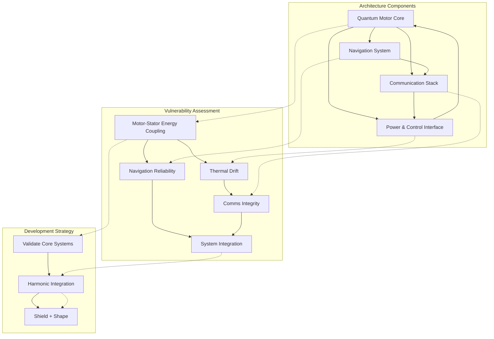

# System Dissection and Developmental Strategy

## System Architecture Overview

Our quantum propulsion framework integrates these key components:

- **Quantum motor core** (Casimir-based, zero-point dynamic, or magneto-electrodynamic drive)
- **Navigation system** (inertial with quantum gyros hybridization)
- **Communication stack** (optical, RF, or quantum-entangled packet transfer)
- **Power & Control interface** (thermal management, oscillation regulation, harmonics dampening)

## Vulnerability Assessment

### Key chokepoints to audit:

#### Motor-Stator Energy Coupling
- Is your vacuum oscillation symmetrical?
- Have you mitigated Lorentz force feedback or magnetic shear instability?
- Are Casimir cavity boundaries resistive or superconductive?

#### Thermal Drift & Vibrational Interference
- CLOAK-type interface stabilization may apply here
- Thermal decoherence represents functional death in any quantum system
- Consider diamond lattice phonon insulators or zero-point capacitive suppression

#### Navigation Reliability
- Are you shielded from magnetic/EM interference in gyros?
- Did you integrate atomic-clock syncing or quantum-locked navigation (QLN)?

#### Communications Integrity
- Standard RF systems are traceable; quantum channels may offer immunity
- Audit for packet decay, entanglement fidelity, and phase error rates under motion

#### System Integration Failure
- Cross-domain EM interference between motor and navigation systems
- Timing jitter in command processors — eliminate via optical bus or photonic CPU mesh

## Development Strategy

Our three-phase development approach ensures systematic validation and integration:

### Phase 1: Validate Core Systems in Isolation
- Emulate closed-loop operation of quantum motor in inert environment (no other system load)
- Log thermal, vibrational, and power fluctuations

### Phase 2: Harmonic Integration Testing
- Introduce navigation and communication layers
- Look for cross-coupling via EM harmonics, feedback latency, and entropic leakage
- Run coherence preservation tests under simulated motion

### Phase 3: Shield and Shape for Field Deployment
- Build Faraday-level isolation cage for internal EM control
- Use bio-mimetic resonance shaping (REBAL concept from Gateway) to distribute harmonics
- Consider embedding a dynamic resonance modulator — smart materials that adjust reflectivity based on feedback

*Figure 1: System Architecture, Vulnerability Map, and Development Strategy Integration*

## Research and Development Tools

The following research approaches are critical to our development process:

- **Historical Analysis**: Study known zero-point drives (Podkletnov, Searl, Schauberger) to reveal technology patterns and avoid repeating failures
- **Comparative Audit**: Examine nav/comm weak points in existing aerospace platforms to strengthen our designs
- **Technical Blueprint Generation**: Create hybrid shielding systems optimized for quantum stability
- **Patent Research**: Review quantum motor patents (US/JP/EU) for critical insights from established research

## Integration with Existing Systems

The system dissection approach complements our other quantum technologies:

1. **Quantum Vacuum Energy Harvesting**: Ensuring motor-stator coupling is optimized for energy efficiency
2. **Quantum Position Determination**: Enhancing navigation reliability through improved shielding
3. **Quantum Entanglement Networks**: Implementing secure communications immune to external interference
4. **Thermal Management**: Applying diamond lattice phonon insulators to critical components

## Technical Specifications

| System Component | Vulnerability | Mitigation Strategy | Development Phase |
|------------------|--------------|---------------------|-------------------|
| Quantum Motor Core | Asymmetrical vacuum oscillation | Lorentz force dampening | Phase 1 |
| Casimir Cavity Boundaries | Superconductive disruption | Resistive boundary layer | Phase 1 |
| Navigation Gyros | EM interference | Quantum-locked navigation | Phase 2 |
| Communication System | Packet decay | Entanglement fidelity monitors | Phase 2 |
| System Integration | Cross-domain interference | Optical bus isolation | Phase 3 |
| Field Deployment | Environmental disruption | Bio-mimetic resonance shaping | Phase 3 |

## Research Priorities

1. Diamond lattice phonon insulator fabrication techniques
2. Quantum-locked navigation (QLN) integration protocols
3. Photonic CPU mesh architecture for command processing
4. Bio-mimetic resonance shaping implementation
5. Dynamic resonance modulator materials research 