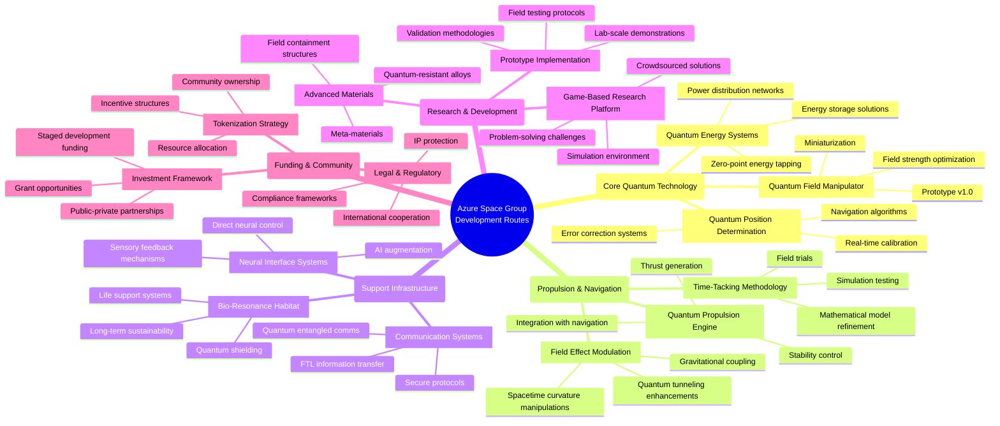

# Azure Space Group Development Roadmap

This mind map outlines our strategic development pathways, highlighting the interconnected technologies and research directions that will guide our progress.

## Development Priorities

Our immediate development focuses are:

1. **Quantum Field Manipulator (QFM)** - The cornerstone technology that enables manipulation of quantum fields for propulsion and navigation
2. **Bio-Resonance Habitat Systems** - Creating sustainable living environments for long-duration space missions
3. **Game-Based Research Platform** - Leveraging collective intelligence to solve complex engineering challenges

## Timeline Projections

| Development Phase | Target Completion | Key Deliverables |
|-------------------|-------------------|------------------|
| Conceptual Design | Q4 2025 | Complete theoretical models, simulation results |
| Prototype Alpha | Q2 2026 | Functional lab-scale QFM demonstrator |
| Prototype Beta | Q4 2026 | Integrated propulsion-navigation test platform |
| Field Testing | Q2 2027 | Suborbital flight demonstrations |
| Full Integration | Q4 2027 | Complete system with habitat integration |

## How to Contribute

We welcome contributions across all development pathways. See our [Contributing Guide](/docs/contributing) for details on how to get involved. 