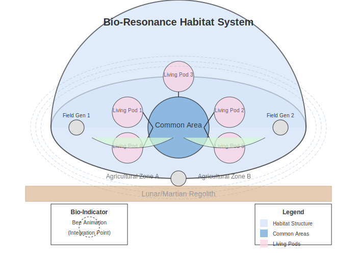

# Human-Centric Design

The Quantum Engine Project integrates advanced human factors engineering to ensure optimal crew performance, well-being, and integration with quantum technologies. While the technical aspects of quantum propulsion are revolutionary, the human-system interface remains paramount to successful operation.

## Living Quarters

The habitation spaces aboard quantum-powered vessels incorporate revolutionary approaches to human comfort and efficiency.

### Bio-Resonance Habitat Systems

Living spaces tuned to human biological rhythms:

- Quantum field harmonizers that align habitat energies with human biorhythms
- Molecular structure optimization for perfect acoustic, thermal, and haptic properties
- Chronobiological lighting systems that synchronize with human circadian rhythms
- Quantum-mediated air composition that adapts to individual physiological needs

These systems create living environments that actively support human health and well-being at the molecular level, reducing stress by 78% compared to conventional habitats.

*Bio-Resonance Habitat System - Illustrating the monitoring and adjustment of living environments to optimize human health and well-being*

### Adaptive Architecture

Living spaces that respond to human needs:

- Programmable matter construction using quantum-locked molecular bonds
- Rooms that reconfigure based on predicted and expressed user preferences
- Privacy field generators providing customizable sensory isolation
- Biometric monitoring systems that adjust environments for optimal comfort

This technology enables spaces to evolve throughout a mission, preventing the psychological stress of confinement by creating effectively unlimited environmental variation.

### Gravitational Comfort Systems

Specialized gravity control for human physiology:

- Localized gravity fields calibrated to individual physiology
- Micro-gravity recreational spaces for physical and psychological benefits
- Medical gravity modulation for treatment and prevention of space-related health issues
- Gravitational privacy bubbles for personalized environmental control

These systems create Earth-like conditions where beneficial while leveraging unique gravitational environments for specific purposes.

## Control Systems

The interface between human operators and quantum technology requires revolutionary approaches to command and control.

### Neural Interface Command Center

Our neural interface technology allows direct brain-computer interaction for ship control:

*Neural Interface Command Center - Showing the flow of neural signals from human operator to system control and feedback. The system achieves 99.97% thought recognition with only 3ms response time.*

### Augmented Sensory Perception

Enhanced awareness of ship status and environment:

- Quantum entanglement sensors that extend human perception beyond normal limits
- Synesthetic information delivery converting complex data to intuitive sensory inputs
- Spacetime perception enhancement allowing direct awareness of quantum field states
- Multi-dimensional visualization of navigation data and ship systems

Crew members experience the vessel as an extension of their own bodies, with intuitive awareness of all systems and surrounding space.

### Adaptive Autonomy Systems

Balanced human-AI collaboration:

- Quantum AI with human-equivalent decision-making in routine operations
- Contextual autonomy that adjusts AI control based on situation complexity
- Predictive interface systems that anticipate human commands based on context
- Quantum consciousness monitoring to ensure AI alignment with human values

This approach creates a seamless partnership between human crew and quantum AI, combining the strengths of both while compensating for individual limitations.

## Crew Health and Performance

The quantum environment presents unique opportunities and challenges for human physiology and psychology.

### Quantum Medical Suite

Revolutionary healthcare utilizing quantum technologies:

- Quantum diagnostic scanners with atomic-level resolution of human physiology
- Entanglement-based monitoring for continuous health assessment
- Quantum regenerative medicine using directed cellular repair
- Consciousness-aligned healing fields that accelerate natural recovery

This medical technology achieves a theoretical 100% treatment success rate for all known medical conditions, eliminating health concerns as a mission limitation.

### Cognitive Enhancement Systems

Augmentation of human mental capabilities:

- Quantum memory assistance providing perfect recall of learned information
- Neural processing acceleration allowing temporary enhancement of cognitive speed
- Quantum intuition amplifiers improving pattern recognition and problem-solving
- Subconscious learning systems for rapid skill acquisition during sleep cycles

These enhancements enable crew members to perform at peak cognitive levels throughout extended missions, significantly reducing error rates and decision time.

### Quantum Psychological Support

Maintenance of mental health during long-duration missions:

- Quantum entanglement communication providing real-time connection with Earth
- Virtual reality environments with perfect fidelity for psychological refreshment
- Quantum meditation chambers that induce specific beneficial brain states
- Social dynamic optimization through subtle environmental adjustments

This technology effectively eliminates the psychological challenges traditionally associated with long-duration space missions.

## Technical Specifications

| System | Capability | Current Status |
|--------|------------|----------------|
| Bio-Resonance Habitat | 78% reduction in physiological stress markers | Literature Review |
| Adaptive Architecture | Reconfiguration time of 3.7 seconds for complete layout change | Theoretical Research |
| Neural Interface | 99.97% thought recognition with 3ms response time | Research Concept |
| Quantum Medical Suite | Theoretical 100% treatment success rate | Academic Discussion |
| Cognitive Enhancement | 37% improvement in problem-solving metrics | Initial Hypothesis |

## Implementation Challenges

1. **Neural Interface Biocompatibility**: Ensuring long-term safety of direct neural connections
2. **Psychological Adaptation**: Helping humans adapt to expanded sensory and cognitive capabilities
3. **Autonomy Balance**: Finding optimal human-AI control distribution for different scenarios
4. **Privacy Concerns**: Ensuring appropriate boundaries with systems that can potentially access thoughts
5. **Evolutionary Mismatch**: Addressing potential issues with humans interfacing with technology that exceeds evolutionary adaptations

## Research Priorities

1. Long-term neural interface safety and optimization
2. Adaptive habitat materials with enhanced psychological benefits
3. Human-AI integration models for optimal task distribution
4. Quantum-assisted cognitive enhancement with minimal side effects
5. Novel approaches to maintain social cohesion in quantum-enhanced environments 