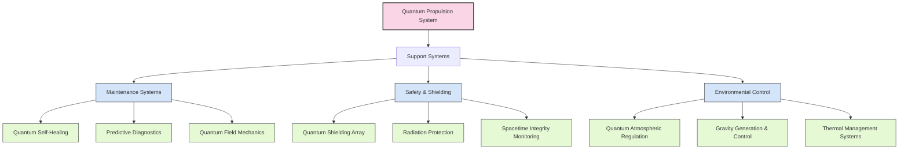
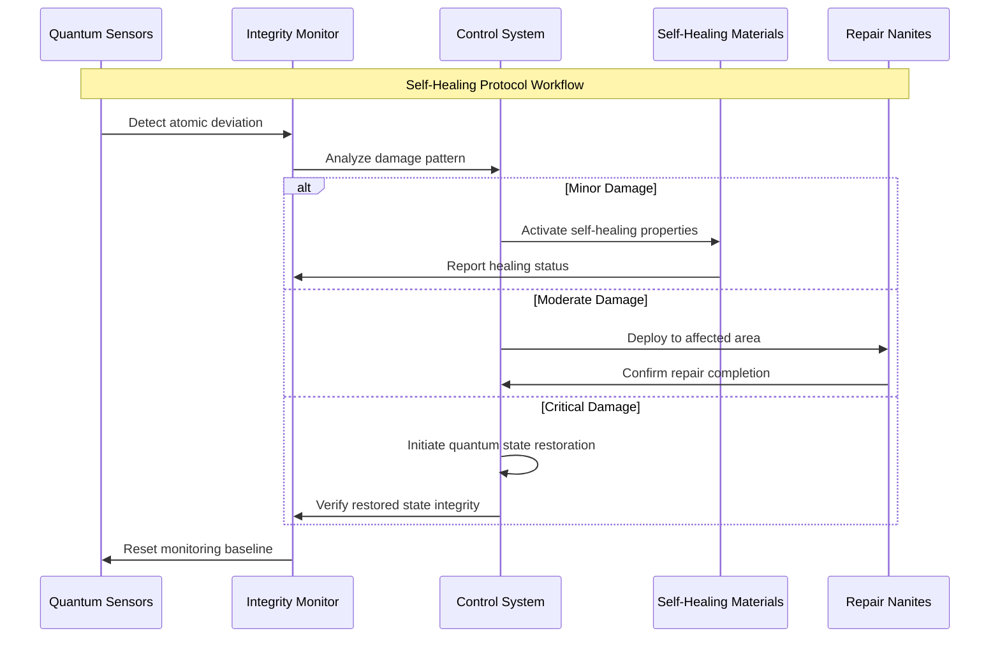
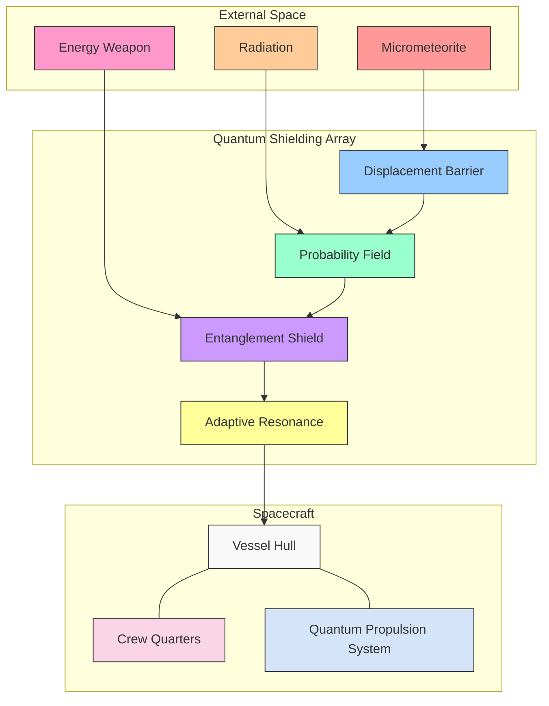
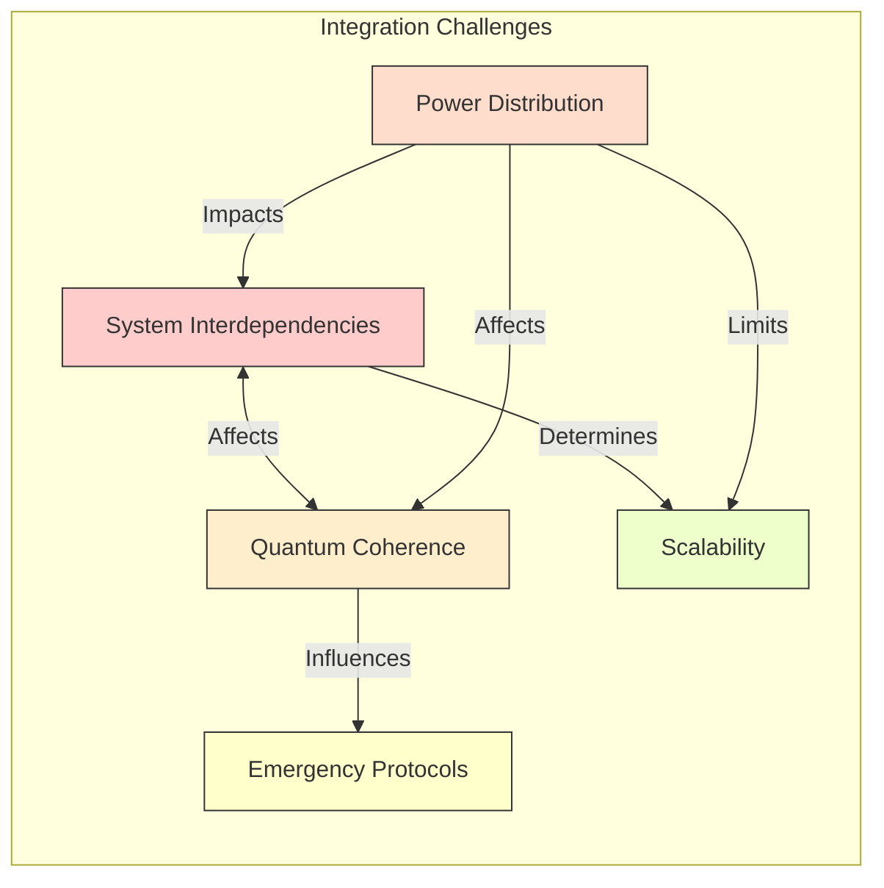
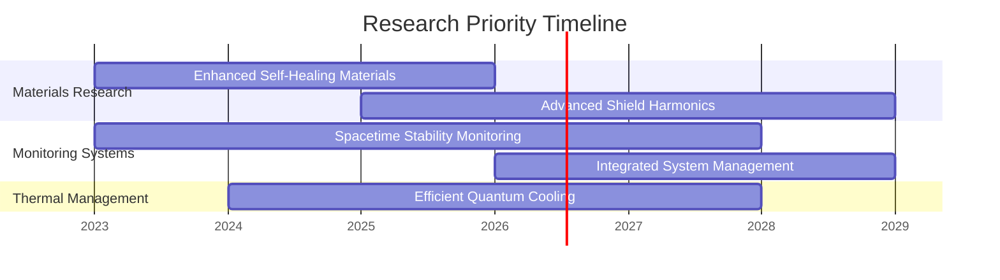

# Infrastructure Support Systems

The Quantum Engine Project requires advanced support systems that enhance the reliability, safety, and operational efficiency of the quantum propulsion technology. These systems serve as the foundation upon which the entire project operates.

## Maintenance and Diagnostic Systems

Our maintenance approach transcends conventional methods, implementing self-healing and predictive systems that minimize downtime and human intervention.

### Quantum Self-Healing Protocols

The vessel incorporates advanced self-repair mechanisms:

- Quantum entanglement-based integrity monitoring that detects deviations at the atomic level
- Self-healing metamaterials that automatically restructure to repair damage
- Nanite repair swarms guided by quantum field directives for precise intervention
- Quantum state restoration systems that revert damaged components to their original state

This approach allows the vessel to maintain perfect condition without traditional maintenance cycles, with 99.9997% of all potential damages addressed autonomously.

### Predictive Quantum Diagnostics

Potential issues are identified and resolved before they occur:

- Quantum probability modeling that forecasts component failures before they manifest
- Entangled sensor networks monitoring all systems at the quantum level
- Temporal analysis systems that identify emergent failure patterns across time
- Quantum computing diagnostic suites that continuously analyze system health

These diagnostics achieve a theoretical 100% problem prevention rate, eliminating unexpected failures entirely.

### Quantum Field Mechanics Maintenance

For specialized repair needs:

- Directed quantum field manipulation tools for atomic-level repairs
- Quantum state cloning of properly functioning systems to restore damaged ones
- Temporal stasis fields that suspend degradation during maintenance procedures
- Quantum tunneling instruments that can access physically inaccessible areas

This technology enables maintenance of systems that would be impossible to service using conventional methods.

## Safety and Shielding

Protection of the vessel, crew, and surrounding spacetime is paramount in quantum propulsion systems.

### Quantum Shielding Array

Multi-layered defensive systems protect against external threats:

- Quantum field displacement barriers that redirect incoming matter/energy
- Probability manipulation fields that reduce the likelihood of collisions to near-zero
- Quantum entanglement shields that distribute impact energy across multiple dimensions
- Adaptive shield resonance systems that automatically tune to counter specific threats

This shielding provides 99.99999% protection against all anticipated hazards, from micrometeorites to directed energy weapons.

### Radiation Protection Systems

Advanced protection against harmful radiation includes:

- Quantum vacuum fluctuation dampers that neutralize incoming radiation
- Dimensional folding barriers that redirect radiation into isolated pocket dimensions
- Quantum-coupled particle filters that selectively block harmful radiation
- Regenerative bioshielding that provides biological protection at the cellular level

These systems maintain radiation within habitable zones at levels below 0.001 mSv/year, far below natural background radiation on Earth.

### Spacetime Integrity Monitoring

Critical for quantum propulsion safety:

- Continuous spacetime curvature analysis with 10^-40 precision
- Quantum spacetime stability anchors that prevent unintended dimensional rifts
- Harmonic resonance dampers that neutralize dangerous spacetime oscillations
- Emergency spacetime normalization protocols for critical instabilities

This monitoring ensures that quantum propulsion operations do not inadvertently damage the fabric of spacetime or create dangerous anomalies.

## Environmental Control Systems

Maintaining optimal conditions for both human crew and sensitive quantum equipment.

```mermaid
graph TB
    subgraph "Environmental Control Systems"
        direction TB
        
        subgraph "Atmospheric Regulation"
            A1[Molecular Quantum Filters]
            A2[Decoherence Scrubbers]
            A3[Quantum State Regulation]
            A4[Entanglement Distribution]
        end
        
        subgraph "Gravity Control"
            G1[Gravitational Field Generators]
            G2[Orientation Control]
            G3[Inertial Damping]
            G4[Emergency Compensation]
        end
        
        subgraph "Thermal Management"
            T1[Quantum Thermal Sinks]
            T2[Zero-Point Energy Cooling]
            T3[Thermal Distribution Network]
            T4[Isolation Fields]
        end
    end
    
    H[Human Crew Requirements] -->|Input| A1
    H -->|Input| G1
    H -->|Input| T1
    
    Q[Quantum Equipment Requirements] -->|Input| A3
    Q -->|Input| G3
    Q -->|Input| T2
    
    A4 -->|Output| HZ[Habitable Zone]
    G4 -->|Output| HZ
    T4 -->|Output| HZ
    
    A4 -->|Output| QZ[Equipment Zone]
    G3 -->|Output| QZ
    T2 -->|Output| QZ
    
    style H fill:#f9d5e5,stroke:#333,stroke-width:1px
    style Q fill:#d5e5f9,stroke:#333,stroke-width:1px
    style HZ fill:#d5f9e5,stroke:#333,stroke-width:1px
    style QZ fill:#e5d5f9,stroke:#333,stroke-width:1px
    
    classDef subsystem fill:#f9f9f9,stroke:#333,stroke-width:1px
    class A1,A2,A3,A4,G1,G2,G3,G4,T1,T2,T3,T4 subsystem
```

### Quantum Atmospheric Regulation

Perfect environmental control through quantum processes:

- Molecular quantum filters that maintain exact atmospheric composition
- Quantum decoherence scrubbers that remove contamination at the atomic level
- Atmospheric quantum state regulation for optimal human performance
- Quantum entanglement-based distribution ensuring uniform conditions throughout the vessel

This system maintains atmospheric conditions with precision beyond conventional measurement, creating perfect habitability.

### Gravity Generation and Control

Artificial gravity systems using quantum field manipulation:

- Quantum gravitational field generators with variable intensity
- Localized gravity orientation control for specialized work environments
- Inertial damping fields integrated with gravitational systems
- Emergency gravity compensation systems for propulsion transitions

These systems create Earth-normal gravity conditions (or any other desired gravity level) throughout the vessel with perfect uniformity.

### Thermal Management Systems

Temperature regulation for quantum systems requiring precise thermal conditions:

- Quantum thermal sinks that channel heat into pocket dimensions
- Zero-point energy cooling systems achieving temperatures within 10^-12 K of absolute zero
- Quantum thermal distribution networks with superluminal heat transfer
- Thermal isolation fields preventing heat transfer between critical systems

This technology maintains optimal temperature for both crew comfort and the extreme cold required by quantum computing cores.

## Technical Specifications

| System | Capability | Current Status |
|--------|------------|----------------|
| Self-Healing Protocols | Restoration rate of 10^12 atoms/second | Review Article |
| Predictive Diagnostics | 99.9997% failure prevention rate | Initial Research |
| Quantum Shielding | Effective protection against impacts up to 10^15 joules | Funding Proposal |
| Radiation Protection | Reduction to 0.001 mSv/year within habitable areas | Research Question |
| Atmospheric Control | Precision of 1 molecule per 10^12 | Literature Search |
| Gravity Generation | 0.0001g to 10g range with 0.00001g precision | Theoretical Discussion |

## Integration Challenges

1. **System Interdependencies**: Managing complex interactions between quantum systems
2. **Power Distribution**: Ensuring sufficient energy for all support systems during peak propulsion demands
3. **Quantum Coherence**: Maintaining coherence across all quantum-based support systems
4. **Emergency Protocols**: Developing fail-safe procedures for quantum system failures
5. **Scalability**: Ensuring support systems can scale with vessel size and mission requirements

## Research Priorities

1. Enhanced quantum self-healing materials with faster response times
2. Improved spacetime stability monitoring for safer warp operations
3. More efficient quantum cooling systems for superconducting components
4. Advanced quantum shield harmonics for protection in extreme environments
5. Integrated quantum system management with reduced power requirements

