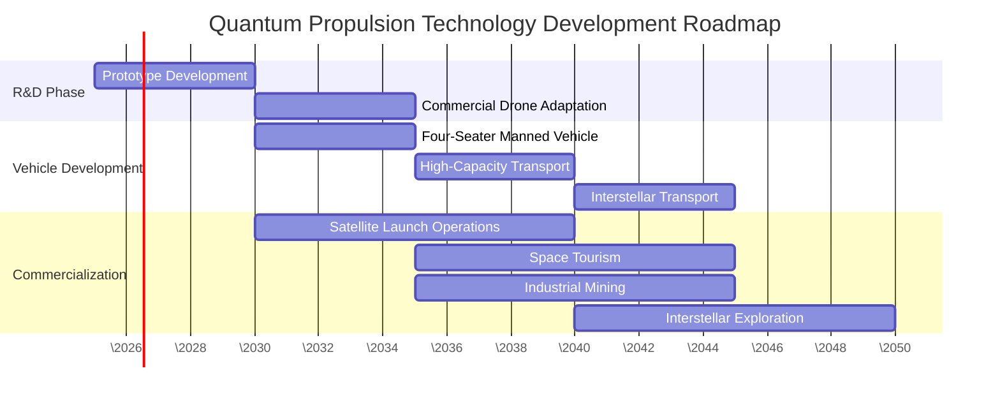

# Azure Space Group Technologies | Investor Pitch Deck

*Revolutionary quantum propulsion for the future of space exploration*

This pitch deck provides a slide-by-slide presentation of the Azure Space Group Technologies investment opportunity.

## Slide 1: Title | The Future of Space Exploration

**Azure Space Group Technologies**
* **Revolutionary Quantum Propulsion Systems**
* **Near-Light Speed Travel with Zero Conventional Fuel**
* **Website**: [https://intstelforce.com](https://intstelforce.com)
* **Contact**: [qpt@europe.com](mailto:qpt@europe.com) | +44(0)7599978487

## Slide 2: The Problem | Limitations of Current Space Technology

**Current Space Exploration Challenges:**
* Traditional propulsion limited to &lt;50 km/s maximum velocity
* 70\% of spacecraft weight dedicated to fuel
* Excessive launch costs ($20,000/kg to LEO)
* Radiation exposure for crews
* Mission durations measured in years, not hours
* Limited payload capacity
* Expensive infrastructure requirements

## Slide 3: Our Solution | Quantum Propulsion Technology

**Quantum Cocoon Propulsion System:**
* **Generates a quantum field** around spacecraft that distorts physical connections with environment
* **Zero propellant mass** required for operation
* **Near-light speed potential** - reduces interplanetary travel from months to hours
* **Complete radiation shielding** for crew protection
* **Inertial isolation** eliminating G-force limitations
* **95\% reduction** in energy requirements compared to conventional propulsion

## Slide 4: Revolutionary Technology | Biomimicry Approach

**Nature-Inspired Technology:**
* Technology based on principles observed in insects' flight mechanics
* High-frequency wing vibration in insects creates electromagnetic cocoons
* Our approach reverse-engineers and scales these natural quantum effects
* Following the same innovation pattern as the Wright brothers with bird flight
* Not inventing new physics - enhancing and scaling natural phenomena

## Slide 5: Market Opportunity | Trillion-Dollar Potential

**Multi-Sector Disruption:**
* **$380B Space Transportation** - 75\% cost reduction potential
* **$650B Satellite Industry** - Revolutionary deployment & maintenance
* **$215B Defense & Security** - Unprecedented mobility & capabilities 
* **$880B Commercial Aerospace** - Next-generation aircraft systems
* **$700 quintillion** in accessible asteroid resources - First economically viable mining

## Slide 6: Competitive Advantages | Insurmountable Lead

| Feature | Azure Space Group Technology | Competitor Technologies |
|---------|----------------------|------------------------|
| Propellant Requirements | Zero propellant mass needed | Requires reaction mass or energy source |
| Maximum Velocity | Near or exceeding light speed | Limited to &lt;50 km/s |
| G-Force Protection | Complete inertial isolation | No protection from acceleration forces |
| Energy Efficiency | Minimal energy after initial field generation | Continuous high energy consumption |
| Radiation Shielding | Quantum field provides complete protection | Requires heavy physical shielding |
| Manufacturing Cost | Comparable to conventional aircraft | Exponentially higher with increased size |

## Slide 7: Development Roadmap | Execution Plan

## Slide 8: Financial Projections | ROI Potential

**Financial Projections (in millions USD):**

| Fiscal Year | 2025 | 2026 | 2027 | 2028 | 2029 | 2030 |
|-------------|------|------|------|------|------|------|
| Investment Inflow | 5 | 170 | 350 | 500 | 750 | 1,200 |
| R&D Expenses | 3 | 75 | 120 | 180 | 210 | 175 |
| Capital Expenditures | 1 | 35 | 95 | 175 | 240 | 380 |
| Operating Expenses | 1 | 60 | 85 | 130 | 165 | 210 |
| Revenue | 0 | 0 | 0 | 18 | 350 | 1,200 |
| Cash Flow | 0 | 0 | 50 | 33 | 485 | 635 |
| Cumulative Cash | 0 | 0 | 50 | 83 | 568 | 1,203 |

**Break-even Timeline:** Q2 2029  
**Pre-money Valuation:** $3.8 billion

## Slide 9: World-Class Team | Experts Leading Innovation

**Leadership Team:**
* **Alex Ioskevich** - Founder, CEO & Chief Technical Specialist
  * 30+ years in aerospace & IT industries
  * Expert in electronics, software, radiocommunications
  
* **Stan Zemskoff** - Chief Technology Officer (CTO)
  * Specialist in quantum mechanics and propulsion systems
  * Expert in high-energy physics

* **Mushfiqul Alam** - Scientific Advisor & Flight Dynamics Expert
  * Professor at Cranfield University
  * PhD in Flight Dynamics & Control

* **Olena Molchanova** - Director of Sales & Marketing
  * 20+ years in media, design, and business consulting

* **Lt. Col. (Ret) Nick "N.J." Joist** - Aviation & Defense Advisor
  * Former US Navy test pilot and NASA astronaut trainer

## Slide 10: Research & Development Strategy

**Multifaceted R&D Ecosystem:**

* **Advanced Research Facilities:** Custom laboratories for quantum field manipulation
* **World-Class Expertise:** Leading quantum physicists, aerospace engineers, materials scientists
* **Research & Industry Partnerships:**
  * Quantum Engineering Institute – Theoretical model validation
  * Advanced Materials Corporation – Specialized fabrication support
  * SpaceX – Integration considerations for launch vehicles
  * NASA JPL – Application methodology for deep space missions
* **Community-Driven Research:** Game-based research platform for distributed problem-solving
* **Open Innovation Approach:** Combination of proprietary and open-source development

## Slide 11: Innovative Funding Model

**Hybrid Approach to R&D Acceleration:**

* **Traditional Investment:**
  * Staged equity rounds with clear technical milestones
  * Strategic corporate partnerships for manufacturing and deployment

* **Tokenization Strategy:**
  * Multi-token ecosystem for research funding and incentives
  * Community Research Pool with token rewards for valuable contributions
  * Decentralized participation in research and development
  * For details, see our [Tokenization Strategy](/docs/tokenization-strategy)

## Slide 12: Game-Based Research Platform

**Accelerating Innovation Through Collective Intelligence:**

* **Distributed Problem Solving:**
  * Complex research challenges transformed into interactive experiences
  * Leverages cognitive diversity of thousands of contributors
  * Gamification of quantum physics problems and engineering challenges

* **Platform Components:**
  * Quantum Simulator for visualizing quantum field interactions
  * Virtual Laboratory for component design and testing
  * Research Network for collaborative optimization
  * For details, see our [Game-Based Research Platform](/docs/research-documentation/game-based-research-platform)

## Slide 13: Investment Opportunity | Seed Round

**Current Opportunity: $5M Seed Round (Q1 2025)**

**Allocation:**
* **Specialized Research Equipment** ($2.5M)
  * Quantum field measurement apparatus
  * Materials testing equipment
  * Laboratory enhancements
  
* **Core Research Activities** ($1.5M)
  * Theoretical model validation
  * Initial component design
  * Quantum field simulation software
  
* **Team Development** ($1M)
  * Key researcher recruitment
  * Specialized consultants
  * Initial engineering assessments

## Slide 14: Future Funding Rounds | Growth Strategy

**Structured Investment Roadmap:**

| Round | Date | Amount | Purpose |
|-------|------|--------|---------|
| Seed | Q1 2025 | $5M | Initial research equipment and validation |
| Series A | Q4 2025 | $170M | Laboratory expansion and first prototype |
| Series B | Q3 2026 | $350M | Full-scale field generator development |
| Series C | Q4 2027 | $500M | First field tests and regulatory preparation |
| Series D | Q2 2029 | $750M | Advanced testing and regulatory approvals |
| Pre-IPO | Q1 2030 | $1.2B | Manufacturing scale-up and commercialization |

## Slide 15: Exit Strategy | Investor Returns

**Multiple Exit Pathways:**

1. **Initial Public Offering (IPO)**
   * Timeline: 2030-2031
   * Estimated valuation: $12-15 billion
   * Target exchanges: NASDAQ, NYSE

2. **Strategic Acquisition**
   * Potential acquirers: Major aerospace/defense contractors
   * Estimated valuation: $9-14 billion
   * Timeline: 2029-2030

3. **Licensing Model**
   * Recurring revenue potential: $1.5-2 billion annually by 2032
   * Retention of core IP and ongoing development

## Slide 16: Contact Information | Next Steps

**For Further Information:**

**Alex Ioskevich - Founder, CEO & Chief Technical Specialist**
* Email: qpt@europe.com
* Phone: +44(0)7599978487
* LinkedIn: [Alex Ioskevich](https://www.linkedin.com/in/alex-ioskevich-244194183/)

**Stan Zemskoff - Chief Technology Officer (CTO)**
* Phone: +1(786)6178722
* Email: stanislav_zemskov@icloud.com
* LinkedIn: [Stan Zemskoff](https://www.linkedin.com/in/stan-zemskoff-55a55221/)

**Website:** [https://intstelforce.com/](https://intstelforce.com/)

**Next Steps:**
1. Sign NDA for detailed technical information
2. Schedule technical demonstration
3. Review comprehensive financial models
4. Discuss investment terms and structure 