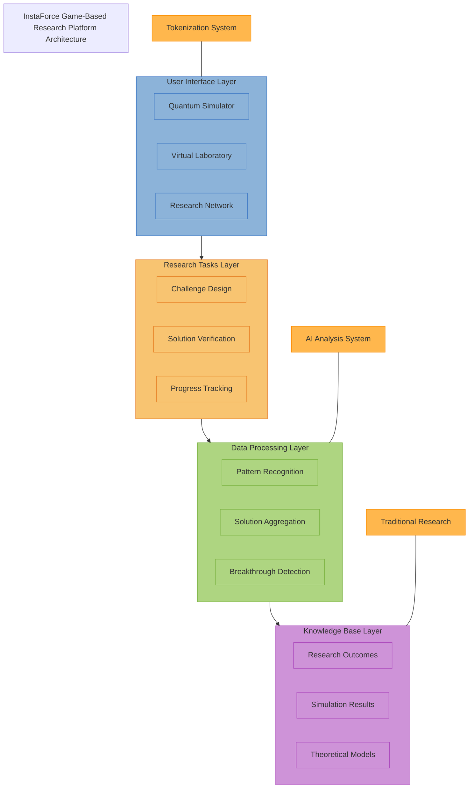

# Game-Based Research Platform

## Executive Summary

The InstaForce Game-Based Research Platform represents a revolutionary approach to accelerating scientific breakthroughs in quantum propulsion technology through distributed problem-solving, gamification, and collective intelligence. This platform transforms complex research challenges into interactive experiences that can be tackled by contributors with diverse backgrounds and expertise levels.

By harnessing the cognitive power of thousands of participants through carefully designed gaming mechanics, we aim to overcome critical research obstacles while building a community of engaged stakeholders who contribute directly to the advancement of quantum propulsion technology.

## Platform Concept

### Core Philosophy

The game-based research platform is built on three fundamental principles:

1. **Collective Intelligence**: Complex problems can be solved more effectively by diverse groups of independently thinking individuals than by isolated experts.

2. **Intrinsic Motivation**: People are more engaged and productive when motivated by curiosity, challenge, and achievement rather than external rewards alone.

3. **Knowledge Democratization**: Scientific progress accelerates when knowledge is accessible and research participation is open to contributors beyond traditional academic boundaries.

### Platform Architecture

The platform consists of four integrated layers:

| Layer | Function | Components |
|-------|----------|------------|
| User Interface | Interactive game environment | 3D visualizations, challenge interfaces, collaboration tools |
| Research Tasks | Problem formulation and validation | Challenge design, solution verification, progress tracking |
| Data Processing | Analysis and integration of contributions | Pattern recognition, solution aggregation, breakthrough detection |
| Knowledge Base | Structured repository of findings | Research outcomes, simulation results, theoretical models |

## Game Environments

### Quantum Simulator

An immersive 3D environment where players manipulate quantum field variables to achieve specific outcomes. This environment visualizes abstract quantum mechanics concepts through intuitive interfaces that allow non-specialists to contribute meaningfully.

**Key Features:**
- Interactive quantum field visualization
- Real-time feedback on approach validity
- Multi-player collaboration zones
- Progressive difficulty levels based on real research challenges

### Virtual Laboratory

A detailed laboratory simulation where players design, build, and test components for quantum propulsion systems. This environment focuses on engineering challenges and practical implementation of theoretical models.

**Key Features:**
- Realistic physics simulation
- Resource management and optimization challenges
- Component failure analysis
- Integration testing of proposed solutions

### Research Network

A meta-game layer that connects players, tracks contributions, and allocates resources across research directions. This environment emphasizes strategic thinking about research priorities and resource allocation.

**Key Features:**
- Research tree visualization
- Team formation and management
- Resource allocation decision-making
- Progress tracking and milestone celebration

## Problem Types and Game Mechanics

### Problem Categories

| Problem Category | Game Implementation | Real-world Application |
|------------------|---------------------|------------------------|
| Theoretical Optimization | Puzzle-solving with constraints | Field configuration optimization |
| Pattern Recognition | Visual identification challenges | Anomaly detection in quantum fields |
| System Design | Building and testing simulations | Component configuration for efficiency |
| Predictive Modeling | Scenario projection mini-games | Forecasting system behavior under conditions |
| Resource Allocation | Strategy game elements | Research prioritization and funding |

### Core Game Mechanics

1. **Discovery Loops**: Short feedback cycles that reward experimentation and learning
2. **Skill Trees**: Progressive mastery of research domains with increasing complexity
3. **Collaboration Multipliers**: Mechanics that enhance outcomes when diverse players work together
4. **Knowledge Unlocks**: Access to new game areas based on collective research progress
5. **Recognition Systems**: Visible attribution and credit for significant contributions

## Data Collection and Research Integration

### Contribution Processing Pipeline

All player actions and solutions are processed through a sophisticated pipeline:

1. **Data Collection**: Recording of player approaches, solutions, and collaborative patterns
2. **Filtering & Validation**: AI-driven assessment of solution quality and relevance
3. **Pattern Recognition**: Identification of recurring approaches and novel techniques
4. **Integration & Synthesis**: Incorporation of valuable insights into formal research
5. **Feedback Loop**: Research outcomes influence new game challenges and mechanics

### Machine Learning Integration

Machine learning algorithms enhance the platform's ability to extract value from player contributions:

- **Solution Clustering**: Grouping similar approaches to identify consensus directions
- **Novelty Detection**: Identifying unique solutions that deviate from established patterns
- **Performance Prediction**: Forecasting the real-world viability of proposed solutions
- **Player Skill Matching**: Connecting players with challenges suited to their abilities
- **Collaboration Optimization**: Suggesting team formations to maximize complementary skills

## User Progression and Engagement

### Player Journey

The platform is designed to engage participants at multiple skill levels and commitment levels:

| Stage | Experience | Contribution Value |
|-------|------------|-------------------|
| Novice | Tutorial-driven exploration of basic concepts | Data generation, diversity of approaches |
| Enthusiast | Regular engagement with moderate challenges | Refined solutions, community building |
| Expert | Deep focus on specific research problems | Novel solutions, mentorship of others |
| Researcher | Integration with formal research process | Direction setting, challenge design |

### Incentive Structure

The platform employs a multi-layered incentive system:

1. **Intrinsic Rewards**: Achievement, mastery, discovery, and recognition
2. **Community Recognition**: Reputation systems, leadership boards, and attribution
3. **Knowledge Access**: Privileged insights into research developments and findings
4. **Token Rewards**: Integration with the InstaForce tokenization system (see [Tokenization Strategy](/docs/tokenization-strategy))
5. **Career Development**: Pathways to formal research roles for top contributors

## Development Roadmap

### Phase 1: Foundation (Q3-Q4 2025)
- Core gameplay concepts prototyping
- Research challenge framework development
- Initial user testing with simplified challenges
- Integration with data collection systems

### Phase 2: Alpha Platform (Q1-Q2 2026)
- Development of primary game environments
- Implementation of basic incentive structures
- Limited release to research partners and early adopters
- Initial data validation and contribution assessment

### Phase 3: Beta Release (Q3 2026-Q1 2027)
- Full implementation of all game environments
- Integration with tokenization system
- Public beta with structured onboarding
- Refinement of data processing pipelines

### Phase 4: Full Launch (Q2 2027 onwards)
- Complete platform with all features
- Integration with formal research workflow
- Ongoing challenge development process
- Community governance implementation

## Technical Implementation

### Platform Technologies

The game-based research platform will leverage several cutting-edge technologies:

- **Game Engine**: Unity or Unreal Engine for immersive 3D environments
- **Simulation Backend**: Custom quantum physics simulation framework
- **AI Layer**: TensorFlow or PyTorch for contribution analysis
- **Distributed Computing**: Kubernetes for scalable processing of player contributions
- **Blockchain Integration**: Connection to the InstaForce tokenization infrastructure

### Security and Intellectual Property

The platform includes robust measures to protect research data and intellectual property:

- **Contribution Tracking**: Blockchain-based record of all meaningful contributions
- **Challenge Partitioning**: Segmentation of research problems to protect sensitive information
- **Attribution System**: Clear tracking and acknowledgment of contributor insights
- **IP Management**: Structured approach to handling intellectual property from collective research

## Expected Outcomes

### Research Acceleration

We project that the game-based research platform will accelerate key aspects of quantum propulsion research:

| Research Area | Traditional Timeline | With Game Platform | Key Benefits |
|---------------|----------------------|-------------------|--------------|
| Field Configuration Optimization | 3-5 years | 1-2 years | Exploration of 10x more configurations |
| Component Design | 2-3 years per iteration | 6-9 months per iteration | Parallel testing of multiple approaches |
| System Integration | 4-7 years | 2-3 years | Identification of non-obvious compatibility issues |
| Theoretical Model Refinement | Ongoing | Ongoing with 3x velocity | Continuous feedback from practical applications |

### Community Development

Beyond direct research outcomes, the platform will foster a vibrant community:

- A global network of 50,000+ contributors with varying expertise levels
- Identification and recruitment of exceptional talent from non-traditional backgrounds
- Creation of an educational pathway for future quantum physicists and engineers
- Development of a shared language and conceptual framework among diverse stakeholders

## Integration with Overall Strategy

The game-based research platform is deeply integrated with other aspects of the InstaForce strategy:

- **Tokenization**: Direct connection to the token incentive system (see [Tokenization Strategy](/docs/tokenization-strategy))
- **Traditional Research**: Complementary approach to formal laboratory and theoretical work
- **Talent Pipeline**: Identification and development of future team members
- **Public Engagement**: Accessible entry point for broader audience understanding
- **Investor Relations**: Demonstrable progress and community growth metrics

## Conclusion

The InstaForce Game-Based Research Platform represents a bold reimagining of how cutting-edge scientific research can be conducted in the 21st century. By combining the power of gamification, collective intelligence, and advanced data analytics, we aim to dramatically accelerate the development of quantum propulsion technology while building a global community of contributors invested in our success.

For more information on participating in our game-based research initiatives or to discuss potential partnerships, please contact our research team at [irnbrue@gmail.com](mailto:irnbrue@gmail.com). 