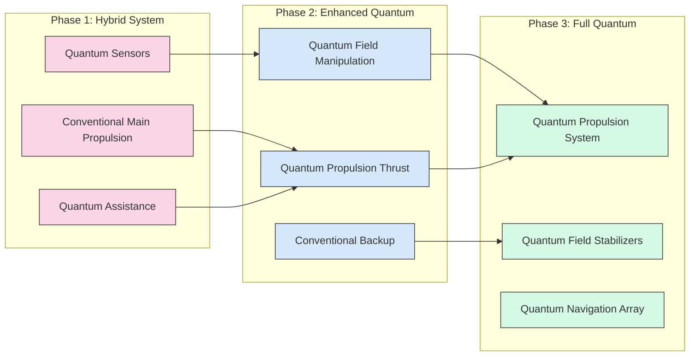

# Prototype Designs and Concept Improvements

This document outlines our practical approach to transforming InstaForce's theoretical foundations into tangible prototypes and improved concepts. These prototypes represent critical stepping stones toward demonstrating the viability of quantum navigation and propulsion technologies.

## Concept Enhancements

Based on our theoretical research and recent advancements in quantum navigation technology, we've identified several opportunities to enhance the core InstaForce concepts.

### Hybrid Propulsion Architecture

We are evolving our propulsion concept to incorporate a pragmatic hybrid approach:

- **Dual-Mode Operation**: Demonstrate quantum effects at small scale while using conventional systems for main propulsion
- **Phased Development**: Create a clear technological roadmap from partially quantum to fully quantum propulsion
- **Reduced Technological Leap**: Enable faster prototyping and testing by leveraging existing technologies alongside quantum innovations

This hybrid approach facilitates earlier testing and validation while maintaining alignment with our long-term vision of fully quantum propulsion.

*Three-phase approach to quantum propulsion development*

### Quantum Field Sensing as Core Technology

We're repositioning quantum sensing as the foundational technology that enables multiple capabilities:

- **Immediate Application**: Precise navigation in GPS-denied environments
- **Medium-Term Goal**: Field manipulation research based on sensing capabilities
- **Long-Term Vision**: Field-based propulsion derived from sensing and manipulation expertise

This approach delivers immediate practical value while establishing the technological foundation for our more ambitious goals.

### Human-Machine Interface Simplification

We're redesigning our human integration concept to follow a more pragmatic development path:

- **Augmented Interface**: Begin with augmented cognitive interfaces rather than direct neural connections
- **Graduated Integration**: Implement increasing levels of human-system integration as technology matures
- **Enhanced Decision-Making**: Focus on augmenting human capabilities rather than replacing them

This revised approach reduces biological and ethical complexities while maintaining the vision of advanced human-machine integration.

## Prototype Development Opportunities

We've identified four high-priority prototypes that demonstrate key technologies while providing practical validation of our theoretical concepts.

### 1. Quantum-Enhanced Inertial Navigation Unit (QEINU)

A tabletop demonstration system that proves our navigation concepts without requiring full propulsion integration.

**Capabilities:**
- Uses quantum magnetometers to detect Earth's magnetic field variations
- Implements map-matching algorithms for position determination
- Functions independently of GPS or other external signals
- Maintains position accuracy over extended periods

**Components:**
- Commercial quantum magnetometer (e.g., SQUID-based)
- Edge computing device for field processing
- Map database of local magnetic anomalies
- Custom software for field interpretation

**Technical Specifications:**

| Specification | Target Value | Notes |
|---------------|--------------|-------|
| Position Accuracy | < 10 meters | After 1 hour of operation |
| Size | 30 × 30 × 15 cm | Tabletop form factor |
| Power Consumption | < 50 watts | Standard power supply |
| Field Sensitivity | 1 picotesla | Enables detection of subtle field variations |
| Processing Latency | < 100 ms | For real-time navigation |

**Development Timeline:**
- **Month 1-2**: Component acquisition and baseline testing
- **Month 3-4**: Integration and software development
- **Month 5-6**: Laboratory testing and calibration
- **Month 7-8**: Field testing in varied environments

### 2. Quantum Field Modulation Testbed (QFMT)

A laboratory apparatus to demonstrate small-scale quantum field modification effects and validate core theoretical principles.

**Capabilities:**
- Generates measurable force through quantum field manipulation
- Provides empirical validation of theoretical models
- Enables precise measurement of field-matter interactions
- Allows controlled experimentation with various field configurations

**Components:**
- Quantum vacuum chamber
- Precision force measurement instruments
- Field generation and manipulation equipment
- Data acquisition and analysis systems

**Technical Specifications:**

| Specification | Target Value | Notes |
|---------------|--------------|-------|
| Force Generation | 10 micronewtons | Initial target |
| Vacuum Level | 10^-10 torr | Ultra-high vacuum |
| Temperature Range | 0.1K - 300K | Variable for different experiments |
| Field Strength | 10 tesla | Maximum field generation |
| Measurement Precision | 0.1 nanonewtons | Force detection threshold |

**Development Timeline:**
- **Month 1-3**: Laboratory setup and equipment calibration
- **Month 4-6**: Initial experiments and baseline measurements
- **Month 7-9**: Optimization of field parameters
- **Month 10-12**: Comprehensive testing and documentation

### 3. Energy System Proof-of-Concept (ESPOC)

A scaled demonstration of energy harvesting from quantum fields, providing validation of our power generation concepts.

**Capabilities:**
- Harvests energy from quantum vacuum fluctuations
- Demonstrates conversion and storage of harvested energy
- Enables efficiency measurements and optimization
- Tests theoretical power generation limits

**Components:**
- Quantum field energy collector array
- Power conversion electronics
- Energy storage subsystem
- Performance monitoring instrumentation

**Technical Specifications:**

| Specification | Target Value | Notes |
|---------------|--------------|-------|
| Energy Output | 100 watts | Continuous operation |
| Conversion Efficiency | > 40% | Field energy to electrical |
| Size | 1 × 1 × 0.5 meters | Laboratory scale |
| Storage Capacity | 1 kilowatt-hour | Integrated battery system |
| Operational Stability | > 100 hours | Continuous operation |

**Development Timeline:**
- **Month 1-3**: Prototype collector array development
- **Month 4-6**: Power conversion circuit optimization
- **Month 7-9**: Integration and system testing
- **Month 10-12**: Efficiency optimization and performance documentation

### 4. Spatial Frequency Mapping Device (SFMD)

A portable system that maps spatial frequency variations, creating quantum-readable navigation markers for precise positioning.

**Capabilities:**
- Maps spatial frequency variations in various environments
- Creates quantum-readable navigation markers
- Tests fundamental concepts of quantum navigation
- Provides spatial frequency data for navigation systems

**Components:**
- Array of quantum sensors
- Processing unit for real-time data analysis
- Mapping software with visualization capabilities
- Portable power supply and housing

**Technical Specifications:**

| Specification | Target Value | Notes |
|---------------|--------------|-------|
| Mapping Resolution | 1 meter | Spatial accuracy |
| Range | 500 meters | Effective scanning radius |
| Scan Speed | 10 m²/second | Area mapping rate |
| Data Points | 1000/m² | Spatial frequency density |
| Battery Life | 8 hours | Field operation time |

**Development Timeline:**
- **Month 1-2**: Sensor array development and calibration
- **Month 3-4**: Processing unit programming and testing
- **Month 5-6**: Integration and laboratory validation
- **Month 7-8**: Field testing and refinement

## Research Implementation Strategy

To effectively develop these prototypes, we've established a strategic approach that maximizes resources and accelerates development.

### 1. Parallel Development Tracks

We'll pursue multiple prototype developments simultaneously to leverage cross-functional insights:

- Each prototype will have a dedicated development team
- Weekly cross-team knowledge-sharing sessions
- Shared equipment and facilities where appropriate
- Integrated technical documentation system

### 2. Staged Validation

Each prototype will undergo rigorous validation to ensure scientific integrity:

- Clear success criteria established before development begins
- Independent verification of results where possible
- Comprehensive documentation of all experimental outcomes
- Regular peer reviews by both internal and external experts

### 3. External Collaboration

We'll leverage partnerships to accelerate development:

- Academic institutions for theoretical validation
- Quantum technology companies for sensor development
- Aerospace organizations for integration testing
- Government research labs for specialized testing facilities

## Integration with Existing Research

These prototypes are designed to integrate seamlessly with our established research infrastructure:

- Prototypes will be tested in our Quantum Vacuum Testing Chamber
- Results will inform our Game-Based Research Platform simulations
- Findings will be incorporated into our quantum simulations
- Data will be shared with our Global Research Network partners

## Funding and Resource Requirements

| Prototype | Estimated Cost | Team Size | Development Duration |
|-----------|----------------|-----------|----------------------|
| QEINU | $1.2 million | 5-7 people | 8 months |
| QFMT | $3.5 million | 8-10 people | 12 months |
| ESPOC | $2.8 million | 6-8 people | 12 months |
| SFMD | $1.5 million | 4-6 people | 8 months |

## Risk Assessment and Mitigation

| Risk | Probability | Impact | Mitigation Strategy |
|------|------------|--------|-------------------|
| Component availability | Medium | High | Pre-order critical components, identify alternatives |
| Technical performance shortfall | Medium | Medium | Phased development with clear go/no-go criteria |
| Integration challenges | High | Medium | Regular integration testing throughout development |
| Cost overruns | Medium | Medium | 20% contingency budget, modular development approach |
| Schedule delays | High | Low | Flexible milestone deadlines, focus on core functionality first |

## Conclusion

These prototype designs represent a significant evolution in our approach, transitioning from theoretical research to practical demonstration. By developing these systems, we will validate key concepts, attract additional investment, and advance the timeline for full quantum propulsion capabilities.

The prototypes provide a pragmatic path to achieving our ambitious long-term goals while delivering near-term value and technological demonstrations that prove the viability of our quantum navigation and propulsion concepts. 