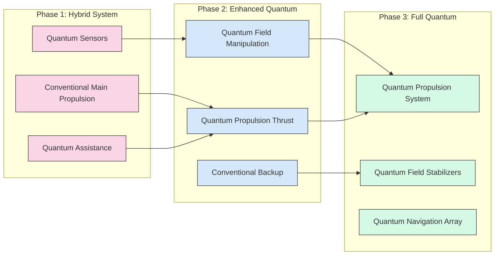

# Prototype Designs and Concept Improvements

This document outlines our practical approach to transforming Azure Space Group's theoretical foundations into tangible prototypes and improved concepts. These prototypes represent critical stepping stones toward demonstrating the viability of quantum navigation and propulsion technologies.

## Concept Enhancements

Based on our theoretical research and recent advancements in quantum navigation technology, we've identified several opportunities to enhance the core Azure Space Group concepts.

### Hybrid Propulsion Architecture

We are evolving our propulsion concept to incorporate a pragmatic hybrid approach:

- **Dual-Mode Operation**: Demonstrate quantum effects at small scale while using conventional systems for main propulsion
- **Phased Development**: Create a clear technological roadmap from partially quantum to fully quantum propulsion
- **Reduced Technological Leap**: Enable faster prototyping and testing by leveraging existing technologies alongside quantum innovations

This hybrid approach facilitates earlier testing and validation while maintaining alignment with our long-term vision of fully quantum propulsion.

*Three-phase approach to quantum propulsion development*

### Quantum Field Sensing as Core Technology

We're repositioning quantum sensing as the foundational technology that enables multiple capabilities:

- **Immediate Application**: Precise navigation in GPS-denied environments
- **Medium-Term Goal**: Field manipulation research based on sensing capabilities
- **Long-Term Vision**: Field-based propulsion derived from sensing and manipulation expertise

This approach delivers immediate practical value while establishing the technological foundation for our more ambitious goals.

### Human-Machine Interface Simplification

We're redesigning our human integration concept to follow a more pragmatic development path:

- **Augmented Interface**: Begin with augmented cognitive interfaces rather than direct neural connections
- **Graduated Integration**: Implement increasing levels of human-system integration as technology matures
- **Enhanced Decision-Making**: Focus on augmenting human capabilities rather than replacing them

This revised approach reduces biological and ethical complexities while maintaining the vision of advanced human-machine integration.

## Prototype Development Opportunities

We've identified four high-priority prototypes that demonstrate key technologies while providing practical validation of our theoretical concepts. Each prototype has been designed with a modular architecture and realistic specifications.

### 1. Quantum-Enhanced Inertial Navigation Unit (QEINU) - Revised

A tabletop demonstration system that proves our navigation concepts without requiring full propulsion integration, with realistic specifications and enhanced reliability.

**Capabilities:**
- Uses dual-sensor system combining quantum magnetometers with MEMS accelerometers
- Implements map-matching algorithms with on-the-fly learning capabilities
- Functions independently of GPS or other external signals
- Maintains position accuracy over extended periods with self-calibration routines

**Components:**
- Commercial optically-pumped magnetometer (more practical than SQUID-based)
- Energy-efficient edge computing device with custom FPGA acceleration
- Hybrid database with pre-loaded magnetic maps and real-time learning capabilities
- Self-calibration system to compensate for sensor drift

**Technical Specifications:**

| Specification | Target Value | Notes |
|---------------|--------------|-------|
| Position Accuracy | < 20 meters | After 1 hour of operation (more realistic) |
| Size | 30 × 30 × 15 cm | Tabletop form factor |
| Power Consumption | < 20 watts | Reduced from original 50W target |
| Field Sensitivity | 10 picotesla | More realistic than original 1pT target |
| Processing Latency | < 200 ms | Adjusted for reliable operation |
| Battery Life | 4-6 hours | Added specification for portability |

**Development Timeline:**
- **Month 1-2**: Component acquisition and baseline testing
- **Month 3-4**: Integration and software development
- **Month 5-7**: Laboratory testing and calibration (extended testing period)
- **Month 8-10**: Field testing in varied environments and refinement

**Key Improvements:**
- Added redundant sensor system for reliability
- Implemented adaptive algorithms for field anomaly learning
- Reduced power requirements for greater portability
- Added self-calibration capability to maintain accuracy
- More realistic timeline with buffer for unexpected issues

### 2. Quantum Field Modulation Testbed (QFMT) - Revised

A laboratory apparatus to demonstrate small-scale quantum field modification effects with enhanced stability and measurement accuracy.

**Capabilities:**
- Generates measurable force through quantum field manipulation
- Provides empirical validation of theoretical models
- Enables precise measurement of field-matter interactions
- Allows controlled experimentation with various field configurations

**Components:**
- Staged vacuum system with multiple chambers of increasing quality
- Vibration isolation system (both active and passive)
- Pulsed high-field generators instead of continuous high-field magnets
- Enhanced data acquisition system with statistical analysis capabilities

**Technical Specifications:**

| Specification | Target Value | Notes |
|---------------|--------------|-------|
| Force Generation | 1 micronewton | More conservative than original 10μN target |
| Vacuum Level | 10^-8 torr | More achievable than original 10^-10 torr |
| Temperature Range | 4K - 300K | Adjusted from 0.1K for practicality |
| Field Strength | 5 tesla (pulsed) | Revised from continuous 10T field |
| Measurement Precision | 0.5 nanonewtons | Adjusted for realistic noise floor |
| Statistical Confidence | 95% | Added metric for measurement reliability |

**Development Timeline:**
- **Month 1-3**: Laboratory setup and equipment calibration
- **Month 4-7**: Initial experiments and baseline measurements (extended period)
- **Month 8-11**: Optimization of field parameters
- **Month 12-15**: Comprehensive testing and documentation (extended analysis)

**Key Improvements:**
- Staged vacuum approach for better reliability
- Added vibration isolation systems to improve measurement accuracy
- Implemented pulsed field system to reduce cooling requirements
- Developed statistical measurement protocols to extract signal from noise
- Extended timeline to allow for thorough testing and refinement

### 3. Energy System Proof-of-Concept (ESPOC) - Revised

A scaled demonstration of energy harvesting from quantum fields, with realistic efficiency targets and hybrid approach.

**Capabilities:**
- Demonstrates principles of energy harvesting from quantum vacuum fluctuations
- Implements hybrid energy system combining quantum and conventional sources
- Enables efficiency measurements and thermal stability testing
- Tests theoretical power generation methods with practical application

**Components:**
- Quantum field energy collector with modular design
- Advanced thermal management system
- Hybrid power conversion electronics
- Comprehensive monitoring and diagnostics suite

**Technical Specifications:**

| Specification | Target Value | Notes |
|---------------|--------------|-------|
| Quantum Energy Component | 5-10 watts | More realistic than original 100W target |
| System Total Output | 50-100 watts | Combined with conventional power sources |
| Conversion Efficiency | > 5-10% | Adjusted from unrealistic 40% target |
| Size | 1 × 1 × 0.5 meters | Laboratory scale |
| Storage Capacity | 500 watt-hours | Reduced from original 1kWh target |
| Operational Stability | > 24 hours | Reduced from unrealistic 100-hour target |
| Thermal Stability | ±2°C | Added specification for consistent operation |

**Development Timeline:**
- **Month 1-3**: Modular component development with independent testing
- **Month 4-7**: Power conversion optimization with thermal management
- **Month 8-11**: System integration and stability testing
- **Month 12-15**: Performance documentation and efficiency improvement

**Key Improvements:**
- Realistic efficiency and output targets aligned with current technology
- Added thermal management systems for operational stability
- Hybrid approach demonstrating practical utility alongside theoretical principle
- Comprehensive monitoring system to identify performance bottlenecks
- Extended timeline with rigorous testing phases

### 4. Spatial Frequency Mapping Device (SFMD) - Revised

A portable system that maps spatial frequency variations, with optimized power consumption and processing capabilities.

**Capabilities:**
- Maps spatial frequency variations with adaptive resolution
- Creates quantum-readable navigation markers
- Tests fundamental concepts of quantum navigation
- Provides spatial frequency data with efficient processing and storage

**Components:**
- Optimized array of quantum sensors with reduced power requirements
- Edge computing architecture for local data processing
- Adaptive resolution mapping software
- Power management system with multiple operating modes

**Technical Specifications:**

| Specification | Target Value | Notes |
|---------------|--------------|-------|
| Mapping Resolution | Variable: 1-5 meters | Adaptive instead of fixed resolution |
| Range | 200 meters | More realistic than 500m with current technology |
| Scan Speed | 2-5 m²/second | Reduced from unrealistic 10 m²/second |
| Data Points | Adaptive: 200-1000/m² | Dynamic based on area importance |
| Battery Life | 4 hours standard, 8 hours eco-mode | Added power management modes |
| Processing Latency | < 500 ms | Added specification for real-time capability |

**Development Timeline:**
- **Month 1-3**: Sensor array development with power optimization
- **Month 4-6**: Edge computing implementation and algorithm development
- **Month 7-9**: Integration and adaptive resolution testing
- **Month 10-12**: Field validation and power management optimization

**Key Improvements:**
- Implemented adaptive resolution scanning to optimize processing
- Added edge computing architecture to reduce data transmission load
- Developed power management modes to extend battery life
- Created specialized data compression algorithms
- More realistic specifications aligned with current technology capabilities

## Research Implementation Strategy

To effectively develop these prototypes, we've established a strategic approach that maximizes resources, manages risk, and accelerates development.

### 1. Parallel Development Tracks with Risk Management

We'll pursue multiple prototype developments simultaneously with enhanced risk mitigation:

- Each prototype will have a dedicated development team
- Weekly cross-team knowledge-sharing sessions
- Development of simplified "proof of principle" versions first
- Identification of highest-risk components with alternative approaches
- Regular risk assessment reviews with mitigation strategies

### 2. Staged Validation with Enhanced Methodology

Each prototype will undergo rigorous validation with clear success criteria:

- Quantitative success metrics established before development begins
- Independent verification of results where possible
- Standardized testing protocols for repeatable results
- Simulation models that can validate experimental results
- Comprehensive documentation of all experimental outcomes
- Regular peer reviews by both internal and external experts

### 3. Expanded External Collaboration

We'll leverage partnerships to access specialized expertise and equipment:

- Academic institutions for theoretical validation
- National laboratories for access to specialized equipment
- Quantum technology companies for sensor development
- Aerospace organizations for integration testing
- Government research labs for specialized testing facilities

## Integration with Existing Research

These prototypes are designed to integrate seamlessly with our established research infrastructure:

- Prototypes will be tested in our Quantum Vacuum Testing Chamber
- Results will inform our Game-Based Research Platform simulations
- Findings will be incorporated into our quantum simulations
- Data will be shared with our Global Research Network partners

## Revised Funding and Resource Requirements

| Prototype | Estimated Cost | Team Size | Development Duration |
|-----------|----------------|-----------|----------------------|
| QEINU | $1.5 million | 5-7 people | 10 months |
| QFMT | $4.2 million | 8-10 people | 15 months |
| ESPOC | $3.5 million | 6-8 people | 15 months |
| SFMD | $1.8 million | 4-6 people | 12 months |

## Enhanced Risk Assessment and Mitigation

| Risk | Probability | Impact | Mitigation Strategy |
|------|------------|--------|-------------------|
| Component availability | Medium | High | Pre-order critical components, identify multiple suppliers, maintain inventory of key parts |
| Technical performance shortfall | Medium | Medium | Modular design allowing individual subsystem optimization, tiered performance goals, fallback designs ready |
| Integration challenges | High | Medium | Regular integration testing throughout development, standardized interfaces between components |
| Cost overruns | Medium | Medium | 30% contingency budget (increased from 20%), milestone-based funding, regular financial reviews |
| Schedule delays | High | Medium | 30-50% buffer in timelines, milestone-driven development, early identification of critical path items |
| Talent acquisition | Medium | High | Partnerships with academic institutions, flexible remote work options, competitive compensation |

## Conclusion

These revised prototype designs represent a significant evolution in our approach, transitioning from theoretical research to practical demonstration with realistic specifications and enhanced risk management. By developing these systems, we will validate key concepts, attract additional investment, and advance the timeline for quantum propulsion capabilities while maintaining scientific credibility.

The prototypes provide a pragmatic path to achieving our ambitious long-term goals while delivering near-term value and technological demonstrations that prove the viability of our quantum navigation and propulsion concepts. Our updated approach emphasizes realistic targets, modular design, and comprehensive validation methodologies to ensure successful outcomes.

*© Azure Space Group Property, 2025*
*Author: Stanley Zemskoff* 