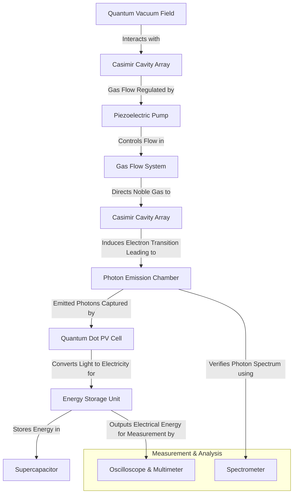

# Quantum Battery Prototype

## Overview

The Quantum Battery represents a revolutionary approach to energy generation and storage by harnessing quantum vacuum fluctuations. This document outlines our approach to developing a quick and inexpensive prototype that demonstrates the core principles while focusing on the most achievable components first.

## Components & Materials Procurement Guide

### Casimir Cavity Components
| Component | Specifications | Source | Estimated Cost |
|-----------|--------------|--------|---------------|
| Gold-coated silicon plates | 99.99% purity, 50-100μm thickness | NanoFabrication Labs, Sigma-Aldrich | $200-350 per set |
| Graphene sheets | Single-layer, 1-5cm² area | Graphenea, ACS Materials | $100-300 per sheet |
| Conductive nanostructures | Gold, silver, or platinum nanoparticles | American Elements, Nanopartz | $150-250 per gram |
| MEMS actuators | Piezoelectric, sub-micron precision | Thorlabs, Newport | $500-800 per unit |

### Gas Flow System
| Component | Specifications | Source | Estimated Cost |
|-----------|--------------|--------|---------------|
| Noble gas (Xenon/Neon) | 99.999% purity, research grade | Praxair, Air Liquide | $300-500 per cylinder |
| Piezoelectric micro-pumps | Flow rate: 0.1-10ml/min | TCS Micropumps, Bartels Mikrotechnik | $200-400 per unit |
| Sealed chambers | Borosilicate glass or stainless steel | Thorlabs, Kurt J. Lesker | $300-600 per chamber |
| Pressure regulators | 0-100kPa, precision control | MKS Instruments, Swagelok | $250-450 per unit |

### Photon Emission & Capture
| Component | Specifications | Source | Estimated Cost |
|-----------|--------------|--------|---------------|
| Silicon photodiodes | Spectral range: 200-1100nm | Hamamatsu, Thorlabs | $100-300 per unit |
| Quantum dot solar cells | PbS or Perovskite-based | Quantum Solutions, Ossila | $300-700 per unit |
| Spectrophotometer | UV-Vis-NIR capabilities | Ocean Optics, Avantes | $3,000-5,000 |
| Optical filters | Bandpass, specific wavelengths | Edmund Optics, Thorlabs | $80-200 per filter |

### Energy Storage & Measurement
| Component | Specifications | Source | Estimated Cost |
|-----------|--------------|--------|---------------|
| Graphene supercapacitors | 1-10F capacity | Skeleton Technologies, Maxwell | $150-300 per unit |
| Digital oscilloscope | 100MHz+ bandwidth | Tektronix, Keysight | $1,000-2,500 |
| Precision multimeter | 6½ digits, nA sensitivity | Keithley, Fluke | $800-1,500 |
| Vacuum chamber | Small desktop size, 10⁻⁶ torr capability | Kurt J. Lesker, Edwards Vacuum | $3,000-7,000 |

## Manufacturing Procedures

### Casimir Cavity Fabrication

#### Method 1: University Nanofabrication Facility
1. **Access**: Partner with university nanofabrication facilities (e.g., Stanford Nanofabrication Facility, Cornell NanoScale Facility)
2. **Process**:
   - Submit designs for electron-beam lithography pattern definition
   - Use chemical vapor deposition (CVD) for precise layer growth
   - Apply multi-stage etching for nanoscale spacing definition
3. **Cost**: $2,000-5,000 for a small batch production run
4. **Turnaround**: Typically 2-4 weeks

#### Method 2: DIY Approach
1. **Required Equipment**:
   - Spin coater ($1,000-2,000)
   - Precision CNC mill with sub-micron resolution ($5,000-10,000)
   - Clean room setup - HEPA filtration, laminar flow hood ($3,000-5,000)
2. **Process**:
   - Mechanical polishing of silicon wafers to optical quality
   - Sputter coating with 50-100nm gold layer
   - Precision spacer application using photolithography
3. **Cost**: $10,000-15,000 for equipment setup, then $50-100 per cavity
4. **Feasibility**: Challenging but achievable with technical expertise

#### Method 3: Commercial Fabrication Services
1. **Providers**: NanoFab Solutions, MEMS Exchange, Micronit
2. **Process**: Submit CAD designs with precise specifications
3. **Cost**: $3,000-8,000 depending on complexity and quantity
4. **Quality**: High precision with validated processes

### Gas Flow System Assembly

#### Required Skills
- Micro-fluidics experience
- Clean room protocols
- Vacuum system handling

#### Assembly Procedure
1. **Chamber Preparation**:
   - Thoroughly clean all components with semiconductor-grade solvents
   - Assemble in Class 100 (ISO 5) clean room environment or better
   - Verify seals using helium leak detector ($1,500-3,000 rental)

2. **Gas System Integration**:
   - Use VCR or ultra-high vacuum (UHV) fittings throughout
   - Install in-line particulate filters (0.003μm) to prevent contamination
   - Calibrate flow meters against NIST-traceable standards

3. **Validation Testing**:
   - Pressure stability test (24-hour monitoring)
   - Gas composition verification with mass spectrometer
   - Flow rate characterization at operating conditions

## Manufacturing vs. Purchasing Decision Guide

### Components to Purchase
- **Precision Instruments**: Always purchase spectrometers, oscilloscopes, and multimeters from established manufacturers
- **Pure Materials**: Source high-purity noble gases, nanoparticles, and quantum dots from commercial suppliers
- **Optical Components**: Buy photodiodes, filters, and specialized optics from optical supply companies

### Components to Manufacture
- **Casimir Cavity Arrays**: Custom fabrication provides necessary control over critical dimensions
- **Gas Flow Integration**: Self-assembly allows for unique configurations not commercially available
- **Photon Collection Systems**: Custom arrangements optimize for the specific emission wavelengths

### Hybrid Approach for Complex Components
1. **Quantum Dot Arrays**:
   - Purchase base quantum dots commercially
   - Custom arrangement and deposition for optimal sensitivity to specific wavelengths
   - Estimated cost reduction: 40-60% versus commercial alternatives

2. **Piezoelectric Control Systems**:
   - Purchase commercial piezoelectric elements
   - Design and fabricate custom mounting and control circuitry
   - Integrate with microcontroller-based feedback system
   - Estimated cost reduction: 30-50% versus turnkey systems

## Development Phases

### Phase 1: Feasibility and Rapid Prototyping

#### Casimir Cavity Fabrication
- Use nano-engineered parallel plates with metallic coatings to test quantum vacuum energy harvesting
- Employ graphene or conductive nanostructures to optimize the Casimir effect
- Utilize MEMS/NEMS fabrication techniques to create tunable cavity spacing

#### Gas Flow Energy Extraction
- Select a noble gas (e.g., xenon, krypton, or neon) that exhibits efficient electron transitions
- Implement a closed-loop system with gas cycling through the Casimir cavities
- Capture released photons using high-efficiency quantum dot photovoltaic cells

#### Photon Capture & Energy Conversion
- Test perovskite-based quantum dot arrays for near-complete photon-to-electricity conversion
- Use nanostructured photonic collectors to enhance spectral absorption

#### Energy Storage & Output
- Instead of advanced QVF storage, start with supercapacitors or solid-state quantum batteries
- Develop a quantum-coherent capacitor system using dielectric materials with high permittivity

### Phase 2: Optimization & Scaling

#### Quantum Coherence Stability
- Apply isolation techniques (shielding from external electromagnetic interference)
- Introduce superconducting Casimir cavity configurations at cryogenic temperatures

#### Stacked Disk Design for Efficiency
- Arrange Casimir plates in multi-layered formations to maximize photon release
- Integrate piezoelectric gas flow controllers for fine-tuned energy extraction

#### Energy Recycling & Waste Reduction
- Utilize phonon capture arrays to reclaim vibrational energy
- Implement quantum thermal gradient harvesters to recover waste heat

## Experimental Setup for Proof-of-Concept (PoC)

### Objective

To demonstrate energy extraction from the quantum vacuum using a gas flow through Casimir cavities, leading to photon emission and conversion into usable electricity via quantum dot photovoltaics.

### Experimental Procedure

#### Step 1: Fabricating the Casimir Cavity Array
- Prepare conductive nano-plates using gold or graphene coatings
- Use MEMS fabrication to ensure precise spacing (~100nm gaps)
- Assemble in a multi-layer stacked configuration for increased effect

#### Step 2: Setting Up Gas Flow through Casimir Cavities
- Introduce noble gas (Xenon or Neon) into a controlled flow system
- Use piezoelectric actuators to regulate gas movement
- Ensure gas cycles through the Casimir cavity without contamination

#### Step 3: Photon Emission and Detection
- Observe electron transitions as gas molecules move through the cavity
- Capture emitted photons with a high-resolution spectrometer to verify expected wavelength
- Direct photons onto quantum dot solar cells for energy conversion

#### Step 4: Energy Harvesting & Storage
- Connect quantum dot PV cells to an energy storage circuit
- Monitor electrical output using an oscilloscope & multimeter
- Analyze energy efficiency & possible improvements

### Expected Results & Validation Points

- ✅ **Photon Emission Confirmation**: Verify emitted photons match theoretical predictions
- ✅ **Electricity Generation**: Measurable voltage/current output from quantum dot solar cells
- ✅ **Repeatability**: Stable energy output over multiple gas flow cycles

### Scalability & Next Steps

- Optimize Casimir cavity materials & structure for enhanced energy extraction
- Integrate better gas cycling mechanisms for continuous operation
- Test alternative quantum dot materials for improved efficiency

## Timeline

- **Phase 1 Prototype (3–6 months)**: Small-scale energy harvesting with Casimir cavities and photon conversion
- **Phase 2 (6–12 months)**: Optimization of quantum stability, improved gas cycling, and enhanced photon capture

## System Diagram

## 3D Model Visualization

We have developed a 3D model of the quantum battery prototype setup using the provided Blender script. This visualization helps in understanding the spatial arrangement of various components and their interconnections. 

*Note: The actual 3D model rendering would be generated from the provided Blender script and included here as an image.*

## Related Research

For additional context and theoretical foundations, please refer to:
- [Advanced Materials Research](./advanced-materials-research)
- [Quantum Research Paper](./quantum-research-paper)
- [Energy Systems Documentation](../core-documentation/energy-systems) 