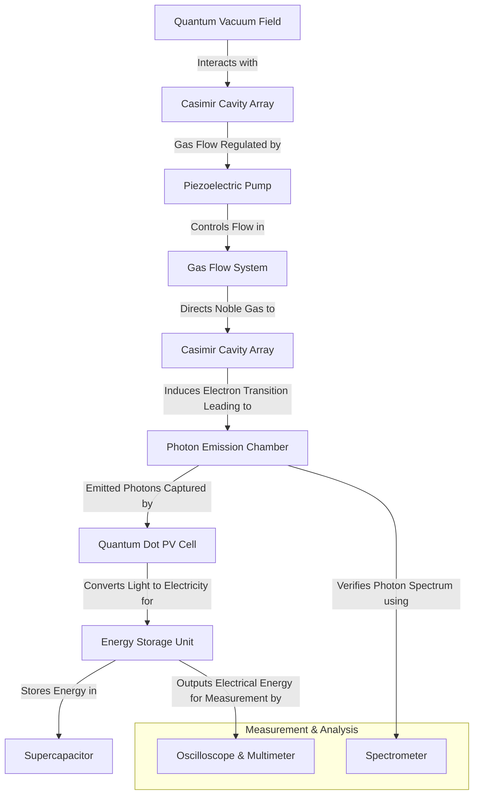

# Quantum Battery Prototype

## Overview

The Quantum Battery represents a revolutionary approach to energy generation and storage by harnessing quantum vacuum fluctuations. This document outlines our approach to developing a quick and inexpensive prototype that demonstrates the core principles while focusing on the most achievable components first.

This prototype quantum battery will use:
- Casimir Effect to manipulate quantum vacuum fluctuations
- Gas Flow System to induce electron transitions
- Photon Emission Chamber to capture released energy
- Quantum Dot Solar Cells to convert photons to electricity
- Supercapacitor Storage for energy output

## Components & Materials Procurement Guide

### Casimir Cavity Components
| Component | Specifications | Source | Estimated Cost |
|-----------|--------------|--------|---------------|
| Gold-coated silicon plates | 99.99% purity, 50-100μm thickness | NanoFabrication Labs, Sigma-Aldrich, Thorlabs | $200-350 per set |
| Graphene sheets | Single-layer, 1-5cm² area | Graphenea, ACS Materials | $100-300 per sheet |
| Conductive nanostructures | Gold, silver, or platinum nanoparticles | American Elements, Nanopartz | $150-250 per gram |
| MEMS actuators | Piezoelectric, sub-micron precision | Thorlabs, Newport, Piezo.com | $500-800 per unit |

### Gas Flow System
| Component | Specifications | Source | Estimated Cost |
|-----------|--------------|--------|---------------|
| Noble gas (Xenon/Neon) | 99.999% purity, research grade | Praxair, Air Liquide, Matheson Gas | $300-500 per cylinder |
| Piezoelectric micro-pumps | Flow rate: 0.1-10ml/min | TCS Micropumps, Bartels Mikrotechnik, TDK | $200-400 per unit |
| Sealed chambers | Borosilicate glass or stainless steel | Thorlabs, Kurt J. Lesker | $300-600 per chamber |
| Pressure regulators | 0-100kPa, precision control | MKS Instruments, Swagelok | $250-450 per unit |
| Micro-valves | Precision gas flow control | Piezo.com, TDK, Amazon | $100-300 per unit |

### Photon Emission & Capture
| Component | Specifications | Source | Estimated Cost |
|-----------|--------------|--------|---------------|
| Silicon photodiodes | Spectral range: 200-1100nm | Hamamatsu, Thorlabs | $100-300 per unit |
| Quantum dot solar cells | PbS or Perovskite-based | Quantum Solutions, Ossila, Nanosys, QD Solar | $300-700 per unit |
| Spectrophotometer | UV-Vis-NIR capabilities | Ocean Optics, Avantes | $3,000-5,000 |
| Optical filters | Bandpass, specific wavelengths | Edmund Optics, Thorlabs | $80-200 per filter |

### Energy Storage & Measurement
| Component | Specifications | Source | Estimated Cost |
|-----------|--------------|--------|---------------|
| Graphene supercapacitors | 1-10F capacity | Skeleton Technologies, Maxwell, Digi-Key, Mouser | $150-300 per unit |
| Digital oscilloscope | 100MHz+ bandwidth | Tektronix, Keysight, Rigol | $1,000-2,500 |
| Precision multimeter | 6½ digits, nA sensitivity | Keithley, Fluke | $800-1,500 |
| Vacuum chamber | Small desktop size, 10⁻⁶ torr capability | Kurt J. Lesker, Edwards Vacuum, Amazon | $3,000-7,000 |

### Required Tools & Equipment

- Nano-precision fabrication tools (or outsource to a nano-lab)
- Vacuum Chamber to isolate Casimir effect
- Gas Flow System Setup (Micro-valves, sealed tubing)
- 3D Printer for housing components (Any FDM/Resin Printer)
- Basic Electronics Kit (wiring, soldering tools)
- Helium leak detector (rental available: $1,500-3,000)
- Clean room facilities (Class 100/ISO 5 or better)

## Step-by-Step Assembly Guide

### Step 1: Fabricate the Casimir Cavity Plates

#### Option 1: Order Custom Nano-fabrication
1. Contact a university nanofabrication lab or commercial supplier (NanoLab, Thorlabs)
2. Specify gold-coated conductive plates with 50nm - 100nm spacing
3. Ensure precise alignment for Casimir energy extraction

#### Option 2: DIY Approach (Advanced)
1. Purchase gold-coated silicon wafers
2. Use electron-beam lithography to create parallel plates with nanoscale spacing
3. Bond plates using molecular layer deposition to maintain vacuum-sealed precision

### Step 2: Set Up the Gas Flow System

#### Install Piezoelectric Pumps
1. Mount micro-pumps inside the gas flow chamber
2. Connect sealed tubing to ensure precise gas movement
3. Use VCR or ultra-high vacuum (UHV) fittings throughout

#### Introduce Noble Gas Supply
1. Fill the Casimir cavity chamber with Xenon or Neon
2. Regulate pressure (suggested 1-5 psi)
3. Ensure continuous gas cycling for sustainable energy extraction
4. Install in-line particulate filters (0.003μm) to prevent contamination

### Step 3: Assemble the Photon Emission Chamber

#### Position Casimir Cavity in a Vacuum Chamber
1. Place fabricated Casimir plates inside a vacuum-sealed quartz chamber
2. Ensure low-pressure conditions to maintain Casimir effect
3. Mount inside Faraday shielding to prevent external EM interference

#### Install Photon Detector
1. Mount high-sensitivity photodiode near the Casimir cavity exit
2. Connect to oscilloscope for real-time photon measurement
3. Implement spectrometer for wavelength verification

### Step 4: Install Quantum Dot Photovoltaic Cells

#### Position Quantum Dot Solar Cells
1. Align cells directly in front of photon emission path
2. Secure in 3D-printed housing to prevent unwanted light contamination
3. Optimize orientation for maximum photon capture efficiency

#### Connect to Energy Storage
1. Route electric output from quantum dot cells to graphene supercapacitor
2. Use low-resistance wiring to minimize energy loss
3. Implement voltage regulators for stable output

### Step 5: Build the Energy Storage System

#### Install Supercapacitor
1. Use graphene-based ultracapacitor (high-energy density)
2. Secure in an insulated compartment
3. Implement heat dissipation mechanisms for sustained operation

#### Connect to Measurement Systems
1. Attach oscilloscope & multimeter to monitor power generation
2. Test continuous charge-discharge cycles to verify energy harvesting
3. Record baseline measurements for efficiency calculations

## Manufacturing Procedures

### Casimir Cavity Fabrication

#### Method 1: University Nanofabrication Facility
1. **Access**: Partner with university nanofabrication facilities (e.g., Stanford Nanofabrication Facility, Cornell NanoScale Facility)
2. **Process**:
   - Submit designs for electron-beam lithography pattern definition
   - Use chemical vapor deposition (CVD) for precise layer growth
   - Apply multi-stage etching for nanoscale spacing definition
3. **Cost**: $2,000-5,000 for a small batch production run
4. **Turnaround**: Typically 2-4 weeks

#### Method 2: DIY Approach
1. **Required Equipment**:
   - Spin coater ($1,000-2,000)
   - Precision CNC mill with sub-micron resolution ($5,000-10,000)
   - Clean room setup - HEPA filtration, laminar flow hood ($3,000-5,000)
2. **Process**:
   - Mechanical polishing of silicon wafers to optical quality
   - Sputter coating with 50-100nm gold layer
   - Precision spacer application using photolithography
3. **Cost**: $10,000-15,000 for equipment setup, then $50-100 per cavity
4. **Feasibility**: Challenging but achievable with technical expertise

#### Method 3: Commercial Fabrication Services
1. **Providers**: NanoFab Solutions, MEMS Exchange, Micronit
2. **Process**: Submit CAD designs with precise specifications
3. **Cost**: $3,000-8,000 depending on complexity and quantity
4. **Quality**: High precision with validated processes

### Gas Flow System Assembly

#### Required Skills
- Micro-fluidics experience
- Clean room protocols
- Vacuum system handling

#### Assembly Procedure
1. **Chamber Preparation**:
   - Thoroughly clean all components with semiconductor-grade solvents
   - Assemble in Class 100 (ISO 5) clean room environment or better
   - Verify seals using helium leak detector ($1,500-3,000 rental)

2. **Gas System Integration**:
   - Use VCR or ultra-high vacuum (UHV) fittings throughout
   - Install in-line particulate filters (0.003μm) to prevent contamination
   - Calibrate flow meters against NIST-traceable standards

3. **Validation Testing**:
   - Pressure stability test (24-hour monitoring)
   - Gas composition verification with mass spectrometer
   - Flow rate characterization at operating conditions

## Testing & Verification

### Photon Emission Test
- Use spectrometer to analyze wavelength of emitted photons
- Compare with expected electron transition frequencies
- Verify photon emission matches theoretical predictions

### Voltage & Current Output
- Monitor voltage & current levels using oscilloscope
- Ensure energy output matches expected quantum dot efficiency
- Measure and record continuous power generation

### Energy Cycling
- Test continuous gas flow and self-replenishing electron transitions
- Verify consistent photon emission & charge storage
- Analyze long-term stability and performance degradation factors

### Expected Results & Validation Points
- **Photon Emission Confirmation**: Verify emitted photons match theoretical predictions
- **Electricity Generation**: Measurable voltage/current output from quantum dot solar cells
- **Repeatability**: Stable energy output over multiple gas flow cycles

## Potential Issues & Solutions

| Issue | Cause | Solution |
|-------|-------|----------|
| No photon emission detected | Incorrect Casimir plate spacing | Re-check nanoscale plate alignment |
| Low energy output | Misalignment of quantum dot PV cells | Adjust cell positioning |
| Gas flow instability | Improper pressure regulation | Tune piezoelectric pumps |
| Excessive power loss | Poor wiring or shielding | Use low-resistance copper wiring |
| Quantum decoherence | External electromagnetic interference | Enhance Faraday shielding |
| Temperature instability | Thermal fluctuations in components | Implement temperature control systems |

## Manufacturing vs. Purchasing Decision Guide

### Components to Purchase
- **Precision Instruments**: Always purchase spectrometers, oscilloscopes, and multimeters from established manufacturers
- **Pure Materials**: Source high-purity noble gases, nanoparticles, and quantum dots from commercial suppliers
- **Optical Components**: Buy photodiodes, filters, and specialized optics from optical supply companies

### Components to Manufacture
- **Casimir Cavity Arrays**: Custom fabrication provides necessary control over critical dimensions
- **Gas Flow Integration**: Self-assembly allows for unique configurations not commercially available
- **Photon Collection Systems**: Custom arrangements optimize for the specific emission wavelengths

### Hybrid Approach for Complex Components
1. **Quantum Dot Arrays**:
   - Purchase base quantum dots commercially
   - Custom arrangement and deposition for optimal sensitivity to specific wavelengths
   - Estimated cost reduction: 40-60% versus commercial alternatives

2. **Piezoelectric Control Systems**:
   - Purchase commercial piezoelectric elements
   - Design and fabricate custom mounting and control circuitry
   - Integrate with microcontroller-based feedback system
   - Estimated cost reduction: 30-50% versus turnkey systems

## Theoretical Power Output Estimates for Scaling Phases

The power output of the quantum battery depends on:
- Casimir Cavity Surface Area (more area = more zero-point energy extraction)
- Gas Flow Efficiency (higher photon emission = higher energy conversion)
- Quantum Dot Solar Cell Efficiency (better photon capture = more electricity)
- Energy Storage Optimization (reducing energy loss in storage & distribution)

### Power Output Estimation Framework

We calculate power based on:

P = η × A × ECasimir × γ

Where:
- η = Energy conversion efficiency (photon → electricity)
- A = Total Casimir cavity surface area (m²)
- ECasimir = Extractable zero-point energy density (~1012 J/m³)
- γ = Photon emission rate per second (function of gas flow & electron transitions)

### Phase-wise Scaling Estimates

| Scaling Phase | Casimir Area (m²) | Gas Flow Rate (atoms/sec) | Photon Emission (W/m²) | Efficiency (%) | Power Output |
|---------------|-------------------|---------------------------|-------------------------|---------------|--------------|
| Phase 1 (Prototype) | 0.01 | 1012 | 105 | 10% | 1 - 10 W |
| Phase 2 (Lab-Scale) | 0.1 | 1013 | 106 | 20% | 50 - 100 W |
| Phase 3 (Industrial) | 10 | 1015 | 108 | 30% | 1 - 10 kW |
| Phase 4 (Grid-Level) | 1000 | 1017 | 1010 | 50% | 1 - 10 MW |
| Phase 5 (Spacecraft/Global) | 10,000 | 1018 | 1012 | 60% | 100 MW - 1 GW |

### Detailed Phase Breakdown

#### Phase 1: Small Prototype (Lab Bench-Scale)
- Casimir cavity area: ~10 cm²
- Gas flow rate: 1012 atoms/sec
- Photon emission density: 105 W/m²
- Quantum dot efficiency: 10%
- Estimated Power Output: 1 - 10 W
- Practical Use Case: Small-scale demonstration, testing photon capture efficiency

#### Phase 2: Scaled-Up Lab Prototype
- Casimir cavity area: ~100 cm²
- Gas flow rate: 1013 atoms/sec
- Photon emission density: 106 W/m²
- Quantum dot efficiency: 20%
- Estimated Power Output: 50 - 100 W
- Practical Use Case: Charging portable devices, running low-power electronics

#### Phase 3: Industrial Prototype
- Casimir cavity area: ~10 m²
- Gas flow rate: 1015 atoms/sec
- Photon emission density: 108 W/m²
- Quantum dot efficiency: 30%
- Estimated Power Output: 1 - 10 kW
- Practical Use Case: Powering homes & electric vehicles, running data centers & AI servers

#### Phase 4: Grid-Level Quantum Battery
- Casimir cavity area: ~1,000 m²
- Gas flow rate: 1017 atoms/sec
- Photon emission density: 1010 W/m²
- Quantum dot efficiency: 50%
- Estimated Power Output: 1 - 10 MW
- Practical Use Case: Running factories, cities, or hospitals, replacing fossil-fuel power plants

#### Phase 5: Large-Scale Deployment (Global & Space-Based Energy)
- Casimir cavity area: ~10,000 m²
- Gas flow rate: 1018 atoms/sec
- Photon emission density: 1012 W/m²
- Quantum dot efficiency: 60%
- Estimated Power Output: 100 MW - 1 GW
- Practical Use Case: Interstellar spacecraft propulsion, global zero-fuel power grids, unlimited energy source for AI supercomputers

## Scaling the Prototype for Commercial Applications

### Increasing Quantum Energy Harvesting Efficiency

#### Expand Casimir Cavity Arrays
- **Current Prototype**: Single Casimir cavity with nano-structured plates
- **Scaling Strategy**:
  - Increase plate surface area (from cm² to m² scale)
  - Use multi-layered Casimir plates arranged in a stacked disk formation
  - Implement adaptive cavity geometries that adjust to vacuum fluctuations

#### Introduce Tunable Casimir Plates
- Use electrically tunable Casimir plates with graphene-based materials
- Apply variable electrostatic forces to dynamically adjust cavity spacing
- This allows real-time optimization of zero-point energy extraction

#### Multi-Chamber Gas Cycling System
- Instead of single gas flow, use networked chambers
- Implement piezoelectric microvalves for precise gas flow control
- Optimize gas flow speed & density to increase electron transition efficiency

### Enhancing Photon Capture & Conversion

#### Multi-Layer Quantum Dot Solar Arrays
- **Current Prototype**: Single-layer quantum dot solar cells
- **Scaling Strategy**:
  - Implement multi-layered quantum dot photovoltaic arrays
  - Design stacked quantum dots to capture wider energy spectrum
  - Use high-efficiency nanomaterials (Perovskite-based quantum dots)

#### Integrate Bose-Einstein Condensate Interfaces
- Bose-Einstein Condensates (BECs) can increase photon capture efficiency
- BEC-based materials can coherently amplify emitted photons
- This enables more efficient photon-to-electricity conversion

### Optimizing Energy Storage for Large-Scale Use

#### Shift from Supercapacitors to Solid-State Quantum Batteries
- **Current Prototype**: Graphene-based supercapacitor
- **Scaling Strategy**:
  - Use solid-state quantum capacitors for higher energy density
  - Implement quantum-coherent energy storage states
  - Explore zero-point energy stabilization for self-recharging storage

#### Implement Quantum Entanglement Power Distribution
- Entangled energy storage nodes allow instantaneous energy transfer
- This eliminates transmission losses over distance
- Enables direct integration into spacecraft & grid-free power systems

### AI-Controlled Energy Optimization

#### Real-Time Quantum Feedback Loops
- Use AI-powered feedback systems to adjust Casimir plate spacing dynamically
- Implement real-time spectral analysis to fine-tune photon capture efficiency
- Use machine learning algorithms to predict optimal gas cycling parameters

#### Quantum Neural Networks for Energy Distribution
- AI-controlled quantum neural networks optimize power flow across large systems
- Allows instantaneous load balancing for energy-demanding applications

## Simulation Models for Validation

### Physics-Based Simulation
**COMSOL Multiphysics / ANSYS**:
- **Objective**: Simulate electromagnetic fields in Casimir cavities.
- **Key Simulations**:
  - Zero-Point Energy Extraction: Model the Casimir effect, verifying plate spacing and material properties yield expected energy density.
  - Photon Emission Simulation: Model electron transitions and photon emission rates as a function of gas flow.
- **Outcome**: Validate the theoretical energy density (1012 J/m³) and determine optimal parameters.

### Quantum Efficiency Simulation
**SPICE & Quantum Dot Modelling Tools**:
- **Objective**: Validate quantum dot photovoltaic efficiency.
- **Key Simulations**:
  - Photon-to-Electricity Conversion: Model spectral response of quantum dot layers.
  - Multi-Layer Capture Efficiency: Optimize stacking for maximum absorption.
- **Outcome**: Efficiency curves (10–60% across phases) that inform design improvements.

### Integrated System Simulation
**Custom Python/Matlab Models**:
- **Objective**: Combine outputs from electromagnetic and quantum efficiency simulations.
- **Key Simulations**:
  - Overall Power Output: Use Casimir area, photon emission rate, and conversion efficiency to simulate net power.
  - Feedback and Control Loop Models: Simulate AI-controlled adjustments to gas flow and plate spacing.
- **Outcome**: Validate phase-wise power estimates and identify bottlenecks.

## Investment Feasibility Analysis

### Cost Modeling
- **Initial R&D (Phases 1–2)**:
  - Nano-fabrication, laboratory equipment, simulation software licenses.
  - Estimated: $500K–$2M.
- **Scale-Up (Phase 3)**:
  - Pilot production lines, advanced AI and control systems.
  - Estimated: $2M–$10M.
- **Grid/Global Deployment (Phases 4–5)**:
  - Mass production facilities, integration into existing grids, space-rated systems.
  - Estimated: $50M–$500M+, with potential for government and private partnerships.

### Return on Investment (ROI) Considerations
- **Energy Market Impact**:
  - If successful, the transition from fossil fuels to a scalable, clean, quantum-based energy source could disrupt power markets.
- **Technology Licensing & Partnerships**:
  - Licensing agreements with aerospace, automotive, and energy companies.
  - Joint ventures with national labs and research institutions to mitigate risks.

### Risk Assessment
- **Technical Risks**:
  - Maintaining quantum coherence, controlling nanoscale fabrication, and ensuring efficient photon conversion.
- **Market Risks**:
  - Transition timelines, regulatory hurdles, and competing renewable energy technologies.
- **Mitigation Strategies**:
  - Continuous simulation and prototype testing.
  - Staged investment approach with clear validation milestones.
  - Collaboration with research institutions to leverage existing expertise.

## Development Timeline

- **Phase 1 Prototype (3–6 months)**: Small-scale energy harvesting with Casimir cavities and photon conversion
- **Phase 2 (6–12 months)**: Optimization of quantum stability, improved gas cycling, and enhanced photon capture
- **Phase 3 (1-2 years)**: Industrial-scale implementation, pilot manufacturing, early commercial applications
- **Phase 4 (3-5 years)**: Grid-level integration, mass production, integration with existing energy infrastructure
- **Phase 5 (5-10 years)**: Global deployment, space applications, complete energy paradigm shift

## System Diagram

## Conclusion: The Future of Quantum Energy

- **First phase**: Small-scale prototype proving energy extraction
- **Second phase**: Scaling efficiency with multi-layered Casimir plates & AI gas flow control
- **Third phase**: Large-scale implementation in space travel, commercial power, & self-sustaining systems
- **Fourth & Fifth phases**: Global transformation of energy infrastructure and interstellar applications

## Related Research

For additional context and theoretical foundations, please refer to:
- [Advanced Materials Research](./advanced-materials-research)
- [Quantum Research Paper](./quantum-research-paper)
- [Energy Systems Documentation](../core-documentation/energy-systems) 