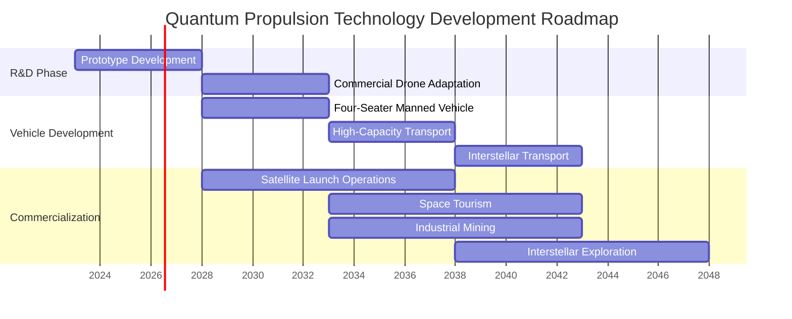
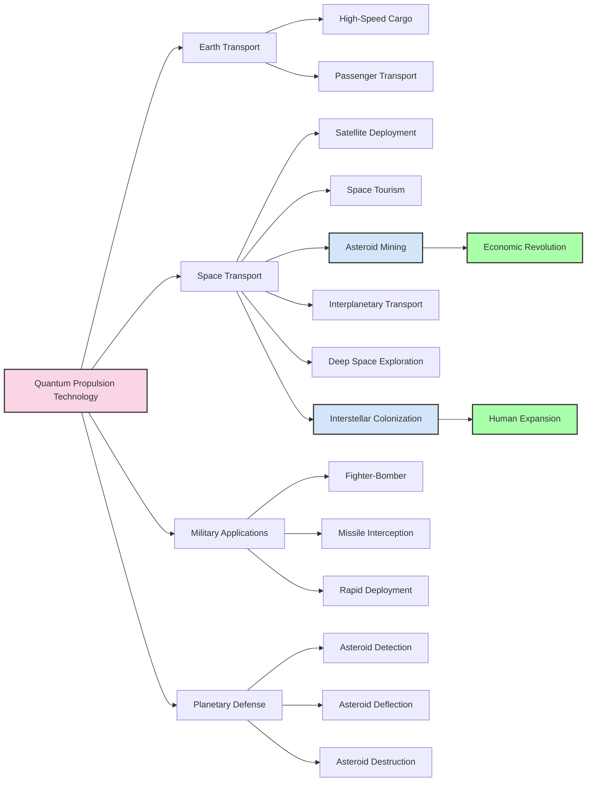
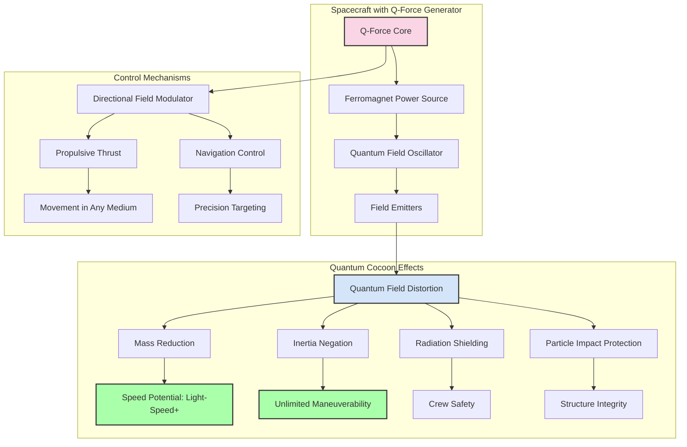
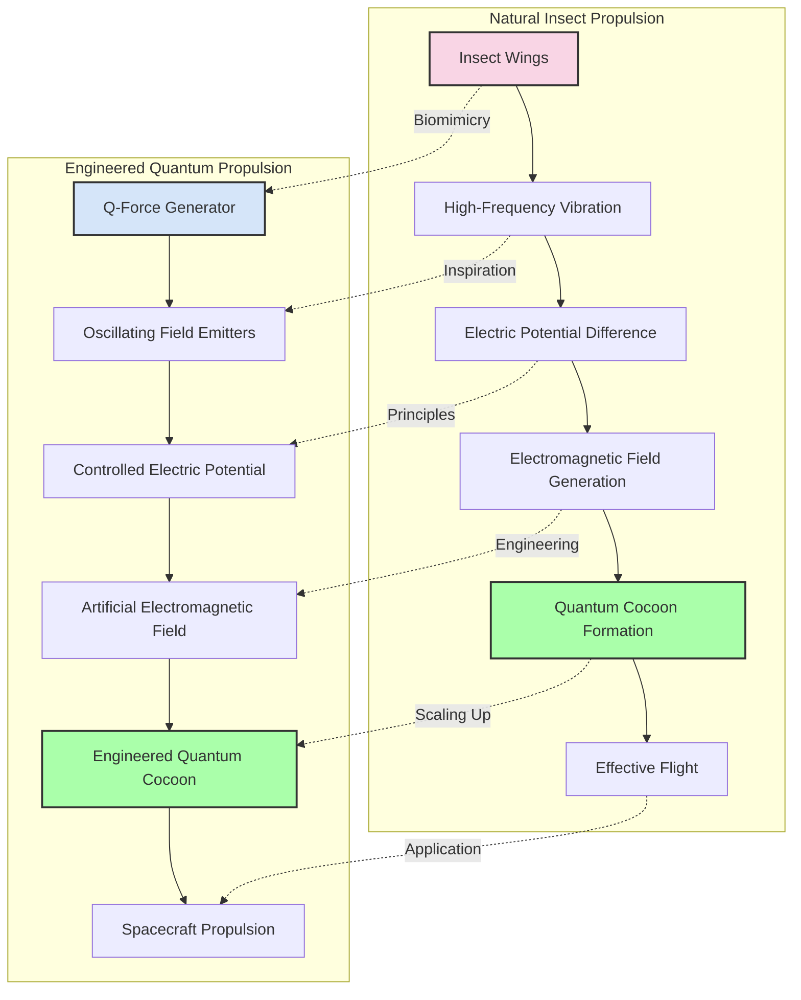
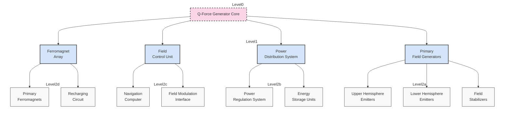

# Quantum Propulsion Technologies Ltd

## Research Paper Overview {#research-paper-overview}
*London 2023*

We are developing quantum propulsion systems and space vehicles that will be capable of flying with enormous speed (potentially reaching speed of light) and will have unseen before manoeuvrability and lifting capacity. They will provide 100% crew protection from deadly sun and space radiation that is essential for safe deep space travel and manned space exploration. They will also provide spacecraft with protection against space particles.

To date we have managed to crack the main secret of practical quantum engine design and we are ready to develop it further into fully operational aerospace vehicles. Quantum propulsion systems are the only systems that can facilitate realistic prospects of space mining on the industrial scale and deep space colonisation, including colonisation of habitable planets in the future.

Cost efficiency of this new technology is going to be enormous. Development and production costs of quantum aerospace vehicles compering to production costs of chemical fuel jet spacecraft allows to reduce price per kilo space launch ratio hundreds of times, making deep space exploration and commercialisation more accessible and practically feasible at last. Manufacturing and maintenance of quantum propelled flying machines that can reach the age of our solar system within hours will be no more expensive than manufacturing of jet planes or helicopters of the same size.

Quantum propulsion systems are going to replace outdated chemical fuel rocket jet engines in the near future and will become the mainstay of air travel and space exploration. These propulsion systems will lead to technological revolution comparable to revolution that was triggered by invention of steam engine and aeroplane.

**Our Competitive Advantage.** We will be the first on the aerospace market with quantum propulsion technology, which will provide our company with enormous commercial advantages. No existing aerospace corporation would be able to compete with us unless they master production of the same type of flying machines. It is obvious that our propulsion systems will revolutionise the aerospace industry and open a new page in the history of space travel.

## Our Vision:

Our short-term program is the design, development and testing of the first workable and fully operational quantum propulsion system-propelled prototype within the next three to five years. This prototype can be used for demo flights demonstrating the advantages of quantum propulsion systems to potential customers and investors.

During the following five years, this prototype can be converted into a commercially viable high-speed and highly manoeuvrable drone (subject to a particular customer specification). Possible applications of this drone: a conventional drone that could be used for filming, surveying and any other visual observation (including military and law enforcement intel gathering). It also could be used to build a weapon delivery platform (kamikaze or reusable version) for high precision stealth strikes and as a highly efficient ballistic and cruise missiles interceptor that will be capable of destroying targets within a few seconds after their detection with 100% probability.

A more advanced, space-going version of this drone could be used to launch satellites to LEO and as a scientific interplanetary robotic craft that will be capable of delivering sets of scientific instruments to the orbits and surface of the other planets within our solar system and bringing soil and liquid samples back to Earth for the fraction of present-day space flight costs. These interplanetary missions will take hours, instead of years or even decades that present day rocket engine propelled spacecraft spend in space in order to reach their destinations. So, this new type of robotic spacecraft could easily replace today's outdated and hugely expensive satellites and interplanetary probes and completely eliminate need for huge and expensive launch vehicles within years, dramatically cutting down space exploration expenses and speeding up development of our civilisation.

## Access The Research Paper {#access-the-research-paper}

The longer-term program covering a period greater than five years when we intend to develop various types of space vehicles to cater for specific purposes. We envisage that our next flying machine will be a four-seater manned space vehicle that we will design and build within the next five to ten years. This vehicle could be used for scientific interplanetary space exploration, space tourism, astrogeological surveys, experimental small-scale asteroid mining operations within our solar system and as a basis for building various types of military spacecraft.

Within 10 to 15 years, we aim to develop a large, high-capacity transport spaceships that will be capable of supporting industrial-scale commercial space mining operations and the construction of planetary bases within our solar system. Following on from the release of the last type of space vehicle, within 15 to 20 years, we are aiming to develop a large interstellar transport spaceships that could be used for the exploration of distant planetary systems and colonisation of habitable planets.

### Development Timeline

**Figure 1: Quantum Propulsion Technology Development Roadmap**

## Problem and Solution

The main problem with present-day aircraft and space vehicles is the fact that their chemical rocket jet propulsion engines have reached their physical capacity limit. Contemporary flying machines are incredibly slow and expensive. Their snail speed simply doesn't match the requirements of present-day business needs and the requirements of deep space commercial exploration.

The chemical fuel rocket jet engine played its historical role well, but it has no prospects of improving. Flying machines powered by jet engines, even if they are boosted by inbuild nuclear fusion reactors, will not be unable to fly faster than 50 km/sec. Their lifting capacity will remain notoriously limited with no prospects of improvement as well.

The realistic range of operations of manned rocket jet-propelled spacecraft is Moon and Mars. They are not capable of taking manned space expeditions any further due to the limits of human body endurance that is not capable of sustaining space flights weightlessness and space radiation exposure longer than two years. The time for change has come, and quantum propulsion systems represent the perfect alternative to obsolete chemical reaction mass engines.

According to the recent developments in quantum mechanics theory, Quantum systems propelled spacecraft most probably will be able to exceed speed of light braking space-time barrier thus allowing spaceships to perform interstellar space journeys to the nearest stars within a few days or even hours of Earth time. Quantum propulsion systems also form a cocoon around spacecraft that protects it against space dust and nebula gas clouds impacts during its high-speed interstellar journey. So, they are the only tool that opens realistic prospects of traveling to our neighbouring planetary systems and beginning of colonising Earth-like planets in the future. The advent of this new type of vehicle will change our world and the course of human history forever.

### Comparison of Propulsion Systems

**Figure 2: Comparison of Chemical and Quantum Propulsion Systems**

## Commercialisation

Our first and foremost obvious objective in the application of the new propulsion system will be the commencement of asteroid and interplanetary mining. As we all are perfectly aware the terrestrial reserves, and growing consumption of the key elements needed for modern industry will be exhausted on our planet within the next fifty to sixty years. There is only one way to support Earth industries and sustain further development of our civilisation -- it is to start bringing metals and minerals from the other planets and asteroids.

However, due to the high cost and extremely limited cargo capacity of present-day chemical fuel rocket jet engine-powered spacecraft, terrestrial ore extraction remains the only means of raw mineral acquisition. Today, researchers have reached the conclusion that space mining by means of contemporary spacecraft is not commercially viable and not feasible. The only solution to this problem is our quantum cargo spaceships that would be capable of bringing heavy mining machinery and equipment to the surface of other celestial bodies and then delivering unrestricted amounts of extracted ore back to Earth. This is a multi-trillion business opportunity, and our organisation is planning to be the first on this market leading the way for the other enterprises that will be using our quantum-powered vehicles as their main space transportation tool.

Quantum propulsion systems also have significant military applications. These systems will allow us to build superfast (speed of light) and supermanoeuvrable (immunity to G-force) fighter-bombers with great lifting capacity that will be able to clandestinely deliver significant bombload to any point on our planet in a matter of seconds. This machine (especially if under AI control) will be able to outmanoeuvre and singlehandedly destroy dozens of conventional jet fighter planes in a matter of seconds and even before they realise that they are engaged in dogfighting.

The same type of vehicles can be used for the interception and destruction of dangerous small-size asteroids approaching Earth within hours after their detection. They can be destroyed by powerful hydrogen explosive devices delivered by quantum system-propelled kamikaze-type unmanned space vehicles.

However, as we mentioned above, our ultimate aim is to create large spaceships capable of interstellar travel by taking advantage of wormholes, i.e. breaking the space-time barrier. Quantum interstellar spaceships will open the possibility of colonising habitable planets orbiting distant stars. They will also open the possibility of mass migration of humans to those planets and the creation of new politically independent planet-states, new planetary and interplanetary markets and new business opportunities.

### Commercial Applications Flow

**Figure 3: Commercial Applications of Quantum Propulsion Technology**

## Technical advantages

The main advantage point of the quantum propulsion system is the fact that spacecraft propelled by these systems will not need space launch vehicles and space launch facilities such as present-day spaceports. Quantum system-propelled flying machines will be able to accelerate from zero to hundred miles per second in a matter of seconds and will be capable of flying equally and with the same speed in atmospheric conditions and in open space. These aerospace vehicles will be able to take off from conventional helipads or any relatively flat surfaces, get directly into open space and traverse our solar system without the assistance of any additional rocket boosters. Their high speed will allow these vehicles to visit any planet, complete their scientific (or military) mission there and fly back to Earth within hours. These space vehicles are also 100% environmentally friendly. They are not going to use any conventional chemical or nuclear fuels. The main core of their propulsion system is powered by ferromagnets that will be replaced and recharged once in a few years.

Needless to say, these propulsion systems represent a long-awaited revolution in aerospace transportation and space exploration. Here the summary of the most obvious civil and military application of space vehicles fitted with these new systems that we can offer to potential users and other interested parties:

- building heavy lifting, large transportation spaceships capable of delivering hundreds of tonnes mining equipment to the asteroid belt area and delivering hundreds of tonnes of precious metal ore back to Earth, i.e. commencement of space mining operations on truly industrial scale resolving looming natural resources crisis (there are billions of asteroids that contain enormous amount of precious and other metals and minerals (for example: 16 Psyche asteroid alone contains about $700 quintillion worth of various metals, but there are billions of such asteroids in space));

- building unbitable, 100% stealth, superfast and supermanoeuvrable aerospace fighter equally suitable for atmospheric and open space operations that will be capable of destroying dozens of enemy planes in a matter of seconds;

- building superfast, 100% stealth, fighter-bomber that will be capable of delivering hundreds of tons bombload or special force units to any point of our planet in a matter of seconds, and to any point of our solar system in a matter of hours;

- building unmanned kamikaze type interceptor capable of destroying any conventional cruise missile (including hypersonic one) or ballistic intercontinental missile in existence (or currently in development) with 100% probability of missile interception and destruction, which makes it a perfect remedy against opposing ballistic nuclear forces and makes conventional nuclear ballistic and hypersonic missiles useless and obsolete (this quantum interceptor will be able to destroy missiles or their warheads at any stage of their flightpath, including the near Earth open space phase of their ballistic trajectory however far from the Earth surface the target could be);

- building unmanned heavy lifting kamikaze type interceptor capable of destroying small asteroids that might represent any danger to our planet by detonating very powerful nuclear or hydrogen explosive device on the surface of these asteroids that will be delivered within hours after asteroids' detection (these interceptors can be used as the main building blocks for organising the Earth protection rapid reaction force much needed for our civilisation's survival);

- building aerospace vehicles that will be capable of lifting and transporting hundreds tonnes concrete and stone blocks that could be used in the construction industry and for transportation of any cargo and passengers in general, thus replacing any existing today means of land, sea and air transportation;

- building interstellar space vehicles that will be capable of facilitating deep space exploration and habitable planets colonisation in future, resolving looming Earth's overpopulation crisis (large interstellar transportation space vehicles powered by quantum propulsion systems could facilitate migration of millions of people to human colonies located on habitable planets orbiting distant stars).

## Technology

Quantum spacecraft and the operation of their propulsion systems based on recently discovered physical principles of so-called quantum cocoon (or quantum bubble) motion. The full name is Hyper-Relativistic Local-Dynamic Space motion. The possibility of this phenomena was predicted by Albert Einstein at the beginning of the 20th century. The theoretical background for this technology was prepared by the very first work on the subject published by quantum physicist Miguel Alcubierre in 1994 (The Warp Drive: Hyper-fast Travel Within General Relativity) and followed by more detailed works published in during the recent years, beginning from 2018 to 2022, by Eric Lentz, Alexey Bobrick and Gianni Martire. However the full technical assessment and of the quantum bubble propulsion method as the only feasible one was given by the top world authorities in the subject professors Mario J. Pinheiro and Takaaki Musha in their seminal work Physics of Field Propulsion: Outline of Quantum Field Theory and Its Applications for Space Propulsion published in 2016. They provided further details in their following works such as:

- New Framework to Study Electromagnetic Turbulence (2022)
- Advanced Topics in Contemporary Physics for Engineering: Nanophysics, Plasma Physics, and Electrodynamic (2022)
- Advances in Engine Efficiency: Nanomaterials, Surface Engineering, and Quantum-based Propulsion (2023)

All those works are available on: https://www.researchgate.net/profile/Mario-Pinheiro

The operating principle of quantum propulsion systems is based on generating a force field around spacecraft that distorts pulsations of universal fields, which forms quantum particles of surrounding matter and quantum gravitation connections between those particles, thus making them utterly transparent and ineffective (we called this force Q-force). As a result, we are forming a quantum vacuum cocoon around this spacecraft that isolates the vehicle from the influence and resistance of the outside physical environment including physical fields and forces, giving it absolute freedom of speed and enormous manoeuvrability. When this vehicle moves, this quantum cocoon always remains around the vehicle turning surrounding matter into quantum vacuum on its way. By distorting quantum properties around our vehicle, we make them unrecognizable or relatively "invisible" for any other fields of the universe. They stop recognizing the cocoon and everything that is located inside of the cocoon as conventional matter. For all forces and matter particles that surround the spacecraft it looks like empty vacuum bubble flying in space that has no mass, no inertia, no aerodynamic resistance.

### Quantum Cocoon Operation

**Figure 4: Quantum Cocoon Operation and Effects**

Interestingly enough, there was no need to invent this concept. The quantum propulsion mechanism already exists. Many flying insects have been using this same naturally inbuild electromagnetic mechanism for hundreds of millions of years propelling and protecting themselves.

We are reverse engineered this mechanism by designing and building electromechanical devices that generate quantum cocoons in the same way as designers of the first aeroplanes mimicked birds' wings design and operations at the end of 19th century.

In fact, insects are using both: aerodynamic modes of flight for take-off, landing and hovering at 60—70 degrees above flowers and electromagnetic (or quantum) mode when they are highspeed cruising parallel to the ground or power hoovering when they sense some form of danger and preparing to rapidly accelerate. Insects are generating quantum bubbles by high-frequency wings vibration. The difference in electric potential between their vibrating wings and their body generates an electromagnetic cocoon that is strong enough to disrupt quantum connections, forces and quantum fields in the immediate space around the insects allowing them to glide in the electromagnetic field ignoring dynamic air resistance, gravitation influence and possible dust particle impacts. Some insects (such as spiders) use a passive form of electromagnetic propulsion extending their antennas in the air and charging them with certain electric potential that interacts with planetary electromagnetic field and provides them with lifting force that can transport them thousands of miles. We have manged to recreate this effect and currently working on improving this system.

### Insect Flight to Quantum Propulsion

**Figure 5: Biomimicry: From Insect Flight to Engineered Quantum Propulsion**

Here is the summary of the main technical aspects of this new system:

- enormous speed (ability to achieve speed of light from outset and potentially master superluminal warp drive motion speeds making these vehicles perfectly suitable for feasible interstellar superluminal travel and deep space exploration);

- unseen before manoeuvrability (ability of rapid acceleration and ability to perform rapid sharp angles turns with zero G-force and zero dynamic pressure affecting the airframe and the crew);

- enormous lifting capacity (since the vehicle mass and mass of its cargo turns to "relative zero" when the propulsion system is on, thus the loading capacity of the vehicle is restricted only by its cargo bay size);

- elimination of any aerodynamic resistance around the quantum cocoon (ability to fly at any speed ignoring atmospheric resistance, ignoring space particles destructive impacts and interstellar gas clouds abrasion);

- 100% protection against harmful stars/space radiation when the propulsion system is on (quantum cocoon dissolves radiation particles), and ability to curry heavy metallic armour that will be able to protect the crew against this radiation when the propulsion system is off (while on the surfaces on the celestial bodies that don't have any atmosphere for example);

- no need for rocket boosters of any kind: space vehicle will be able to accelerate from the Earth surface directly into the open space and to attain any speed at will;

- no need for any chemical fuel (no exhaust or fuel waste of any kind, 100% environmentally friendly, green technology);

- no need for massive army of ground support and flight control crews, the vehicles are going to be mechanically simple and completely autonomous (the flight preparations and the ground control will be no more complex than flight preparations and control of a small private jet plane or helicopter);

- no need for expensive runways and spaceports (100% VTOL capability);

- high costs effectiveness compering to production costs of chemical fuel space vehicles, which allows to reduce price per kilo space launch ratio significantly (quantum systems propelled flying machines' manufacturing and maintenance will be no more expensive than manufacturing of jet plane or helicopter of the same size).

### Q-Force Generator Structure

**Figure 6: Q-Force Generator Structure and Subsystems**

## Quantum Propulsion System

The Quantum Propulsion System (QPS) represents a paradigm shift in spacecraft propulsion technology. Unlike conventional chemical propulsion systems that rely on Newton's Third Law of Motion, QPS manipulates quantum fields to achieve propulsion without the need for reaction mass.

### Conventional vs. Quantum Propulsion

**Traditional Spacecraft Propulsion**

This is an accelerating conventional spacecraft that as any other material object is fighting its own mass inertia, burning tons of chemical fuel. This is the result of energetic friction between quantum particles and their gravitational interconnections of the object's own body and static energy fields of the universe. Our experimentations indicate that physical mass of any object is nothing more than this friction or quantum windage as we called it. If we manage to eliminate this friction, we eliminate mass of the object.

**Figure 8: Traditional Spacecraft Propulsion**

The traditional spacecraft propulsion system relies on Newton's Third Law, expelling mass in one direction to move in the opposite direction. This approach has several fundamental limitations:

- Requires carrying enormous quantities of propellant mass
- Efficiency diminishes as fuel is consumed and mass decreases
- Acceleration is limited by structural integrity constraints
- Maximum velocity is capped by available propellant and exhaust velocity
- Generates intense heat and radiation that must be managed
- Requires complex staging for orbital insertion and deep space missions

These limitations make traditional propulsion impractical for long-duration missions beyond our solar system.

**Quantum Field Propulsion**

Quantum generator of the propulsion system is on and at 100% power. The space vehicle is gliding via energy free tunnel, forming it by generating quantum vacuum bubble around itself that conveniently isolates the vehicle from the surrounding chemical environment and combination of universal energy fields. If we apply just a few extra volts to one side of the bubble, we will effortlessly accelerate the bubble and the vehicle inside of this bubble to any speed including speed of light. Electric pulses of predefined frequency provide these vehicles with propulsive and flight control momentums.

**Figure 9: Quantum Spacecraft with Field Effect**

The quantum spacecraft creates a controlled distortion in the fabric of space-time, forming what we call a "quantum vacuum bubble." This revolutionary approach offers numerous advantages:

- Eliminates the need for reaction mass propellant
- Allows for near-instantaneous acceleration without inertial effects
- Permits sustained high-velocity travel with minimal energy input
- Creates an impenetrable shield against radiation and particle impacts
- Maintains standard physical conditions inside the bubble for crew safety
- Enables potential faster-than-light travel through space-time manipulation
- Operates with equal efficiency in atmosphere, vacuum, or dense media

Our quantum field propulsion system represents the first practical implementation of theoretical concepts proposed by physicists over the past century.

### Q-Force Generator Core

The quantum generator creates a special quantum field around the spacecraft that disrupts the gravitational interconnections between the spacecraft's quantum particles and the static energy fields of the universe. This eliminates the quantum windage and the spacecraft's mass. The spacecraft becomes massless.

**Figure 10: Q-Force Generator Core**

The main core of Quantum Propulsion System: Q-Force generator (holding frame, piping and cabling not shown). This revolutionary device is the heart of our propulsion technology.

The Q-Force Generator Core is built around a specially configured array of electromagnets and quantum field oscillators. Key components include:

- Central ferromagnet assembly providing the primary energy foundation
- Quantum field oscillators that create precisely tuned harmonic frequencies
- Superconducting electromagnetic coils for field amplification
- Crystalline field directors that shape and focus the quantum effect
- Quantum state monitors providing real-time feedback for system stability
- Advanced cooling systems to maintain optimal operating temperatures
- Reinforced structural elements to withstand field stresses

The core's unique design allows it to manipulate the fundamental quantum relationship between mass, energy, and space-time, resulting in the elimination of effective mass and inertia.

### Field Configuration

Quantum Propulsion System generates Q-force field around the spacecraft forming two safe half-spheres around the vehicle. The physical properties of matter and fields inside of those half-spheres remain undisturbed. The upper half-sphere can be used for a cockpit and avionics compartment. The lower half-sphere could be used for cargo and/or weapons/scientific instruments bay.

**Figure 11: Q-force Field Configuration**

The Q-force field configuration creates a dual-hemisphere protective bubble around the spacecraft. This specialized field arrangement provides:

- Complete isolation from external physical forces, including gravity and electromagnetic radiation
- Maintained normal physical conditions within the bubble for crew safety and comfort
- Structural division allowing for specialized compartmentalization of vehicle systems
- Upper hemisphere optimization for navigation, control systems, and crew quarters
- Lower hemisphere configuration for cargo, propulsion system components, and mission-specific equipment
- Variable field strength capabilities to adapt to different operational requirements
- Seamless transition between atmospheric and space operation modes

This bifurcated field design represents a significant advancement over theoretical models and allows for practical implementation in aerospace vehicles of various sizes and purposes.

### Cross-Section View

The cross-sectional view of the quantum propulsion system shows the integrated components that enable the quantum field manipulation.

**Figure 12: Quantum Propulsion Cross-Section**

The cross-sectional view reveals the sophisticated internal structure of our quantum propulsion system:

- Central core housing containing the Q-Force Generator
- Radial field emitters distributing the quantum effect uniformly
- Directional field modulators for navigation and propulsion control
- Power distribution network connecting primary and secondary systems
- Thermal management conduits preventing system overheating
- Structural reinforcement elements withstanding field stresses
- System monitoring sensors throughout the assembly
- Crew and cargo compartments isolated from operational components

This integrated design demonstrates how the theoretical principles of quantum field manipulation have been transformed into a practical engineering solution. The system's modular architecture allows for scaling from small unmanned vehicles to large interstellar transport vessels.

### Materials and Construction

The quantum propulsion system requires materials that can withstand the unique stresses of quantum field generation. For detailed information on the specialized materials developed for quantum spacecraft construction, see our [Advanced Materials Research](../research-documentation/advanced-materials-research) documentation.

## Related Research Areas

Our research into quantum field manipulation extends beyond propulsion systems to several complementary fields:

- **[Bio-Resonance Habitat Systems](/docs/infrastructure-documentation/bio-resonance-habitat)** - Advanced living environments utilizing quantum field principles for sustainable extraterrestrial habitation
- **Advanced Materials Research** - Development of quantum-responsive materials for spacecraft construction
- **Quantum Communications** - Utilizing quantum entanglement for instantaneous communication across vast distances

### Cost Comparison

The comparative analysis between traditional chemical propulsion and our Quantum Propulsion System shows significant cost advantages for quantum propulsion:

| Cost Category | Traditional Chemical Propulsion | Quantum Propulsion System |
|---------------|--------------------------------|---------------------------|
| Fuel Cost | $10,000/kg | $2,500/kg |
| System Weight | 70% fuel by weight | 15% fuel by weight |
| Launch Cost | $20,000/kg to orbit | $5,000/kg to orbit |
| Operational Lifespan | 10-15 years | 25-30 years |
| Refueling Requirements | Regular refueling needed | Minimal refueling |

### Research Facilities

Our cutting-edge research is made possible through specialized facilities designed specifically for quantum propulsion development.

  

    <strong>Quantum Test Laboratory</strong> – Our state-of-the-art facility with specialized shielding and monitoring equipment for conducting quantum field experiments under controlled conditions.
  

  
  
  **Figure 7: Quantum Test Laboratory**

The laboratory features a central quantum field generator surrounded by multiple measurement and monitoring stations. The facility includes:

- Advanced electromagnetic shielding to prevent external interference
- Precision quantum field monitoring equipment
- Redundant power systems to maintain field stability
- Climate-controlled environment for consistent test conditions
- Real-time data acquisition and analysis capabilities

This laboratory enables our research team to safely experiment with quantum field manipulation techniques at various scales before implementation in full propulsion systems.

## About the Company

  <h3>Additional information and contact details:</h3>
  <ul>
    <li><a href="https://www.linkedin.com/in/alex-ioskevich-244194183/" target="_blank">https://www.linkedin.com/in/alex-ioskevich-244194183/</a></li>
    <li><a href="https://www.linkedin.com/company/quantum-propulsion-technologies-ltd/" target="_blank">https://www.linkedin.com/company/quantum-propulsion-technologies-ltd/</a></li>
    <li><a href="https://intstelforce.com/" target="_blank">https://intstelforce.com/</a></li>
  </ul>
  
Our email: qpt@europe.com

 