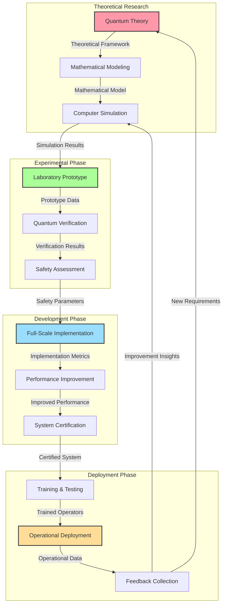

# Research and Development Infrastructure

The Quantum Engine Project requires specialized research facilities, equipment, and collaborative frameworks to advance from theoretical concepts to practical implementation. This infrastructure forms the backbone of our development efforts. The complete research findings and experimental results can be found in our [Quantum Propulsion Research Paper](quantum-research-paper).

## R&D Workflow

Flow chart showing the research and development workflow for InstaForce technology:

*Research & Development Workflow - Illustrating the process from theoretical research through experimental testing to deployment*

## Test Labs and Prototyping Facilities

Our specialized facilities enable the development and testing of quantum propulsion components in controlled environments.

*Our state-of-the-art Quantum Test Laboratory with specialized shielding and monitoring equipment*

### Quantum Vacuum Testing Chamber

For testing components in conditions resembling space:

- Ultra-high vacuum environment with pressure below 10^-12 torr
- Quantum field isolation barriers preventing external interference
- Scalable test volume from microscopic to 100m³
- Variable temperature range from 10^-6 K to 10,000 K
- Simulated cosmic radiation environment

This facility enables testing of quantum components in conditions nearly identical to deep space. The [Quantum Propulsion Research Paper](quantum-research-paper#research-paper-overview) includes detailed experimental results from tests conducted in this chamber.

### Micro-Gravity Quantum Testing Laboratory

For validating quantum effects in zero-G conditions:

- Sustained micro-gravity environment using quantum field manipulation
- Magnetically shielded chambers with field attenuation of 10^-15 Tesla
- Isolated quantum coherence zones for maintaining delicate quantum states
- Real-time 3D observation systems with Planck-scale resolution

This lab allows for precise evaluation of quantum effects without Earth's gravitational interference.

### Quantum Propulsion Test Range

For testing complete propulsion systems:

- 100km isolation corridor with quantum shielding
- Real-space/subspace transition monitoring equipment
- Quantum field mapping grid with 10^-35m resolution
- Emergency containment fields rated for 10^24 joule events
- Temporal monitoring to detect time-dilation effects

This range allows for full-scale testing of quantum propulsion systems under controlled conditions.

## Advanced Fabrication Systems

Specialized equipment for creating quantum technology components.

### Atomic Precision Fabricators

For creating quantum components with perfect precision:

- Matter manipulation at the atomic scale with zero error tolerance
- Quantum entanglement-guided assembly processes
- Exotic matter synthesis and stabilization chambers
- Topological manipulators for creating quantum-stable geometries

These fabricators can create materials and components that would be impossible using conventional manufacturing.

### Quantum Material Development Lab

For creating materials with quantum-specific properties:

- Quantum state maintenance materials that preserve coherence
- Superconductive materials operable at standard temperatures
- Negative energy density materials for warp field generation
- Quantum-phase transitional materials for field modulation

This lab develops the exotic materials required for quantum propulsion systems.

### Temporal Fabrication Facilities

Experimental systems for creating time-stabilized components:

- Chronometric particle stabilization chambers
- Temporal stasis fields for studying long-term material stability
- Closed timelike curve simulators for testing causal materials
- Entropy-reversal fields for manufacturing negative-entropy components

These facilities allow for the development of components that remain stable across extended time periods or during extreme spacetime distortions.

## Cross-Disciplinary Collaboration

Our research approach integrates multiple scientific disciplines to address the complex challenges of quantum propulsion. For a comprehensive overview of our collaborative research methodology, refer to the [Quantum Propulsion Research Paper](quantum-research-paper).

### Quantum Physics Division

Core theoretical and experimental team:

- Quantum field theorists specializing in vacuum energy dynamics
- Experimental physicists focused on macroscopic quantum effects
- Quantum information specialists developing communication protocols
- Quantum gravity researchers exploring spacetime manipulation

This division provides the theoretical foundation for quantum propulsion technologies.

### Engineering Implementation Team

Transforming theory into practical systems:

- Quantum propulsion engineers focused on drive system development
- Quantum materials engineers specializing in exotic material applications
- System integration specialists ensuring component compatibility
- Reliability engineers developing fault-tolerance protocols

This team bridges the gap between theoretical physics and practical implementation.

### Artificial Intelligence Research Group

Developing quantum computing and AI for ship systems:

- Quantum algorithm specialists creating navigation and control systems
- Quantum neural network developers for adaptive ship management
- Quantum consciousness researchers exploring AI-human interfaces
- Quantum decision theory specialists for autonomous operation protocols

This group develops the quantum computing and AI systems essential for operating quantum propulsion technology.

### Human Factors Research Division

Ensuring human-technology integration:

- Quantum interface specialists developing human-machine connections
- Quantum psychologists studying human adaptation to quantum environments
- Neuroscience team developing neural interfaces
- Habitat design specialists creating optimal living environments

This division ensures that quantum technology serves human needs effectively.

## Virtual Development Environment

Advanced simulation capabilities accelerate development without physical prototyping.

### Quantum Reality Simulator

Ultra-high-fidelity simulation environment:

- Quantum processing simulation cores with 10^500 computational states
- Perfect physics models incorporating all known quantum phenomena
- Simulated test environments with 100% fidelity to physical reality
- Time acceleration capabilities for simulating years of operation in minutes

This system enables thorough testing of concepts before committing to physical prototypes.

### Collaborative Quantum Design Interface

Multi-user development environment:

- Quantum entanglement-based real-time collaboration across global teams
- Thought-speed interface for direct concept visualization
- AI-assisted design optimization across billions of potential configurations
- Instantaneous verification against theoretical physics models

This interface allows global teams to work together as if occupying the same physical space.

## Technical Specifications

| Facility | Capability | Current Status |
|----------|------------|----------------|
| Vacuum Test Chamber | 10^-12 torr, 100m³ volume | Initial Planning |
| Micro-Gravity Lab | 10^-6 g residual gravity | Research Proposal |
| Atomic Fabricators | 10^-12m precision | Theoretical Research |
| Quantum Simulator | 10^100 quantum states | Computer Modeling |
| Test Range | 100km isolation corridor | Pre-Feasibility Study |

## Development Challenges

1. **Energy Requirements**: Meeting the enormous power needs of test facilities
2. **Safety Protocols**: Ensuring containment of potentially catastrophic quantum events
3. **Measurement Limitations**: Developing instruments capable of observing quantum phenomena
4. **Theoretical Gaps**: Addressing areas where current quantum theory is incomplete
5. **Experimental Validation**: Verifying theories that challenge conventional physics

## Resource Requirements

1. **Funding**: Estimated $50 billion for complete R&D infrastructure
2. **Personnel**: 5,000+ specialists across quantum physics, engineering, and related fields
3. **Power**: Dedicated zero-point energy facility providing 10^15 watts continuous
4. **Materials**: Access to rare elements and ability to synthesize stable exotic matter
5. **Computing**: Quantum supercomputer with minimum 10,000 stable qubits 