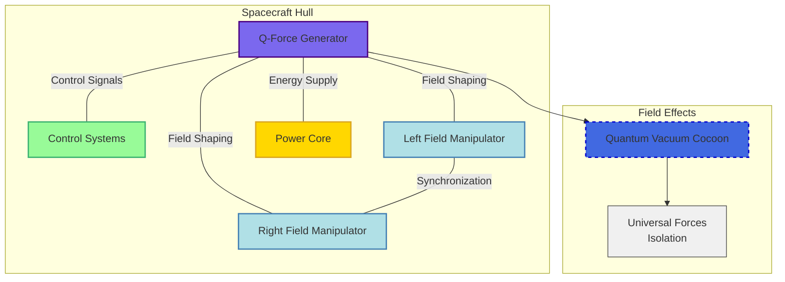

```mermaid
flowchart TD
    subgraph "Spacecraft Hull"
        QFG["Q-Force Generator"]
        style QFG fill:#7b68ee,stroke:#4b0082,stroke-width:2px
        
        CS["Control Systems"]
        style CS fill:#98FB98,stroke:#3CB371,stroke-width:2px
        
        LFMA["Left Field Manipulator"]
        style LFMA fill:#b0e0e6,stroke:#4682b4,stroke-width:2px
        
        RFMA["Right Field Manipulator"]
        style RFMA fill:#b0e0e6,stroke:#4682b4,stroke-width:2px
        
        PC["Power Core"]
        style PC fill:#FFD700,stroke:#DAA520,stroke-width:2px
        
        QFG --- |Control Signals| CS
        QFG --- |Field Shaping| LFMA
        QFG --- |Field Shaping| RFMA
        QFG --- |Energy Supply| PC
        LFMA --- |Synchronization| RFMA
    end
    
    subgraph "Field Effects"
        QVC["Quantum Vacuum Cocoon"]
        style QVC fill:#4169E1,stroke:#0000CD,stroke-width:2px,stroke-dasharray: 5 5
        
        UF["Universal Forces\nIsolation"]
        style UF fill:#f0f0f0,stroke:#444,stroke-width:1px
        
        QFG --> QVC
        QVC --> UF
    end
    
    classDef default fill:#f9f9f9,stroke:#333,stroke-width:1px;
``` 